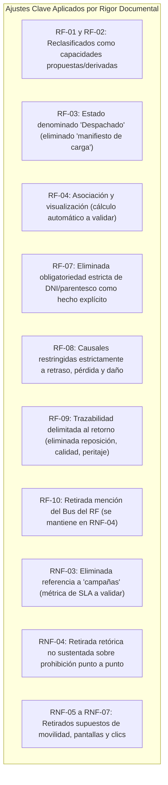

# Matriz Consolidada de Requerimientos

> **Proyecto:** Diseño e Implementación de Arquitectura Empresarial — Caso Yanbal Perú  
> **Área Operativa:** Cadena de Distribución y Transporte  
> **Alcance del Proceso:** Despacho $\longrightarrow$ Transporte/Ruta $\longrightarrow$ Llegada $\longrightarrow$ Entrega $\longrightarrow$ Actualización $\longrightarrow$ Consulta  
> **Principio Rector:** *«Se realizó una revisión individual de cada requisito candidato. La cantidad, numeración y clasificación definitiva de RF y RNF se establecieron únicamente después de verificar su sustento, alcance y naturaleza.»*  
>
> **Navegación:** [[02 - Especificación de Requerimientos Funcionales]] | [[03 - Especificación de Requerimientos No Funcionales]] | [[04 - Trazabilidad y Registro de Depuración]]  
> **Enlaces al AS-IS:** [[01 - Proceso actual]] | [[02 - Actores relevantes]] | [[03 - Actividades y eventos]] | [[04 - Sistemas e información]] | [[05 - Problemas y desfases]] | [[06 - Evidencia y fuentes]]

---

## 1. Delimitación y Marco Metodológico

La presente matriz responde exclusivamente a la pregunta rectora:  
**¿Qué requerimientos necesita la solución para atender las necesidades identificadas en el proceso comprendido desde el despacho hasta la entrega?**

### Criterios de Rigor y Clasificación del Respaldo
Para mantener absoluta transparencia sobre el origen de cada elemento, no se asume que todos los requisitos fueron declarados textualmente por las fuentes. Se utiliza la siguiente clasificación estricta:

1. **`[Explícitamente sustentado]`**: Requisitos que corresponden de forma directa a declaraciones textuales, estados, datos o restricciones manifestadas por el entrevistado.
2. **`[Derivado de una necesidad expresada]`**: Capacidades del sistema propuestas lógicamente para resolver un problema operativo o gestionar un dato existente del proceso, sin que la fuente haya especificado el mecanismo exacto de software.
3. **`[Pendiente de validar]`**: Metas cuantitativas (como la reducción a $\le 30$ min), acuerdos de nivel de servicio (SLAs) o parámetros de diseño que representan expectativas del negocio sujetas a comprobación técnica o de campo.

### Resumen Cuantitativo Real de Requerimientos

| Tipo de Requerimiento | Total | Explícitamente Sustentados | Derivados de Necesidades | Pendientes de Validar |
|---|:---:|:---:|:---:|:---:|
| **Requerimientos Funcionales (RF)** | **12** | 6 | 6 | 0 |
| **Requerimientos No Funcionales (RNF)** | **7** | 4 | 0 | 3 (métricas / metas) |
| **TOTAL DEFINITIVO** | **19** | **10** | **6** | **3** |

---

## 2. Mapa del Proceso y Cobertura de Requerimientos

```mermaid
flowchart LR
    subgraph ETAPA1 ["1. Despacho"]
        direction TB
        RF01["RF-01: Capacidad de clasificación geográfica de pedidos"]
        RF02["RF-02: Gestión de datos de socio logístico y modalidad"]
        RF03["RF-03: Registro de salida de despacho (Estado 'Despachado')"]
        RF04["RF-04: Asociación y visualización de promesa de entrega"]
    end

    subgraph ETAPA2 ["2. Transporte y Ruta"]
        direction TB
        RF05["RF-05: Registro de inicio de traslado (Estado 'En Ruta')"]
    end

    subgraph ETAPA3 ["3. Llegada y Entrega"]
        direction TB
        RF06["RF-06: Registro de entrega (Estado 'Entregado')"]
        RF07["RF-07: Registro de la identidad del receptor real"]
        RF08["RF-08: Registro de entrega fallida e incidencias"]
        RF09["RF-09: Registro de retorno de carga (Logística Inversa)"]
    end

    subgraph ETAPA4 ["4. Actualización y Consulta"]
        direction TB
        RF10["RF-10: Sincronización y disponibilidad de estados"]
        RF11["RF-11: Consulta de trazabilidad por N° Pedido o Cód. Consultor"]
        RF12["RF-12: Visualización de datos del receptor en la consulta"]
    end

    ETAPA1 --> ETAPA2 --> ETAPA3 --> ETAPA4
```

---

## 3. Matriz de Requerimientos Funcionales (RF)

| ID | Tipo | Requerimiento Funcional | Actor Responsable | Etapa | Prioridad | Sustento Metodológico | Problema / Necesidad | Fuente Primaria (`trascrito.text`) |
|:---:|:---:|:---|:---|:---:|:---:|:---:|:---|:---|
| **RF-01** | RF | **Clasificación geográfica de pedidos para despacho:** El sistema debe proveer la capacidad de clasificar y canalizar los pedidos según su destino geográfico (departamento, provincia, distrito y tipo de ciudad: principal o alejada) a partir de los datos de entrega asociados al pedido, como soporte a la zonificación operativa. | Supervisor de Despacho | Despacho | **Alta** | `[Derivado de una necesidad expresada]` *(La zonificación es una actividad operativa confirmada; la capacidad sistémica se propone para gestionarla).* | Canalización y zonificación de despachos | Líneas 14, 16-17 (min 17:41–17:53, min 19:04–19:15) |
| **RF-02** | RF | **Gestión de datos de socio logístico y modalidad de transporte:** El sistema debe permitir registrar y mantener asociados al pedido los datos del proveedor logístico asignado y la modalidad de envío correspondiente (terrestre, bimodal o aérea) para su posterior seguimiento. | Supervisor de Despacho | Despacho | **Alta** | `[Derivado de una necesidad expresada]` *(La fuente confirma la existencia de estos datos y modalidades; la función de registro sistémico es una propuesta).* | Vinculación del transportista y modo de envío | Líneas 4, 14, 17-18 (min 1:24, min 18:02, min 19:15–19:30) |
| **RF-03** | RF | **Registro de salida de despacho del Centro de Distribución:** El sistema debe permitir registrar el egreso del pedido desde el centro de distribución y actualizar su estado a *"Despachado"* (o *"Pedido despachado"*), transfiriendo formalmente la carga al transportista. | Supervisor de Despacho | Despacho | **Alta** | `[Explícitamente sustentado]` *(Se eliminó 'manifiesto de carga' y la etiqueta 'Zonificado/Despachado' por no figurar textualmente).* | Transferencia de custodia en despacho | Línea 18 (min 19:04, min 19:44) |
| **RF-04** | RF | **Gestión y visualización de la promesa de entrega (Lead Time):** El sistema debe permitir asociar y visualizar el plazo de entrega estimado del pedido según su región de destino: 24 horas para Lima Metropolitana y hasta 7 días para provincias. | Sistema / Supervisor | Despacho | **Media** | `[Explícitamente sustentado (datos)]` `[Derivado (asociación en sistema)]` *(El cálculo automático queda pendiente de validar).* | Visibilidad del compromiso de entrega | Líneas 21-22 (min 22:38–22:54) |
| **RF-05** | RF | **Registro de inicio de traslado (Estado 'En Ruta'):** El sistema debe permitir registrar la transición del pedido al estado *"En Ruta"* cuando el socio logístico asume la carga y comienza el traslado físico. | Socio Logístico / Transportista | Transporte | **Alta** | `[Explícitamente sustentado]` *(Sin funciones de GPS ni checkpoints intermedios no mencionados).* | Inicio del recorrido físico en transporte | Línea 18 (min 19:44–19:53) |
| **RF-06** | RF | **Registro de entrega exitosa (Estado 'Entregado'):** El sistema debe permitir registrar la finalización de la entrega en destino y actualizar el estado del pedido a *"Entregado"*, asociando los datos temporales del registro. | Socio Logístico / Transportista | Entrega | **Alta** | `[Explícitamente sustentado (estado)]` `[Derivado (registro temporal)]` *(La estampa temporal es derivación estándar).* | Cierre del flujo principal de distribución | Línea 18 (min 19:53) |
| **RF-07** | RF | **Registro de la identidad del receptor real:** El sistema debe permitir capturar la información de la persona que recibe físicamente el paquete en destino, registrando si la entrega fue recibida por la consultora titular o por un familiar autorizado. | Socio Logístico / Transportista | Entrega | **Alta** | `[Derivado de una necesidad expresada]` *(La fuente confirma que reciben familiares y que no se comunica; los campos específicos y bloqueos son derivados).* | **PR-05:** Falta de visibilidad sobre receptor real y reclamos prematuros | Línea 25 (min 24:45–25:01) |
| **RF-08** | RF | **Registro de entrega fallida e incidencias en ruta/destino:** El sistema debe permitir registrar cuando una entrega no se concreta, actualizando el estado a *"Entrega Fallida"* y tipificando la incidencia exclusivamente según las causales sustentadas: retraso, pérdida o daño. | Socio Logístico / Transportista | Entrega | **Alta** | `[Explícitamente sustentado]` *(Se eliminaron causales no sustentadas como 'ausencia' o 'dirección errónea').* | Gestión de excepciones en transporte/entrega | Línea 19 (min 20:03–20:30) |
| **RF-09** | RF | **Registro de retorno de carga por logística inversa:** El sistema debe permitir registrar el inicio de retorno del pedido hacia el Centro de Distribución por parte del socio logístico tras una entrega fallida confirmada. | Socio Logístico | Entrega | **Media** | `[Explícitamente sustentado (registro retorno)]` *(Se eliminó reposición, almacén, calidad, seguros y peritaje por estar fuera de alcance).* | Control de la carga que regresa a la sede | Líneas 19-20 (min 20:30–20:55) |
| **RF-10** | RF | **Sincronización y disponibilidad de estados de distribución:** El sistema debe sincronizar y hacer disponibles las actualizaciones de estado (En Ruta, Entregado, Entrega Fallida) registradas en campo para que puedan ser visualizadas en los canales de consulta corporativos. | Sistema (Sincronización) | Actualización | **Alta** | `[Derivado de una necesidad expresada]` *(Se retiró la mención al Bus del RF; la integración técnica corresponde a RNF).* | **PR-03:** Desfase de 2h en actualización digital | Líneas 23-24, 33-35 (min 23:19–24:18, min 0:49–1:16 p2) |
| **RF-11** | RF | **Consulta de trazabilidad con soporte multicriterio:** El sistema debe permitir consultar la situación actual del pedido, su estado y promesa de entrega, admitiendo búsquedas mediante dos identificadores: *Número de Pedido* o *Código de Consultora/Cliente*. | Consultora / Agente de Servicio | Consulta | **Alta** | `[Explícitamente sustentado]` *(Ambos criterios declarados textualmente por la fuente; unificados en un solo RF).* | Trazabilidad de cara al usuario | Líneas 21-22 (min 22:03–22:28) |
| **RF-12** | RF | **Visualización de datos del receptor en la consulta de trazabilidad:** El sistema debe mostrar en los canales de consulta de pedidos entregados la información del receptor real (titular o familiar autorizado), permitiendo verificar quién recibió el pedido antes de generar un reclamo. | Consultora / Agente de Servicio | Consulta | **Alta** | `[Derivado de una necesidad expresada]` *(Responde directamente al problema PR-04 y PR-05; sin campos no sustentados).* | **PR-04 / PR-05:** Desconocimiento de recepción y reclamos injustificados | Líneas 24-25 (min 24:29–25:01) |

---

## 4. Matriz de Requerimientos No Funcionales (RNF)

| ID | Tipo | Categoría | Requerimiento No Funcional | Prioridad | Métrica / Criterio de Medición | Sustento Metodológico | Fuente Primaria (`trascrito.text`) |
|:---:|:---:|:---|:---|:---:|:---|:---:|:---|
| **RNF-01** | RNF | **Rendimiento / Latencia de Información** | **Tiempo de propagación de estados de entrega:** El sistema debe propagar las actualizaciones de estado de entrega registradas en campo hacia las plataformas de consulta reduciendo la latencia actual. | **Alta** | **Línea Base Actual:** Desfase promedio de hasta 120 minutos (2 horas). **Meta del Negocio:** Desfase máximo permisible de 30 minutos ($\le 30$ min) o comunicación simultánea. | `[Pendiente de validar]` *(Meta aspiracional declarada por el negocio sujeta a validación técnica).* | Líneas 23, 35 (min 23:29–24:09, min 1:07–1:16 p2) |
| **RNF-02** | RNF | **Capacidad / Cobertura Territorial** | **Soporte territorial nacional y operación multimodal:** El sistema debe operar y dar cobertura a los envíos en los 24 departamentos del Perú bajo las modalidades terrestre, bimodal y aérea. | **Alta** | Cobertura en los 24 departamentos del país en las tres modalidades declaradas. | `[Explícitamente sustentado]` | Líneas 17-18 (min 19:23–19:30) |
| **RNF-03** | RNF | **Disponibilidad / Capacidad** | **Capacidad para grandes volúmenes de datos y disponibilidad:** El sistema debe contar con capacidad para manejar grandes volúmenes de datos y mantener alta disponibilidad para la consulta y registro de distribución. | **Alta** | Capacidad cualitativa declarada para grandes volúmenes de datos. *(Se eliminó referencia a 'campañas'; métrica formal de SLA pendiente).* | `[Explícitamente sustentado (cualitativo)]` `[Pendiente de validar (SLA numérico)]` | Línea 36 (min 1:24 parte 2) |
| **RNF-04** | RNF | **Arquitectura / Restricción de Integración** | **Interoperabilidad mediante Bus de Integración corporativo:** Los sistemas de transporte y consulta deben interoperar a través del Bus de Integración corporativo que conecta los sistemas de Yanbal, adaptándose a su esquema de comunicación. | **Alta** | Integración efectiva mediante el Bus corporativo. *(Se eliminó la prohibición no demostrada de enlaces punto a punto).* | `[Explícitamente sustentado (restricción)]` | Líneas 32, 36 (min 29:00–29:09, min 2:12–2:20 p2) |
| **RNF-05** | RNF | **Seguridad / Control de Acceso** | **Restricción de acceso según nivel de rol:** El sistema debe restringir las acciones de los usuarios según su nivel de responsabilidad: roles operativos limitados a la ejecución de tareas operativas; roles de gestión autorizados a realizar modificaciones y ajustes de parámetros. | **Alta** | Diferenciación de privilegios entre nivel operativo y nivel de gestión. | `[Explícitamente sustentado]` *(Se eliminaron reglas sobre-especificadas para roles particulares).* | Líneas 28-29 (min 25:38–26:43) |
| **RNF-06** | RNF | **Seguridad de la Información** | **Validación formal de seguridad informática:** La solución debe superar la validación por parte del área de Seguridad Informática corporativa para mitigar vulnerabilidades y contingencias en la cadena de distribución. | **Alta** | Dictamen de aprobación emitido por Seguridad Informática de Yanbal. *(Se eliminaron menciones a algoritmos específicos o auditorías inmutables).* | `[Explícitamente sustentado (restricción)]` | Línea 36 (min 1:37–1:49 parte 2) |
| **RNF-07** | RNF | **Usabilidad / Operatividad** | **Facilidad de uso y adaptación a la operación de Yanbal:** Las interfaces del sistema deben estar adaptadas específicamente a la dinámica de trabajo de la operación para facilitar su adopción y uso práctico. | **Media** | Adaptación ergonómica al flujo operativo. *(Se eliminaron supuestos de movilidad en vía pública, clics o tiempos en segundos).* | `[Explícitamente sustentado (cualitativo)]` `[Pendiente de validar (métricas cuantitativas)]` | Línea 36 (min 1:57–2:20 parte 2) |

---

## 5. Resumen de Decisiones de Depuración y Coherencia

Para consultar la matriz cruzada y el inventario exhaustivo de exclusiones, refiérase a [[04 - Trazabilidad y Registro de Depuración]].
