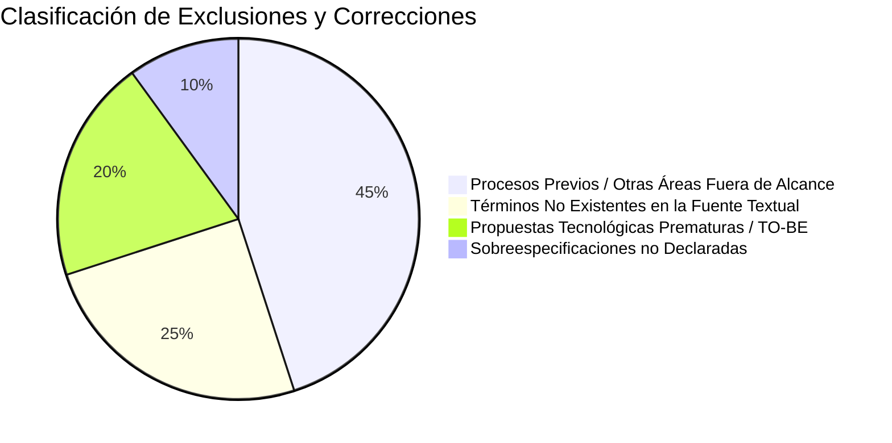

# Trazabilidad y Registro de Depuración

> **Proyecto:** Diseño e Implementación de Arquitectura Empresarial — Caso Yanbal Perú  
> **Área Operativa:** Cadena de Distribución y Transporte  
> **Alcance del Proceso:** Despacho $\longrightarrow$ Transporte/Ruta $\longrightarrow$ Llegada $\longrightarrow$ Entrega $\longrightarrow$ Actualización $\longrightarrow$ Consulta  
>
> **Navegación:** [[01 - Matriz Consolidada de Requerimientos]] | [[02 - Especificación de Requerimientos Funcionales]] | [[03 - Especificación de Requerimientos No Funcionales]]  
> **Enlaces al AS-IS:** [[01 - Proceso actual]] | [[02 - Actores relevantes]] | [[03 - Actividades y eventos]] | [[04 - Sistemas e información]] | [[05 - Problemas y desfases]] | [[06 - Evidencia y fuentes]]

---

## 1. Propósito del Documento

Este documento constituye el **instrumento de auditoría y control de calidad metodológico** de la Matriz de Requerimientos. Su propósito es:
1. Demostrar la **coherencia estricta y trazabilidad bidireccional** entre los problemas identificados en el AS-IS, las actividades del proceso, los requerimientos formulados (RF y RNF), los actores responsables y las citas textuales de la transcripción de la entrevista ([`trascrito.text`](file:///c:/Users/joses/Obsidian/arq-emp%20AS-IS/Entrevista/trascrito.text)).
2. Registrar formalmente el **inventario de elementos excluidos**, fundamentando por qué fueron descartados del alcance delimitado o por qué no contaban con sustento textual suficiente.
3. Transparentar la clasificación metodológica de cada requisito, diferenciando con honestidad técnica lo **explícitamente sustentado**, lo **derivado de una necesidad expresada** y lo **pendiente de validar**.

---

## 2. Matriz de Trazabilidad Bidireccional Consolidada

La siguiente tabla refleja con exactitud los mismos IDs, nombres, actores, etapas y sustentos que figuran en la [[01 - Matriz Consolidada de Requerimientos]], [[02 - Especificación de Requerimientos Funcionales]] y [[03 - Especificación de Requerimientos No Funcionales]]:

| ID Requisito | Nombre Exacto del Requerimiento | Problema / Necesidad AS-IS | Actividad AS-IS Asociada | Actor Responsable | Clasificación Metodológica | Fuente Primaria (`trascrito.text`) |
|:---:|:---|:---|:---|:---|:---:|:---|
| **RF-01** | Clasificación geográfica de pedidos para despacho | Canalización y zonificación de despachos | [[03 - Actividades y eventos#ACT-02\|ACT-02]] | Supervisor de Despacho | `[Derivado de una necesidad expresada]` | Líneas 14, 16-17 (min 17:41–17:53, 19:04–19:15) |
| **RF-02** | Gestión de datos de socio logístico y modalidad de transporte | Vinculación del transportista y modo de envío | [[03 - Actividades y eventos#ACT-03\|ACT-03]] | Supervisor de Despacho | `[Derivado de una necesidad expresada]` | Líneas 4, 14, 17-18 (min 1:24, 18:02, 19:15–19:30) |
| **RF-03** | Registro de salida de despacho del Centro de Distribución | Transferencia formal de custodia en despacho | [[03 - Actividades y eventos#ACT-05\|ACT-05]] | Supervisor de Despacho | `[Explícitamente sustentado]` | Línea 18 (min 19:04, 19:44) |
| **RF-04** | Gestión y visualización de la promesa de entrega (Lead Time) | Visibilidad del compromiso de entrega (24h/7d) | [[03 - Actividades y eventos#ACT-04\|ACT-04]] | Sistema / Supervisor | `[Explícitamente sustentado (datos)]`<br/>`[Derivado (asociación)]` | Líneas 21-22 (min 22:38–22:54) |
| **RF-05** | Registro de inicio de traslado (Estado 'En Ruta') | Inicio del recorrido físico en transporte | [[03 - Actividades y eventos#ACT-06\|ACT-06]] | Socio Logístico | `[Explícitamente sustentado]` | Línea 18 (min 19:44–19:53) |
| **RF-06** | Registro de entrega exitosa (Estado 'Entregado') | Cierre formal de la distribución física | [[03 - Actividades y eventos#ACT-08\|ACT-08]] | Socio Logístico | `[Explícitamente sustentado (estado)]`<br/>`[Derivado (datos temporales)]` | Línea 18 (min 19:53) |
| **RF-07** | Registro de la identidad del receptor real | **PR-05:** Receptor real no comunicado (persona autorizada) | [[03 - Actividades y eventos#ACT-09\|ACT-09]] | Socio Logístico | `[Derivado de una necesidad expresada]` | Línea 25 (min 24:45–25:01) |
| **RF-08** | Registro de entrega fallida e incidencias en ruta/destino | Gestión de contingencias (retraso, pérdida, daño) | [[03 - Actividades y eventos#ACT-10\|ACT-10]] | Socio Logístico | `[Explícitamente sustentado]` | Línea 19 (min 20:03–20:30) |
| **RF-09** | Registro de retorno de carga por logística inversa | Retorno físico del pedido no entregado | [[03 - Actividades y eventos#ACT-11\|ACT-11]] | Socio Logístico | `[Explícitamente sustentado (retorno)]` | Líneas 19-20 (min 20:30–20:55) |
| **RF-10** | Sincronización y disponibilidad de estados de distribución | **PR-03:** Desfase de hasta 2 horas en tracking | [[03 - Actividades y eventos#ACT-12\|ACT-12]] | Sistema (Sincronización) | `[Derivado de una necesidad expresada]` | Líneas 23-24, 33-35 (min 23:19–24:18, 0:49–1:16 p2) |
| **RF-11** | Consulta de trazabilidad con soporte multicriterio | Seguimiento por N° Pedido o Cód. Consultora | [[03 - Actividades y eventos#ACT-13\|ACT-13]] | Consultora / Agente | `[Explícitamente sustentado]` | Líneas 21-22 (min 22:03–22:28) |
| **RF-12** | Visualización de datos del receptor en la consulta | **PR-04 / PR-05:** Reclamos injustificados por no-entrega | [[03 - Actividades y eventos#ACT-14\|ACT-14]] | Consultora / Agente | `[Derivado de una necesidad expresada]` | Líneas 24-25 (min 24:29–25:01) |
| **RNF-01** | Tiempo de propagación de estados de entrega | **PR-03 / NEC-01:** Reducción de latencia (2h a $\le 30$ min) | Transversal | Sistema | `[Pendiente de validar (meta $\le 30$ min)]` | Líneas 23, 35 (min 23:29, 1:07 p2) |
| **RNF-02** | Soporte territorial nacional y operación multimodal | Cobertura 24 depto. (terrestre, bimodal, aérea) | Transversal | Jefatura Distribución | `[Explícitamente sustentado]` | Líneas 17-18 (min 19:23–19:30) |
| **RNF-03** | Capacidad para grandes volúmenes de datos y disponibilidad | Manejo de gran volumen de data y disponibilidad | Transversal | Infraestructura / TI | `[Explícitamente sustentado (cualitativo)]`<br/>`[Pendiente de validar (SLA numérico)]` | Línea 36 (min 1:24 parte 2) |
| **RNF-04** | Interoperabilidad mediante Bus de Integración corporativo | Conexión e integración con ecosistema Yanbal | Transversal | TI Corporativa | `[Explícitamente sustentado (restricción)]` | Líneas 32, 36 (min 29:00–29:09, 2:12–2:20 p2) |
| **RNF-05** | Restricción de acceso según nivel de rol | Control de atribuciones: operativo vs. gestión | Transversal | Seguridad / Accesos | `[Explícitamente sustentado (principio)]`<br/>`[Derivado (matriz detallada)]` | Líneas 28-29 (min 25:38–26:43) |
| **RNF-06** | Validación formal de seguridad informática | Prevención de vulnerabilidades en distribución | Transversal | Seguridad Informática | `[Explícitamente sustentado (restricción)]`<br/>`[Derivado (mecanismos)]` | Línea 36 (min 1:37–1:49 parte 2) |
| **RNF-07** | Facilidad de uso y adaptación a la operación de Yanbal | Facilidad de adopción ergonómica en el flujo real | Transversal | Socio Logístico | `[Explícitamente sustentado (cualitativo)]`<br/>`[Pendiente de validar (métricas)]` | Línea 36 (min 1:57–2:20 parte 2) |

---

## 3. Registro Explícito de Elementos Descartados y Justificación

Para asegurar que la matriz no traslade información ajena ni asuma conceptos no sustentados, se detalla la justificación técnica de cada descarte aplicado tras la auditoría:



### A. Correcciones Específicas por Falta de Evidencia Textual
1. **Eliminación definitiva de "Manifiesto de Carga":**  
   - *Justificación:* Búsqueda textual en `trascrito.text` arrojó **cero coincidencias**. Era un término importado sin sustento en la entrevista. En su lugar, RF-03 se denomina estrictamente *"Registro de salida de despacho del Centro de Distribución"* con estado *"Despachado"*.
2. **Eliminación de Causales No Sustentadas en Entrega Fallida (RF-08):**  
   - *Justificación:* La propuesta inicial incorporaba *"destinatario ausente"* y *"dirección errónea o inaccesible"*. La fuente (`min 20:03–20:15`) cita textualmente como causales únicamente: **retraso, pérdida y daño**. Se eliminaron las demás para evitar listas arbitrarias.
3. **Eliminación de la Delimitación Extrema de Roles (RNF-05):**  
   - *Justificación:* Se descartó sobre-especificar reglas fijas para transportistas, consultoras o analistas como si fueran mandatos textuales. Se preservó el principio general declarado por Joao: los roles operativos ejecutan tareas y los de gestión realizan modificaciones o configuraciones de parámetros.
4. **Eliminación de Referencias a "Campañas Comerciales" (RNF-03):**  
   - *Justificación:* La entrevista confirma cualitativamente la necesidad de gran capacidad para manejar volúmenes de data (`min 1:24 p2`), pero **no menciona campañas ni cierres comerciales**. Se eliminó esa asociación no fundamentada.
5. **Eliminación de Prohibiciones Arquitectónicas No Declaradas (RNF-04):**  
   - *Justificación:* Se retiró la frase *"prohibiendo conexiones punto a punto propietarias y no estandarizadas"*, manteniendo la interoperabilidad mediante el Bus corporativo como una restricción existente sin juicios de diseño adicionales.
6. **Eliminación de Presupuestos Tecnológicos en Usabilidad (RNF-07):**  
   - *Justificación:* Se eliminaron las menciones a *"movilidad"*, *"vía pública"* o límites de pasos/clics, dado que Joao Condorpusa únicamente indicó que los sistemas deben estar *"adaptados específicamente para la operación de Yanbal"* (`min 1:57–2:20 p2`).

### B. Delimitación Estricta de Frontera en Logística Inversa (RF-09)
En la versión inicial, RF-09 extendía su alcance hacia:
- Activación de pedidos de reposición comercial.
- Peritaje de Control de Calidad en almacén.
- Evaluación de Seguridad Patrimonial.
- Activación de pólizas de seguros.

*Motivo de Exclusión:* Aunque el entrevistado menciona que estos eventos ocurren cuando un paquete retorna (`min 20:55–21:35`), todos ellos suceden **dentro del almacén central y corresponden a procesos de calidad, almacén y finanzas**, quedando fuera del alcance *Despacho $\rightarrow$ Transporte $\rightarrow$ Entrega*. Por consiguiente, la trazabilidad de **RF-09 concluye estrictamente en el registro del retorno físico a cargo del socio logístico**.

### C. Descarte de Procesos de Otras Áreas
- **Gestión de Tickets de Reclamo (Ex RF-014):** Se descartó por corresponder al proceso de CRM/Mesa de Ayuda en CELLFORCE/Salesforce, fuera del límite operativo de distribución.
- **Manufactura, Envasado, Almacén de PT y Picking (SPY):** Excluidos por ocurrir antes de la llegada del pedido a la zona de despacho.
- **Facturación Comercial y Catálogo (Maya / SAP Commerce):** Excluidos por pertenecer a la etapa de comercialización previa.
- **Control de Inventario y Merma (PR-01 y PR-02):** Excluidos por corresponder a la administración de existencias en planta y almacén.

---

## 4. Control de Consistencia entre los Cuatro Documentos

Se ha verificado rigurosamente que los cuatro documentos de la carpeta [`Matriz de Requerimientos`](file:///c:/Users/joses/Obsidian/arq-emp%20AS-IS/Matriz%20de%20Requerimientos) mantengan una correspondencia unívoca:

```
01 - Matriz Consolidada   <===>   02 - Especificación RF   <===>   03 - Especificación RNF   <===>   04 - Trazabilidad y Registro
      [Tabla Maestra]                 [Fichas Técnicas]               [Fichas Técnicas]                [Auditoría Cruzada]
```

- **Consistencia de Identificadores:** Los 12 RF (RF-01 a RF-12) y los 7 RNF (RNF-01 a RNF-07) conservan idéntico código en todos los archivos.
- **Consistencia de Nombres:** Ningún requisito cambia de denominación entre un documento y otro (ej. RF-03 se titula uniformemente *"Registro de salida de despacho del Centro de Distribución"* y RF-09 *"Registro de retorno de carga por logística inversa"*).
- **Consistencia de Estados de Validación:** Los aspectos pendientes de validar (meta de $\le 30$ min en RNF-01, SLA numérico en RNF-03 y métricas de usabilidad en RNF-07) están explícitamente etiquetados con el mismo criterio en las matrices y fichas.
- **Consistencia de Alcance:** Ningún archivo contiene requerimientos de manufactura, picking, almacén, inventario ni ticketing de CRM.

---

## 5. Resumen Cuantitativo Final de la Matriz

- **Requerimientos Funcionales Definitivos:** 12
  - *Explícitamente sustentados en la fuente:* 6 (RF-03, RF-05, RF-06, RF-08, RF-09, RF-11)
  - *Derivados de necesidades expresadas:* 6 (RF-01, RF-02, RF-04, RF-07, RF-10, RF-12)
- **Requerimientos No Funcionales Definitivos:** 7
  - *Explícitamente sustentados como restricciones:* 4 (RNF-02, RNF-04, RNF-05, RNF-06)
  - *Cualitativos confirmados con métricas pendientes de validar:* 3 (RNF-01, RNF-03, RNF-07)
- **Total General de Requerimientos:** **19**

Este registro consolida la depuración definitiva, dejando la Matriz de Requerimientos completamente sustentada, alineada con las fuentes y lista para la siguiente fase metodológica.
