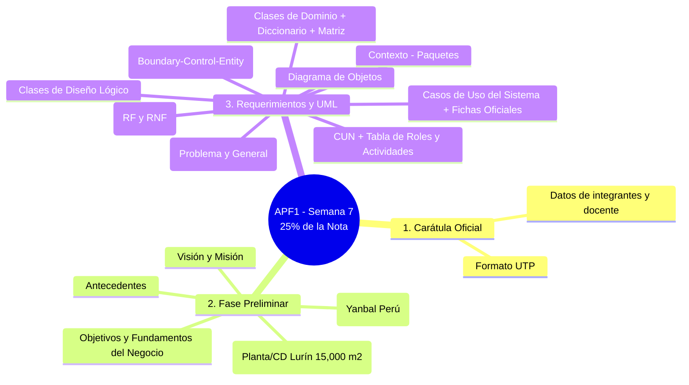

# Base de Conocimiento Académica: Curso de Arquitectura Empresarial

> **Asignatura:** Diseño e Implementación de Arquitectura Empresarial (100000S06I)  
> **Universidad Tecnológica del Perú (UTP)** — Ciclo 2026-2  
> **Carpeta:** `curso/`  
> **Propósito:** Repositorio de referencia académica estructurado en Markdown nativo a partir de los documentos oficiales y presentaciones del curso para consulta directa en Obsidian.

---

## 1. Índice de Documentos del Curso

```
curso/
├── 📄 [[01 - Sílabo - Diseño e Implementación de Arquitectura Empresarial]]
│    └── Marco curricular, fórmula de evaluación (25% APF1, 25% APF2, 10% PA, 40% PROY) y cronograma.
│
├── 📄 [[02 - Guía Oficial de Propuesta de Proyecto Final]]
│    └── Estándar, estructura obligatoria de entregables y rúbrica para APF1, APF2 y PROY.
│
├── 📄 [[03 - Sesión 2 - Laboratorio de Proyectos de Software y Herramientas CASE]]
│    └── Visual Paradigm, taxonomía completa de diagramas UML (Estructurales vs Comportamiento).
│
├── 📄 [[04 - Sesión 8 - Ingeniería de Requerimientos y Casos de Uso]]
│    └── Proceso de requerimientos, relaciones UML y plantilla oficial UTP para fichas de casos de uso.
│
├── 📄 [[05 - Manual de Proyectos UML - Diagramas y Modelado Orientado a Objetos]]
│    └── Semántica de clases, asociaciones, agregación, composición, multiplicidad y ciclo de vida de objetos.
│
└── 📄 [[06 - Sesión 1 - Fundamentos de Metodología RUP y Gestión de Proyectos]]
     └── Ciclo de vida, gestión de riesgos, pilares de RUP (4 fases, 9 disciplinas) y las 6 mejores prácticas.
```

---

## 2. Correspondencia entre Archivos Originales y Notas Markdown

| Archivo PDF Original | Nota Markdown Enriquecida | Rol en el Proyecto |
| :--- | :--- | :--- |
| `DISEÑOEIMPLEMENTACIÓNDEARQUITECTURAEMPRESARIAL_undefined.pdf` | [[01 - Sílabo - Diseño e Implementación de Arquitectura Empresarial]] | **Normativa rectora:** define calendario, ponderaciones y competencias. |
| `Propuesta de Proyecto.pdf` | [[02 - Guía Oficial de Propuesta de Proyecto Final]] | **Rúbrica rectora:** define la estructura obligatoria de entrega de APF1. |
| `PPT_Sesión 2_Gestión_Proyectos_SW_completo.pdf` | [[03 - Sesión 2 - Laboratorio de Proyectos de Software y Herramientas CASE]] | **Herramienta CASE:** catálogo de diagramas UML a utilizar. |
| `PPT_Sesión 8_Ingeniería_Requerimientos_completo.pdf` | [[04 - Sesión 8 - Ingeniería de Requerimientos y Casos de Uso]] | **Plantilla técnica:** formato estándar para documentar Casos de Uso. |
| `Proyectos_UML.pdf` | [[05 - Manual de Proyectos UML - Diagramas y Modelado Orientado a Objetos]] | **Fundamento de modelado:** reglas de clases de dominio, análisis y diseño. |
| `S01_ s1- Material Teorico-DisenoArquitecturaEmpresarial.pdf` | [[06 - Sesión 1 - Fundamentos de Metodología RUP y Gestión de Proyectos]] | **Marco metodológico:** fases de RUP y gestión de riesgos. |

---

## 3. Matriz de Requisitos Exigidos para el Entregable Actual (APF1 - Semana 7)

Conforme a la [[02 - Guía Oficial de Propuesta de Proyecto Final]], los elementos requeridos son:


