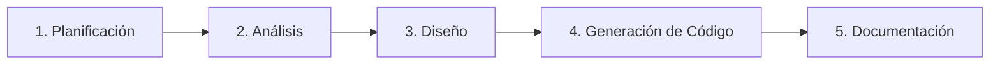
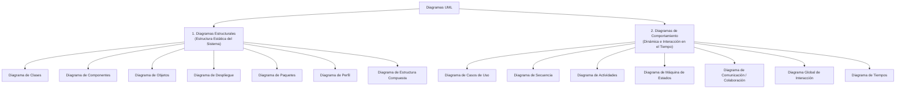

# Sesión 2: Laboratorio de Desarrollo de Software y Herramientas CASE

> **Unidad 1:** Gestión de Requerimientos  
> **Tema:** Proyectos de Desarrollo de Software / Herramienta de Modelado CASE  
> **Software oficial:** Visual Paradigm Community Edition  
> **Documento origen:** `PPT_Sesión 2_Gestión_Proyectos_SW_completo.pdf`

---

## 1. Concepto de Herramienta CASE

Una herramienta **CASE** (*Computer Aided Software Engineering* / Ingeniería de Software Asistida por Computadora) es una aplicación de software multiplataforma orientada a dar soporte tecnológico a todo el ciclo de vida del desarrollo de software:

### Visual Paradigm Community Edition
Es la herramienta seleccionada en el curso para estandarizar los modelos UML bajo el enfoque del Proceso Unificado de Rational (**RUP**). Permite asegurar coherencia entre los requisitos del cliente y los modelos lógicos y físicos de la arquitectura.

---

## 2. Clasificación Oficial de Diagramas UML

Los diagramas de UML (Lenguaje de Modelado Unificado) se dividen en dos grandes familias:

### 2.1. Diagramas Estructurales (Visión Estática)

| Tipo de Diagrama | Definición y Propósito | Aplicación en el Proyecto |
| :--- | :--- | :--- |
| **Diagrama de Clases** | Muestra la estructura estática del sistema, sus clases, atributos, operaciones y relaciones (herencia, asociación, agregación, composición). | **APF1** (Dominio, Análisis y Diseño) |
| **Diagrama de Componentes** | Representa cómo se organizan los componentes modulares de software y sus dependencias técnicas. | **APF2** (Unidad 2) |
| **Diagrama de Objetos** | Representa instancias de clases capturando un estado específico en un instante de tiempo. | **APF1** (Escenario ilustrativo) |
| **Diagrama de Despliegue** | Muestra la arquitectura física de los componentes de hardware, nodos y servidores en la nube. | **PROY** (Unidad 3) |
| **Diagrama de Paquetes** | Organiza elementos del modelo en grupos lógicos y módulos de alto nivel. | **APF1** (Contexto / Paquetes) |
| **Diagrama de Perfil** | Extiende la semántica de UML mediante estereotipos, tagged values y restricciones (ej: `<<microservice>>`). | **PROY** (SOA / Microservicios) |
| **Estructura Compuesta** | Modela los detalles internos y puertos de clases y componentes complejos. | Apoyo técnico avanzado |

### 2.2. Diagramas de Comportamiento (Visión Dinámica)

| Tipo de Diagrama | Definición y Propósito | Aplicación en el Proyecto |
| :--- | :--- | :--- |
| **Diagrama de Casos de Uso** | Define la funcionalidad del sistema desde la perspectiva del usuario y sus interacciones. | **APF1** (CUN y Casos de Uso de Sistema) |
| **Diagrama de Secuencia** | Muestra la interacción entre objetos organizada en una secuencia temporal de mensajes. | **APF2** (Integración técnica Fase B) |
| **Diagrama de Actividades** | Modela el flujo de trabajo o proceso de negocio paso a paso (decisiones, paralelismos, responsables). | **APF1** (Proceso AS-IS y problema) |
| **Máquina de Estados** | Describe los diferentes estados por los que transita un objeto y los eventos que provocan transiciones. | Modelado de ciclo de vida de pedidos |
| **Comunicación / Colaboración**| Enfatiza la organización estructural de los objetos que intercambian mensajes. | Alternativa a secuencia en APF2 |
| **Descripción General de Interacción** | Ofrece una vista de alto nivel combinando actividades y fragmentos de interacción. | Visión de orquestación macro |
| **Diagrama de Tiempos** | Modela el cambio de estado de los objetos a lo largo de una línea de tiempo cuantificable. | Análisis de latencia y SLA |

---

## 3. Actividad de Aplicación y Práctica de Laboratorio

1. **Herramienta CASE:** Instalación y configuración de Visual Paradigm Community Edition ([tutorial de referencia](https://www.youtube.com/watch?v=cbSgA0Ml438)).
2. **Investigación comparativa:** Evaluar 3 herramientas CASE alternativas para modelado RUP (ej: Enterprise Architect, StarUML, Draw.io/PlantUML).
