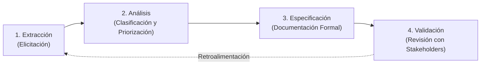
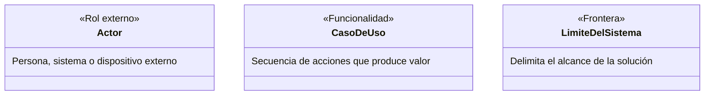
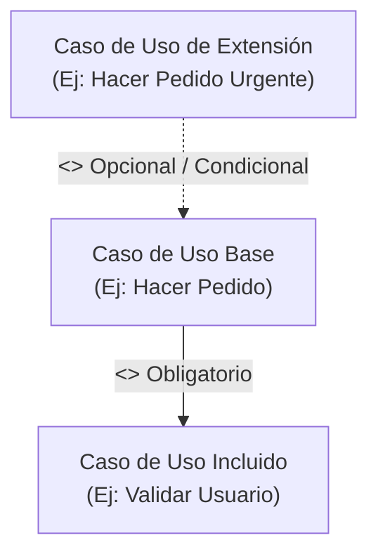

# Sesión 8: Ingeniería de Requerimientos y Casos de Uso

> **Unidad 1:** Gestión de Requerimientos  
> **Tema:** Proceso de Ingeniería de Requerimientos y Documentación de Casos de Uso  
> **Herramienta CASE:** Visual Paradigm  
> **Documento origen:** `PPT_Sesión 8_Ingeniería_Requerimientos_completo.pdf`

---

## 1. El Proceso de Ingeniería de Requerimientos

La **Ingeniería de Requerimientos** es el proceso sistemático de recopilar, analizar y verificar las necesidades de los usuarios y del negocio para un sistema informático, con la meta de entregar una especificación de requisitos de software correcta, no ambigua y completa.

### Las 4 Actividades Fundamentales
1. **Extracción (Elicitación):** Descubrimiento de requerimientos mediante entrevistas con usuarios clave, cuestionarios, observación directa y análisis de procesos actuales.
2. **Análisis:** Resolución de conflictos, identificación de dependencias, delimitación de fronteras y categorización en Requerimientos Funcionales (RF) y No Funcionales (RNF).
3. **Especificación:** Redacción estructurada mediante casos de uso, matrices de trazabilidad y modelos visuales.
4. **Validación:** Confirmación formal con el cliente de que los requisitos capturados corresponden exactamente a las necesidades operativas de la organización.

---

## 2. Modelo de Casos de Uso (UML)

Técnica orientada a documentar el comportamiento funcional del sistema desde el punto de vista de los usuarios que interactúan con él.

### 2.1. Elementos y Simbología

### 2.2. Relaciones entre Casos de Uso

- **Asociación de Comunicación:** Línea continua entre un Actor y un Caso de Uso.
- **Relación de Inclusión (`<<include>>`):** El caso de uso base ejecuta obligatoriamente la funcionalidad del caso de uso incluido para completarse con éxito.
- **Relación de Extensión (`<<extend>>`):** El caso de uso extensor complementa al caso base solo cuando se cumple una condición o punto de extensión específico.
- **Generalización:** Relación de herencia entre actores o entre casos de uso donde el elemento hijo hereda las características y comportamiento del elemento padre.

---

## 3. Plantilla Oficial UTP para Documentación de Casos de Uso

La guía del curso establece el siguiente estándar tabular obligatorio para documentar cada caso de uso:

| Campo | Especificación del Estándar UTP | Ejemplo de la Sesión |
| :--- | :--- | :--- |
| **Nombre:** | Código identificador y nombre en infinitivo. | `CDU15 - Editar Formulario o Boletines` |
| **Actor:** | Rol o roles autorizados para ejecutar el caso. | `Administrador (ADM)` |
| **Descripción:** | Resumen conciso del valor o propósito de la función. | Proceso para gestionar el formulario de contacto y boletines explicativos. |
| **Precondiciones:** | Estado que debe cumplir el sistema antes de iniciar. | Usuario autenticado con perfil de administrador activo. |
| **Flujo Normal:** | Secuencia numerada paso a paso de la interacción:   1. El usuario realiza una acción en la interfaz.   2. El sistema procesa y muestra opciones.   3. El usuario completa los datos requeridos.   4. El sistema valida, persiste y emite confirmación. | 1. El usuario accede al panel de administración.   2. El sistema muestra opciones de edición.   3. El usuario edita información.   4. El sistema arroja mensaje de confirmación. |
| **Flujo Alternativo:** | Caminos de excepción numerados (ej: 4.1):   4.1. El sistema detecta datos inválidos, bloquea la acción y notifica el error. | 4.1. El sistema no permite editar y notifica la restricción al usuario. |
| **Postcondiciones:** | Estado final del sistema tras la ejecución exitosa. | La información queda actualizada y disponible inmediatamente. |

---

## 4. Ejemplo Integrado en Visual Paradigm (Sistema de Ventas)

Durante la sesión se modeló un caso de estudio de tienda virtual con:
- **Actores:** `Cliente`, `Vendedor`, `Cajero`.
- **Casos de Uso Principales:** `Consultar Producto`, `Registrar Venta` (con punto de extensión `Gestionar Cliente` e inclusión obligatoria de `Generar Comprobante`), `Registrar Pago` y `Controlar Entrega de Productos`.
