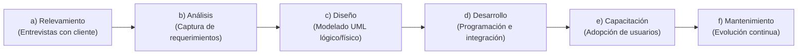
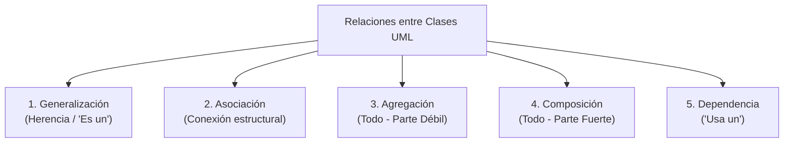

# Manual de Proyectos UML: Modelado Estructural y de Comportamiento

> **Referencia Académica:** Cátedra de Paradigmas de Programación (UTN - FRT)  
> **Autor:** Prof. Ubaldo José Bonaparte  
> **Documento origen:** `Proyectos_UML.pdf`  
> **Propósito:** Guía de referencia sobre la semántica formal de diagramas UML, relaciones entre clases, multiplicidad y ciclo de vida de objetos.

---

## 1. Etapas del Ciclo de Vida del Software

Antes de iniciar la codificación, el desarrollo de software requiere transitar por etapas formales de ingeniería:



UML proporciona la simbología gráfica universal para capturar las ideas del cliente en las etapas de **análisis y diseño**, asegurando que el equipo de trabajo y los directivos compartan una comprensión idéntica del sistema.

---

## 2. Anatomía de una Clase en UML

Una **clase** es una categoría o plantilla que agrupa objetos con atributos y operaciones similares. Se representa mediante un rectángulo dividido en tres secciones:

```
┌────────────────────────────────────────────────────────┐
│ NombreDeLaClase                                        │
├────────────────────────────────────────────────────────┤
│ - visibilidad atributo : Tipo                          │
│ - idPedido : String                                    │
│ - fechaCreacion : Date                                 │
├────────────────────────────────────────────────────────┤
│ + visibilidad metodo(parametros) : TipoRetorno         │
│ + calcularTotal() : Double                             │
│ + cambiarEstado(nuevoEstado : String) : Boolean        │
└────────────────────────────────────────────────────────┘
```

- **Visibilidad:**
  - `-` Privado (*Private*): Solo accesible desde los métodos internos de la propia clase.
  - `+` Público (*Public*): Accesible desde cualquier otra clase o componente.
  - `#` Protegido (*Protected*): Accesible por la clase y sus clases derivadas.

---

## 3. Tipos de Relaciones entre Clases

La comprensión de las relaciones es crítica para diseñar correctamente el **Diagrama de Clases de Dominio**, las **Clases de Análisis** y las **Clases de Diseño** en el APF1:



### 3.1. Generalización (Herencia)
- **Concepto:** Relación jerárquica donde las clases derivadas (*hijas*) heredan propiedades y métodos de una clase base (*padre*). Permite polimorfismo.
- **Símbolo:** Flecha con punta triangular hueca que apunta hacia la clase superior.
- **Ejemplo:** `Persona` generaliza a `Estudiante` y `Profesor`. En logística: `Transporte` generaliza a `TransporteTerrestre` y `TransporteAereo`.

### 3.2. Asociación Simple
- **Concepto:** Vínculo bidireccional o unidireccional que describe que los objetos de una clase colaboran o intercambian datos con objetos de otra.
- **Símbolo:** Línea continua (con flecha abierta si tiene navegabilidad definida).
- **Multiplicidad:** Indica cuántas instancias pueden relacionarse:
  - `1`: Exactamente una.
  - `0..1`: Cero o una (opcional).
  - `1..*`: Una o muchas.
  - `*` o `0..*`: Cero o muchas.

### 3.3. Agregación (Asociación Débil)
- **Concepto:** Relación "todo-parte" donde las partes **pueden existir de forma independiente** si el contenedor es destruido.
- **Símbolo:** Línea con un **rombo hueco (vacío)** en el extremo de la clase contenedora.
- **Ejemplo del texto:** `Factura` agrega `Cliente` y `Producto`. Si se anula la factura, los clientes y productos siguen existiendo en el catálogo.

### 3.4. Composición (Asociación Fuerte)
- **Concepto:** Relación "todo-parte" estricta donde las partes **no tienen vida útil propia** fuera del contenedor. Si el objeto contenedor se destruye, todos sus objetos compuestos son destruidos con él.
- **Símbolo:** Línea con un **rombo relleno (negro)** en el extremo de la clase contenedora.
- **Ejemplo:** Un `Pedido` se compone de `ItemPedido`. Si el pedido se elimina, los items individuales que lo conformaban dejan de existir.

---

## 4. Diagramas de Comportamiento Dinámico

### 4.1. Diagrama de Actividades
Representa la secuencia paso a paso de actividades que ejecutan los actores y los sistemas. Se compone de:
- **Estado Inicial:** Círculo relleno.
- **Acciones / Actividades:** Rectángulos con esquinas redondeadas.
- **Bifurcaciones / Decisiones:** Rombos con condiciones de guarda entre corchetes `[condición]`.
- **Líneas de partición (Swimlanes):** Carriles que asignan la responsabilidad de cada acción a un rol o sistema específico.
- **Estado Final:** Círculo con borde concéntrico.

### 4.2. Diagrama de Secuencia
Modela el intercambio temporal de mensajes entre objetos o líneas de vida (*lifelines*):
- **Eje horizontal:** Los objetos intervinientes (rectángulos superiores con línea vertical punteada).
- **Eje vertical:** El avance cronológico del tiempo hacia abajo.
- **Mensajes síncronos:** Flechas con punta sólida.
- **Respuestas:** Flechas punteadas con punta abierta.
