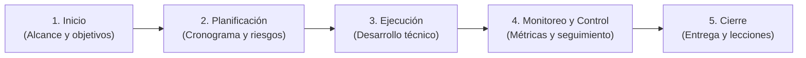
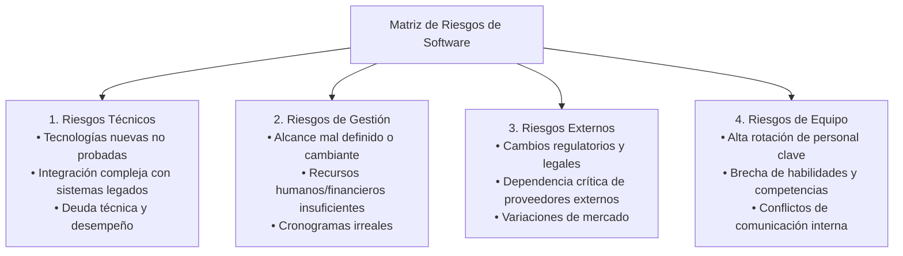
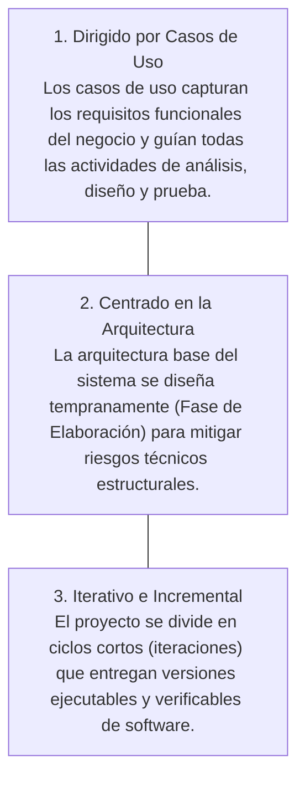

# Sesión 1: Fundamentos de Metodología RUP y Gestión de Proyectos de Software

> **Unidad 1:** Gestión de Requerimientos  
> **Tema:** Ciclo de Vida de Software, Gestión de Riesgos y Proceso Unificado de Rational (RUP)  
> **Institución:** Universidad Tecnológica del Perú (UTP)  
> **Documento origen:** `S01_ s1- Material Teorico-DisenoArquitecturaEmpresarial.pdf`

---

## 1. Fundamentos de la Gestión de Proyectos de Software

Un **proyecto de software** es un esfuerzo temporal emprendido para crear un producto o servicio de software funcional único. Se estructura en 5 etapas estándar de gestión:

> [!CAUTION]
> **El factor crítico de fracaso:**  
> Según el *CHAOS Report* del Standish Group, más del 70% de los proyectos de software fracasan o sufren sobrecostos no por deficiencias técnicas de programación, sino por **fallas en la gestión**, requerimientos ambiguos y falta de control de riesgos.

### Buenas Prácticas vs. Errores Frecuentes

| Dimensión | Buenas Prácticas Recomendadas | Errores Frecuentes que Arruinan Proyectos |
| :--- | :--- | :--- |
| **Alcance** | Delimitar formalmente qué incluye y qué no incluye el proyecto para evitar el *scope creep*. | **Requerimientos vagos:** Iniciar desarrollo sin especificaciones claras, generando retrabajo masivo. |
| **Cronograma** | Estimar tiempos basados en métricas históricas y complejidad real. | **Subestimar tiempos:** Optimismo infundado que conduce a entregas tardías y estrés de equipo. |
| **Calidad** | Gestionar la arquitectura para prevenir la deuda técnica acumulada. | **Ignorar la deuda técnica:** Código desordenado que destruye la mantenibilidad futura. |
| **Pruebas** | Verificación continua de calidad en cada iteración del ciclo. | **Falta de pruebas:** Descubrimiento de defectos graves en producción ante el usuario final. |

---

## 2. Gestión de Riesgos en Proyectos de Software

Un **riesgo** es un evento incierto que, de ocurrir, produce un impacto negativo en el costo, plazo o calidad del proyecto. Su ciclo de administración es continuo:

$$\text{Identificar} \longrightarrow \text{Analizar} \longrightarrow \text{Planificar Respuestas} \longrightarrow \text{Monitorear}$$

### Taxonomía de Riesgos

---

## 3. Metodología RUP (Rational Unified Process)

El **Proceso Unificado de Rational (RUP)** es un marco metodológico iterativo e incremental centrado en la arquitectura y dirigido por casos de uso.

### 3.1. Los Tres Pilares de RUP

### 3.2. Las 4 Fases de RUP

| Fase RUP | Objetivo Primario | Hito Final de la Fase |
| :--- | :--- | :--- |
| **1. Inicio (*Inception*)** | Define el alcance del proyecto, visión, viabilidad técnica/financiera y casos de negocio principales. | Ciclo de Vida: Objetivos aprobados. |
| **2. Elaboración (*Elaboration*)** | **Establece la arquitectura base**, analiza en profundidad los requerimientos y mitiga los riesgos técnicos mayores. | Ciclo de Vida: Arquitectura validada. |
| **3. Construcción (*Construction*)** | Desarrolla los componentes de software restantes de forma iterativa y genera la documentación técnica. | Capacidad Inicial de Operación. |
| **4. Transición (*Transition*)** | Entrega el producto a producción, capacita a los usuarios finales y resuelve incidencias post-despliegue. | Lanzamiento del Producto Final. |

### 3.3. Las 9 Disciplinas de RUP

- **Disciplinas de Ingeniería:**
  1. *Modelado del Negocio* (comprensión de procesos y actores).
  2. *Requerimientos* (captura, análisis y especificación).
  3. *Análisis y Diseño* (modelado lógico y arquitectónico).
  4. *Implementación* (escritura de código y componentes).
  5. *Pruebas* (verificación funcional y de rendimiento).
  6. *Despliegue* (distribución e instalación).
- **Disciplinas de Gestión y Soporte:**
  7. *Gestión de Configuración y Cambios*.
  8. *Gestión del Proyecto*.
  9. *Entorno* (herramientas y procesos CASE).

---

## 4. Las 6 Mejores Prácticas de Desarrollo de Software

RUP y las metodologías modernas resumen las mejores prácticas de la industria en 6 principios universales:

1. **Desarrollo Iterativo:** Construir el software en ciclos cortos para obtener retroalimentación temprana del cliente.
2. **Gestión de Requerimientos:** Capturar, estructurar y rastrear requisitos a lo largo de todo el ciclo de vida mediante matrices de trazabilidad.
3. **Uso de Arquitecturas Basadas en Componentes:** Diseñar módulos desacoplados, altamente cohesivos y reutilizables.
4. **Modelado Visual (UML):** Utilizar diagramas estándar para comunicar el diseño de forma gráfica, precisa y sin ambigüedades.
5. **Verificación Continua de la Calidad:** Realizar pruebas en cada iteración y no postergarlas hasta el final del proyecto.
6. **Control de Cambios Sistemático:** Evaluar el impacto técnico de cualquier solicitud de modificación antes de autorizar su desarrollo.
