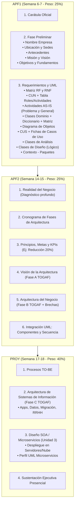

# Guía Oficial de Propuesta de Proyecto Final

> **Curso:** Diseño e Implementación de Arquitectura Empresarial  
> **Institución:** Universidad Tecnológica del Perú (UTP)  
> **Documento rector:** `Propuesta de Proyecto.pdf`  
> **Propósito:** Establecer el estándar, formato y entregables obligatorios para el diseño e implementación de la Arquitectura Empresarial, alineado al sílabo oficial y basado en el marco de trabajo **TOGAF**.

---

## 1. Introducción y Enfoque del Proyecto

El Proyecto Final tiene como objetivo aplicar los marcos de trabajo (**TOGAF**), los principios de **ingeniería de requerimientos** y el **modelado UML** (diagramas estructurales y de comportamiento) para diseñar una arquitectura empresarial orientada a servicios (**SOA**) que responda a un caso de estudio o empresa real propuesto por el equipo.

### Sistema de Evaluación Acumulativa

| Sigla | Entregable | Semana de Entrega | Peso | Enfoque Principal |
| :--- | :--- | :---: | :---: | :--- |
| **APF1** | **Avance de Proyecto Final 1** | **Semana 6 - 7** | **25%** | Fase Preliminar de TOGAF, Gestión de Requerimientos y Modelado UML Inicial. |
| **APF2** | **Avance de Proyecto Final 2** | **Semana 14 - 15** | **25%** | TOGAF Fases A (Visión) y B (Negocio), Análisis de Brechas, Integración UML (Componentes y Secuencia). |
| **PROY** | **Proyecto Final y Sustentación** | **Semana 17 - 18** | **40%** | TOGAF Fase C (Sistemas de Información/Datos), Diseño SOA/Microservicios, Despliegue, Documento Consolidado y Sustentación. |

> [!IMPORTANT]
> **Carácter Acumulativo de los Entregables:**  
> Cada avance debe integrar de manera obligatoria las correcciones indicadas por el docente en la revisión anterior. El documento final (`PROY` en Semana 18) debe contener todo el proyecto consolidado desde la página 1.

---

## 2. Estructura Obligatoria por Entregable

---

## 3. Desglose Detallado del Entregable 1 (APF1)

El documento a entregar en Semana 6-7 debe cubrir obligatoriamente los siguientes 3 capítulos:

### 3.1. Carátula Oficial
Formato institucional UTP que incluye datos del curso, título del caso práctico, docente tutor y lista oficial de integrantes del equipo.

### 3.2. Fase Preliminar: Entorno del Negocio y Principios
- **Nombre de la Empresa:** Razón social y nombre comercial.
- **Ubicación y Sedes:** Localización de instalaciones clave (plantas, centros de distribución, sedes corporativas).
- **Antecedentes de la Empresa:** Trayectoria en el mercado y evolución del modelo operacional.
- **Visión y Misión:** Declaraciones estratégicas vigentes de la empresa.
- **Objetivos y Fundamentos del Negocio:** Metas comerciales, operativas y propuesta de valor.

### 3.3. Ingeniería de Requerimientos y Modelado UML (Apoyo Técnico)

1. **Matriz de Requerimientos:** Listado codificado y clasificado de Requerimientos Funcionales (RF) y Requerimientos No Funcionales (RNF) con prioridad y criterios de validación.
2. **Diagrama de Casos de Uso del Negocio (CUN):** Identificación de actores del negocio y funcionalidades principales. **Obligatorio:** Elaborar la tabla con sus roles y actividades del negocio.
3. **Diagramas de Actividades AS-IS:** 
   - Flujo de los procesos de negocio actuales enfocados en el problema crítico a resolver.
   - Flujo general de los procesos de negocio actuales.
4. **Diagrama de Clases (Nivel Dominio):** Entidades clave del negocio con sus atributos y relaciones conceptuales (sin detalles de implementación de base de datos ni programación). **Obligatorio:** Elaborar el diccionario de datos y matriz de entidades.
5. **Diagrama de Objetos:** Modelado de instancias concretas que ilustren el flujo en un escenario real del negocio.
6. **Diagrama de Casos de Uso del Sistema (CUS):** Funcionalidades iniciales requeridas por la empresa para la solución de software propuesta. **Obligatorio:** Documentar detalladamente los casos de uso mediante fichas técnicas estandarizadas y especificar los requerimientos no funcionales asociados.
7. **Diagrama de Clases de Análisis:** Modelo preliminar de clases estereotipadas según RUP (`<<boundary>>`, `<<control>>`, `<<entity>>`).
8. **Diagrama de Clases del Diseño:** Modelo de diseño lógico generado en base a los casos de uso del sistema.
9. **Diagrama de Contexto - Paquetes:** Vista de alto nivel que delimita las fronteras del sistema propuesto y sus subsistemas / paquetes lógicos.

---

## 4. Condiciones de Entrega y Sustentación

1. **Formato Digital:** El documento formal debe entregarse en formato **PDF** a través de la plataforma virtual (Canvas UTP) en las fechas estipuladas.
2. **Sustentación Presencial (Semana 18):** El equipo presentará una exposición ejecutiva demostrando el problema de la empresa, la solución arquitectónica integral basada en TOGAF y el modelado UML desarrollado a lo largo de las 3 unidades.
