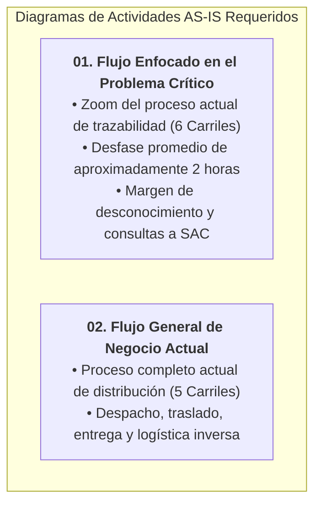

# Índice y Guía Maestra: Diagramas de Actividades AS-IS (Modelado de Procesos Actuales)

> **Carpeta:** `diagram de actividades/`  
> **Proyecto:** Sistema Web y Móvil para la Gestión y Trazabilidad de Despachos y Entregas de Yanbal Perú (Y-Trace)  
> **Curso:** Diseño e Implementación de Arquitectura Empresarial (UTP)  
> **Entregable Oficial:** Avance de Proyecto Final 1 (APF1 — Semanas 6 a 7) — Peso: 25%  
> **Estándar:** UML 2.5 / RUP / TOGAF Fase Preliminar  

---

## 1. Justificación Académica y Requisitos del APF1

En el Capítulo 3.3, numeral 3 de la **Guía Oficial de Propuesta de Proyecto Final (UTP)** se establece como entregable obligatorio:

> *«3. **Diagramas de Actividades AS-IS:**  
>    - Flujo de los procesos de negocio actuales enfocados en el problema crítico a resolver.  
>    - Flujo general de los procesos de negocio actuales.»*

Esta carpeta contiene los **dos diagramas oficiales exigidos**, estructurados rigurosamente con **particiones (*swimlanes*)**, condiciones de guarda y apego estricto a la realidad operativa del negocio:

> [!IMPORTANT]
> **Criterios Metodológicos Fundamentales:**  
> 1. **Conservación de Ambos Modelos:** El **Diagrama 01** realiza un *zoom* sobre la brecha de trazabilidad de 2 horas y su impacto en SAC; el **Diagrama 02** documenta el macro-proceso completo de distribución física que opera hoy en la empresa.
> 2. **Pureza Estricta del AS-IS:** Ninguno de los dos diagramas incorpora requerimientos ni funcionalidades futuras de Y-Trace (como código de activación, App Nativa Android, GPS satelital periódico de la solución ni sincronización offline en `SQLite Room`). Dichos elementos corresponden exclusivamente al modelo **TO-BE**.
> 3. **Integridad del Proceso:** No se elimina ninguna actividad del proceso actual solo porque no exista como requerimiento funcional de software. Los **28 Requerimientos Funcionales (RF)** describen el sistema futuro; el AS-IS describe el proceso que realmente ocurre en el negocio.
> 4. **El Problema Central:** Yanbal **sí tiene tracking** (opera con plataformas como Drivin y ENSDY); el problema radica en que la información **presenta un desfase promedio de 2 horas en actualizarse hacia los canales de consulta**, generando un margen de desconocimiento temporal que Y-Trace resolverá reduciendo dicho desfase a $\le 30$ minutos.

---

## 2. Mapa de Documentos de esta Carpeta

| Documento | Descripción y Enfoque | Formatos Incluidos |
| :--- | :--- | :--- |
| **[[01_DIAGRAMA_ACTIVIDADES_AS_IS_PROBLEMA_CRITICO]]** | Zoom del proceso actual enfocado en el problema de trazabilidad: despacho $\rightarrow$ traslado $\rightarrow$ entrega física $\rightarrow$ registro $\rightarrow$ desfase promedio de 2 horas $\rightarrow$ consulta del solicitante a SAC $\rightarrow$ dificultad para responder $\rightarrow$ actualización posterior a ENTREGADO. | Mermaid nativo + Código PlantUML con 6 *Swimlanes* + Análisis de ineficiencias del AS-IS. |
| **[[02_DIAGRAMA_ACTIVIDADES_AS_IS_GENERAL]]** | Proceso completo actual del negocio de distribución: preparación comercial $\rightarrow$ picking/consolidación $\rightarrow$ zonificación $\rightarrow$ despacho $\rightarrow$ verificación $\rightarrow$ entrega de custodia $\rightarrow$ transporte (24 departamentos) $\rightarrow$ incidencias en ruta o rechazo en destino $\rightarrow$ logística inversa $\rightarrow$ cierre administrativo. | Mermaid nativo + Código PlantUML con 5 *Swimlanes* + Tabla de secuencia de sistemas corporativos. |

---

## 3. Instrucciones para Dibujar o Importar en Visual Paradigm

Para incorporar estos diagramas en el informe final en formato PDF del **APF1**:

1. Abre **Visual Paradigm**.
2. Selecciona **Diagram** $\rightarrow$ **New** $\rightarrow$ **Activity Diagram**.
3. En la barra de herramientas lateral, selecciona la herramienta **Swimlane** (horizontal o vertical).
4. Crea los carriles según la tabla de particiones documentada en cada archivo:
   - **Para el problema crítico (6 carriles):** *Supervisor de Distribución*, *Socio Logístico / Conductor*, *Punto de Destino / Agencia Receptora*, *Sistema de Tracking y Consulta*, *Solicitante / Destinatario*, *Operador SAC / Soporte Logístico*.
   - **Para el flujo general (5 carriles):** *Centro de Distribución (Lurín)*, *Supervisor de Distribución*, *Socio Logístico / Conductor*, *Punto de Destino / Agencia Receptora*, *Administración y Cierre Operativo*.
5. Dibuja las actividades (rectángulos redondeados), decisiones (rombos) y transiciones.
6. Alternativamente, si cuentas con el plugin o visualizador de PlantUML, copia directamente el bloque `@startuml ... @enduml` incluido en cada archivo.

---

## 4. Relación entre Hallazgos AS-IS y Necesidades de la Propuesta TO-BE

Los diagramas AS-IS justifican la necesidad del software sin mezclar ambos niveles metodológicos:
- Las **demoras en conocer el avance y contingencias en ruta** justifican que el TO-BE capture telemetría periódica en segundo plano con soporte offline.
- El **desfase promedio de 2 horas en el tracking actual** justifica que el TO-BE publique eventos al Bus corporativo en un tiempo $\le$ 30 minutos (**RF025**, **RNF006**).
- Las **contingencias en carretera y el proceso de logística inversa** demuestran la importancia de contar con un canal estandarizado de reporte externo y Cancelación Forzada del Seguimiento (**RF009**).
- La **falta de confirmación inmediata en destino** justifica incorporar la detección por geocerca (**RF015**) y confirmación manual consciente sin fotografías (**RF016**).
- La **dificultad para responder con certeza en SAC** justifica un buscador indexado de timeline histórico que recupere la traza certificada en $< 2.0$ segundos (**RF023**, **RNF015**).
