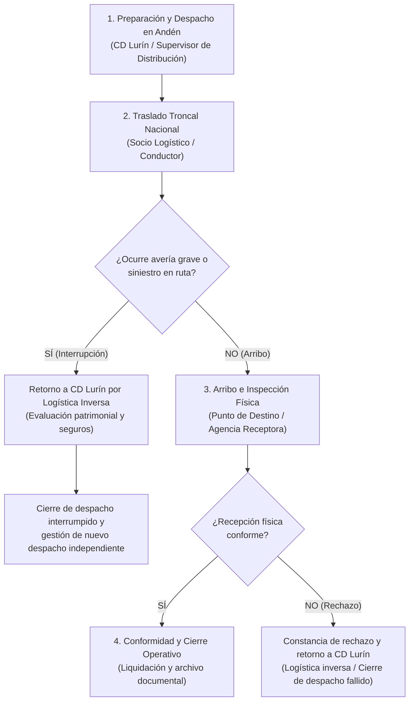
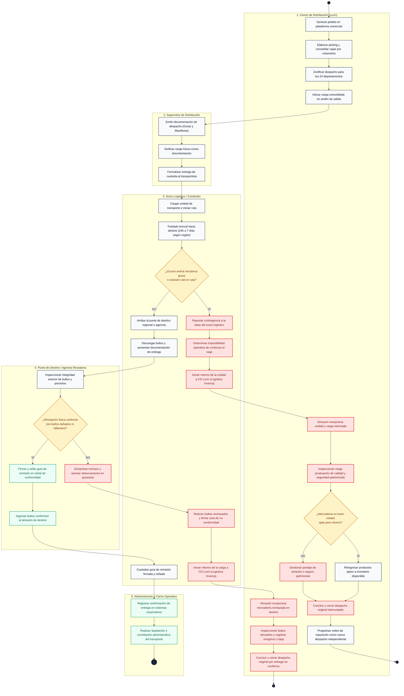
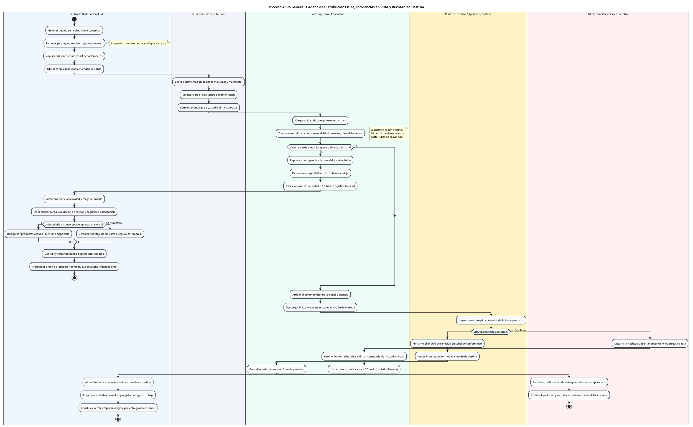

# Diagrama de Actividades AS-IS: Flujo General de los Procesos de Negocio Actuales de Distribución

> **Ubicación:** `diagram de actividades/02_DIAGRAMA_ACTIVIDADES_AS_IS_GENERAL.md`  
> **Curso:** Diseño e Implementación de Arquitectura Empresarial (UTP) — Entregable APF1 (Semana 6 - 7)  
> **Proyecto:** Sistema Web y Móvil para la Gestión y Trazabilidad de Despachos y Entregas de Yanbal Perú (Y-Trace)  
> **Fuente Operativa:** Entrevista oficial al **Ing. Joao Condorpusa Mendoza** (Encargado del Área de Distribución de Yanbal Perú), minutos 20:18 a 21:35 (Logística inversa, retornos y reposición de despachos).  
> **Estándar de Modelado:** UML 2.5 / Metodología RUP (Diagrama de Actividades General con Particiones / *Swimlanes*).

---

## 1. Alcance del Flujo General del Negocio Actual (AS-IS)

Mientras que el diagrama del problema crítico focaliza la latencia de actualización del tracking y su impacto en SAC, este **Diagrama de Actividades General** describe el proceso completo del negocio de distribución física de Yanbal de extremo a extremo, reflejando fielmente la operación actual descrita en la entrevista:

> [!NOTE]
> **Rigor Metodológico del Proceso General:**  
> Este diagrama representa **las actividades del negocio que ocurren actualmente en la realidad operativa**. Las actividades de preparación física (picking/consolidación) en CD Lurín, verificación física en andén, transporte troncal interprovincial, gestión de contingencias viales con retorno a almacén (logística inversa), inspección en destino y cierre administrativo forman parte del proceso real actual del negocio. No se introducen requerimientos futuros (RF001–RF028, RNF, Y-Trace ni Bus corporativo), los cuales corresponden estrictamente a la arquitectura **TO-BE**.

---

## 2. Particiones (*Swimlanes*) del Proceso General

Las responsabilidades operativas se estructuran en **5 Carriles (Particiones)** claramente delimitados:

1. **Centro de Distribución (Lurín):** Almacén central de Yanbal encargado de la recepción de órdenes comerciales, preparación física (*picking*), consolidación de pedidos por volumetría en 8 tipos de cajas, zonificación departamental y recepción/evaluación de retornos por logística inversa (peritaje de calidad, gestión de seguros y reingreso de mercadería).
2. **Supervisor de Distribución:** Responsable de verificar la carga física consolidada contra las guías de remisión y el manifiesto, emitir la documentación oficial de despacho y formalizar el traspaso de custodia al transportista.
3. **Socio Logístico / Conductor:** Transportista asociado a cargo del traslado físico troncal hacia los 24 departamentos (modalidades terrestre, bimodal o aérea), reporte y gestión de averías mecánicas o siniestros en carretera, entrega física en el punto de destino, y ejecución del retorno vehicular bajo logística inversa cuando se produzca una interrupción en ruta o un rechazo en destino.
4. **Punto de Destino / Agencia Receptora:** Agencia departamental o receptor comercial autorizado en destino. Recepciona el vehículo, descarga los paquetes, inspecciona la integridad física exterior de bultos y precintos contra las guías de remisión, y emite el dictamen de conformidad física o acta de rechazo (entrega no conforme).
5. **Administración y Cierre Operativo:** Área administrativa responsable del registro de confirmaciones en sistemas corporativos (SAP/ERP), control documental de guías firmadas y conciliación/liquidación del servicio de transporte.

---

## 3. Diagrama Visual Interactivo en Obsidian (Mermaid)

---

## 4. Código PlantUML Oficial con Particiones (*Swimlanes*)

---

## 5. Secuencia y Relación de Sistemas Corporativos en el Proceso Actual

Para mantener la fidelidad a la operación actual descrita en la entrevista, los sistemas corporativos vigentes intervienen ordenadamente en sus respectivas fases:

| Etapa Operativa | Sistema / Componente de Soporte Actual | Función en el Negocio Real Vigente |
| :--- | :--- | :--- |
| **1. Generación Comercial** | Maya / SAP Commerce | Ingreso comercial de pedidos y transmisión de órdenes consolidadas a almacén. |
| **2. Preparación y Picking** | SPY (Gestor de Picking in-house) | Optimización del recorrido de preparación y cubicaje de pedidos en 8 tipos de cajas. |
| **3. Despacho y Custodia** | Centro de Distribución Lurín / Guías Físicas | Zonificación departamental, emisión de guías de remisión impresas y entrega de custodia. |
| **4. Transporte y Seguimiento** | Socio Logístico / Plataformas de Transporte (Drivin/ENSDY) | Desplazamiento interprovincial y registro de eventos de transporte con latencia de sincronización. |
| **5. Retornos y Calidad** | Almacén CD Lurín / Área de Calidad y Seguridad | Peritaje de mercadería retornada en logística inversa, control de mermas y activación de seguros. |
| **6. Cierre Operativo** | Administración / SAP R/3 | Conciliación de guías físicas suscritas y liquidación de servicios de transporte. |

---

## 6. Comparativa Estructural: Diagrama General vs. Diagrama del Problema Crítico

| Criterio | Diagrama de Actividades AS-IS General | Diagrama de Actividades AS-IS (Problema Crítico) |
| :--- | :--- | :--- |
| **Enfoque** | Proceso completo actual de distribución física, incluyendo la bifurcación de incidencias en ruta y rechazo en destino. | Zoom del proceso actual enfocado en el desfase de trazabilidad (~2 horas) y su impacto en SAC. |
| **Alcance** | Desde la preparación comercial en almacén hasta el cierre administrativo o la terminación por retorno. | Desde el despacho en andén, traslado y entrega física, hasta la consulta en SAC y actualización tardía. |
| **Duración del Ciclo** | Ciclo integral de distribución (días de tránsito interprovincial, logística inversa y liquidación). | Horas críticas del viaje y momento de entrega (ventana de 120 minutos de desactualización). |
| **Actores Clave** | Centro de Distribución (Lurín), Supervisor de Distribución, Socio Logístico / Conductor, Punto de Destino / Agencia Receptora, Administración y Cierre Operativo. | Supervisor de Distribución, Socio Logístico / Conductor, Punto de Destino / Agencia Receptora, Sistema de Tracking y Consulta, Solicitante / Destinatario, Operador SAC / Soporte Logístico. |
| **Rol en el APF1** | Cumple con el requisito de *«Flujo general de los procesos de negocio actuales»*. | Cumple con el requisito de *«Flujo enfocado en el problema crítico a resolver»*. |

---

## 7. Principios de Modelado y Rigor Metodológico del AS-IS

1. **Separación de Incidencia en Ruta vs. Rechazo en Destino:** Se delimita de forma independiente la contingencia en carretera (que interrumpe el tránsito y devuelve la unidad completa) de la no conformidad en destino (que ocurre tras el arribo y la inspección física de bultos).
2. **Independencia de Despachos y Terminación Operativa:** Un despacho interrumpido o rechazado concluye de forma definitiva en el almacén central (`stop`); cualquier reposición posterior constituye un pedido y despacho nuevo e independiente para salvaguardar el servicio sin encadenar viajes en el mismo flujo.
3. **Logística Inversa como Proceso Operativo Real:** Conforme a lo declarado por el Ing. Joao Condorpusa (minutos 20:18 a 21:35), la logística inversa representa el procedimiento operativo real vigente para retornar mercadería a CD Lurín ante averías, siniestros o rechazos.
4. **Ausencia Total de Elementos TO-BE:** El diagrama no incluye RF001–RF028, RNF, Y-Trace, Bus corporativo ni sincronizaciones automáticas. Refleja exclusivamente el proceso fáctico actual.
5. **Homogeneización de Carriles (*Swimlanes*):** Los nombres de los carriles están alineados con los roles del modelo oficial empresarial, garantizando coherencia formal a lo largo de toda la documentación del proyecto.
