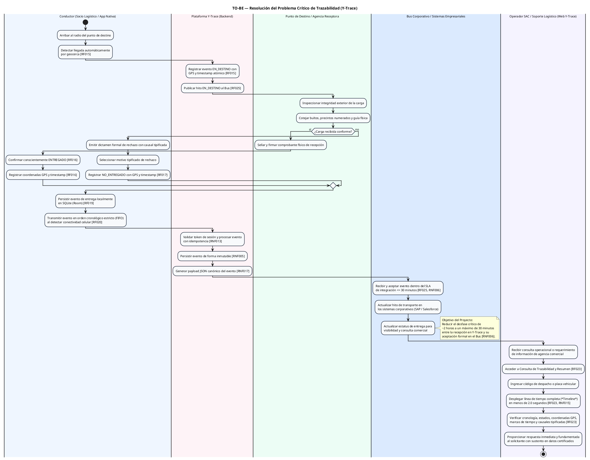

# Diagrama de Actividades TO-BE: Resolución del Problema Crítico de Trazabilidad

> **Ubicación:** `diagram de actividades to-be/diagrama critico tobe/diagrama critico tobe.md`  
> **Curso:** Diseño e Implementación de Arquitectura Empresarial (UTP) — Entregable APF1 (Semana 6 - 7)  
> **Proyecto:** Sistema Web y Móvil para la Gestión y Trazabilidad de Despachos y Entregas de Yanbal Perú (Y-Trace)  
> **Enfoque:** Resolución directa del desfase crítico de ~2 horas (problemas PR-03, PR-04, PR-05) y soporte ágil a SAC mediante los requerimientos oficiales.  
> **Estándar:** UML 2.5 / Metodología RUP con Particiones (*Swimlanes*) oficiales.

---

---

## 2. Coherencia con el Alcance y Requerimientos

1. **Alineación de Particiones y Actores:** Utiliza exclusivamente los actores del negocio participantes (`Conductor`, `Punto de Destino / Agencia Receptora`, `Operador SAC / Soporte Logístico`) y las particiones de soporte para los sistemas y componentes tecnológicos (`Plataforma Y-Trace (Backend)` y `Bus Corporativo / Sistemas Empresariales`), eliminando la partición no oficial de *"Solicitante / Destinatario"* y preservando la concordancia con los actores oficiales definidos en el modelo CUN.
2. **Citas RNF Sincronizadas:**
   - **`RNF006`:** Latencia máxima de integración al Bus ($\le$ 30 minutos), resolviendo la brecha de 2 horas.
   - **`RNF017`:** Estandarización de formato de intercambio en JSON Canónico.
   - **`RNF015`:** Tiempo de respuesta en consulta web de trazabilidad ($< 2.0$ segundos).
   - **`RNF005`:** Inmutabilidad absoluta en la base de datos de eventos de despacho.
   - **`RNF013`:** Procesamiento idempotente de eventos en backend.
3. **Frontera B2B Respetada:** Conductor realiza la confirmación manual consciente en la app móvil; Punto de Destino efectúa la inspección física y firma del documento físico, sin fotografías ni POD multimedia.
