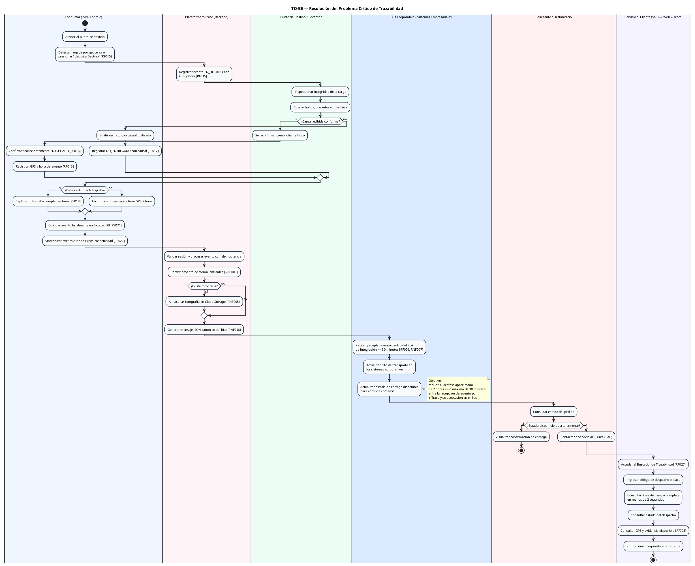

Para el problema crítico mantendría un solo diagrama, más compacto y centrado únicamente en resolver el desfase de aproximadamente 2 horas y dar soporte a SAC.

```plantuml
@startuml Diagrama_Actividades_TO_BE_Yanbal_Problema_Critico

title TO-BE — Resolución del Problema Crítico de Trazabilidad

skinparam shadowing false
skinparam defaultFontName Arial
skinparam defaultFontSize 11

skinparam activity {
    BackgroundColor #F8FAFC
    BorderColor #1E293B
    BorderThickness 1.5
    FontSize 11
}

skinparam partition {
    BackgroundColor #FFFFFF
    BorderColor #475569
    FontColor #0F172A
    FontStyle bold
    FontSize 12
}

' ============================================================
' 1. LLEGADA Y REGISTRO DE ENTREGA
' ============================================================

|#EFF6FF|Conductor (PWA Android)|

start
:Arribar al punto de destino;
:Detectar llegada por geocerca o
presionar "Llegué a Destino" [RF015];

|#FEF3F7|Plataforma Y-Trace (Backend)|

:Registrar evento EN_DESTINO con
GPS y hora [RF015];

|#ECFDF5|Punto de Destino / Receptor|

:Inspeccionar integridad de la carga;
:Cotejar bultos, precintos y guía física;

if (¿Carga recibida conforme?) then (sí)

    :Sellar y firmar comprobante físico;

    |#EFF6FF|Conductor (PWA Android)|

    :Confirmar conscientemente ENTREGADO [RF016];
    :Registrar GPS y hora del evento [RF016];

else (no)

    :Emitir rechazo con causal tipificada;

    |#EFF6FF|Conductor (PWA Android)|

    :Registrar NO_ENTREGADO con causal [RF017];

endif


' ============================================================
' 2. EVIDENCIA Y SINCRONIZACIÓN
' ============================================================

|#EFF6FF|Conductor (PWA Android)|

if (¿Desea adjuntar fotografía?) then (sí)

    :Capturar fotografía complementaria [RF018];

else (no)

    :Continuar con evidencia base GPS + hora;

endif

:Guardar evento localmente en IndexedDB [RF021];
:Sincronizar evento cuando exista conectividad [RF022];

|#FEF3F7|Plataforma Y-Trace (Backend)|

:Validar sesión y procesar evento con idempotencia;
:Persistir evento de forma inmutable [RNF006];

if (¿Existe fotografía?) then (sí)

    :Almacenar fotografía en Cloud Storage [RNF005];

else (no)

endif

:Generar mensaje JSON canónico del hito [RNF018];


' ============================================================
' 3. INTEGRACIÓN CORPORATIVA
' ============================================================

|#DBEAFE|Bus Corporativo / Sistemas Empresariales|

:Recibir y aceptar evento dentro del SLA
de integración <= 30 minutos [RF029, RNF007];

:Actualizar hito de transporte en
los sistemas corporativos;

:Actualizar estado de entrega disponible
para consulta comercial;

note right
Objetivo:
reducir el desfase aproximado
de 2 horas a un máximo de 30 minutos
entre la recepción del evento por
Y-Trace y su aceptación en el Bus.
end note


' ============================================================
' 4. CONSULTA DEL SOLICITANTE Y SOPORTE SAC
' ============================================================

|#FFF1F2|Solicitante / Destinatario|

:Consultar estado del pedido;

if (¿Estado disponible oportunamente?) then (sí)

    :Visualizar confirmación de entrega;
    stop

else (no)

    :Contactar a Servicio al Cliente (SAC);

endif

|#F5F3FF|Servicio al Cliente (SAC) — Web Y-Trace|

:Acceder al Buscador de Trazabilidad [RF027];
:Ingresar código de despacho o placa;
:Consultar línea de tiempo completa
en menos de 2 segundos;

:Consultar estado del despacho;
:Consultar GPS y evidencia disponible [RF025];

:Proporcionar respuesta al solicitante;

stop

@enduml
```
