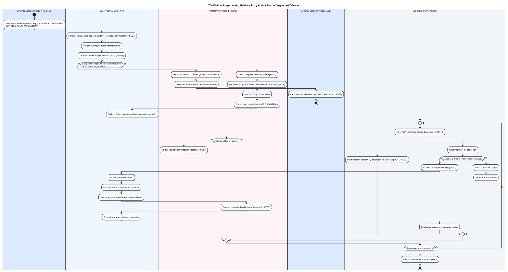
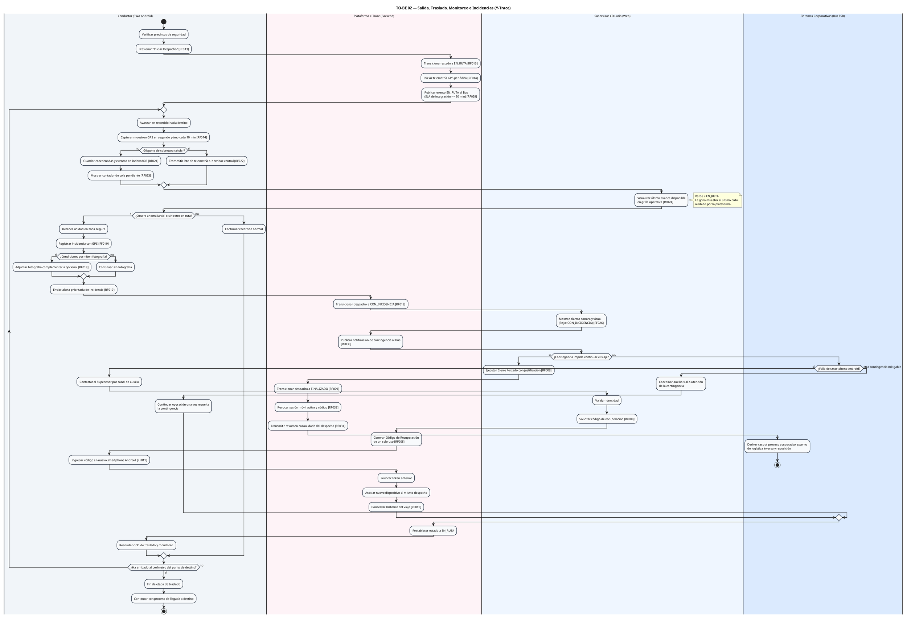
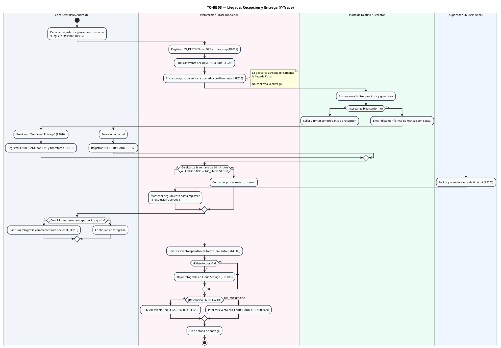
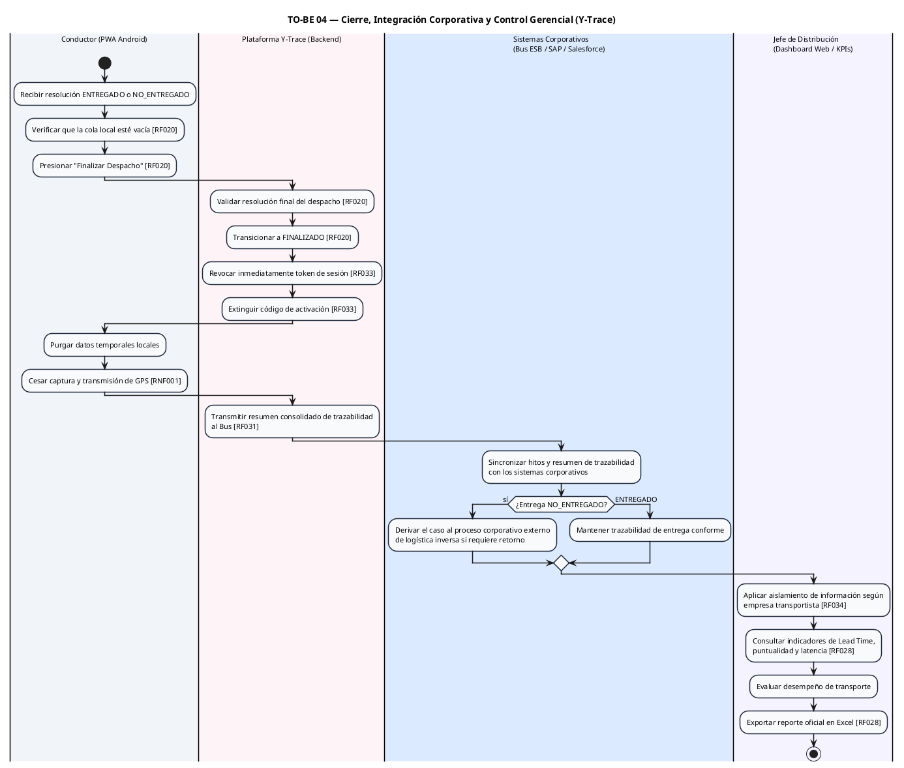

# 1. TO-BE — Preparación, habilitación y activación



# 2. TO-BE — Salida, traslado, monitoreo e incidencias

Este recoge el bloque más grande del diagrama original: EN_RUTA, GPS, offline, monitoreo e incidencias.



# 3. TO-BE — Llegada y entrega

Aquí se concentra EN_DESTINO, inspección, entrega conforme/no conforme y evidencia. El EN_DESTINO no implica entrega.



# 4. TO-BE — Cierre, integración y control

Esta parte contiene FINALIZADO, revocación, sincronización corporativa y KPIs. RF028 es el que contiene la exportación Excel; RF034 corresponde al aislamiento por empresa transportista.



La relación entre los cuatro queda así:

```text
TO-BE 01
Preparación / Habilitación / Activación
        │
        ▼
SESIÓN OPERATIVA ESTABLECIDA
        │
        ▼
TO-BE 02
Salida / Traslado / Monitoreo / Incidencias
        │
        ▼
EN_DESTINO
        │
        ▼
TO-BE 03
Llegada / Recepción / Entrega
        │
        ▼
ENTREGADO o NO_ENTREGADO
        │
        ▼
TO-BE 04
Cierre / Integración / KPIs
        │
        ▼
FINALIZADO
```
