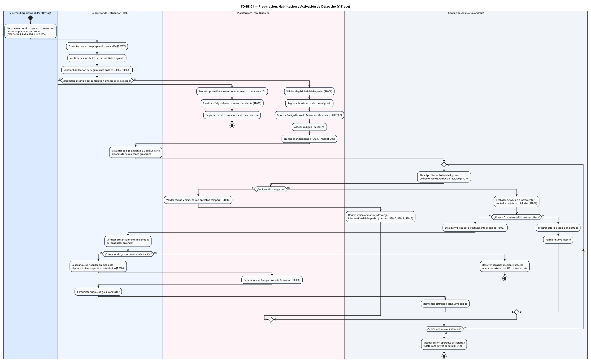
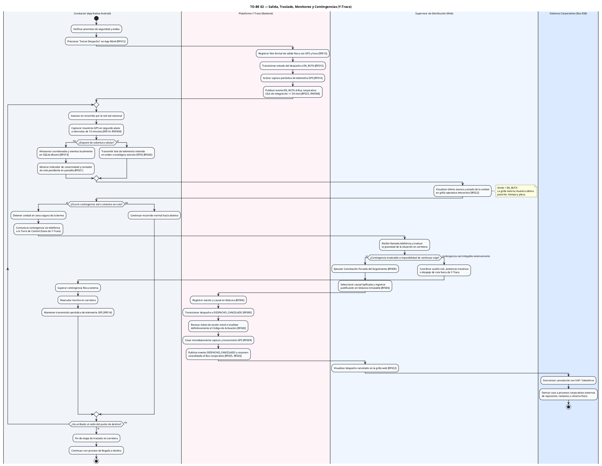
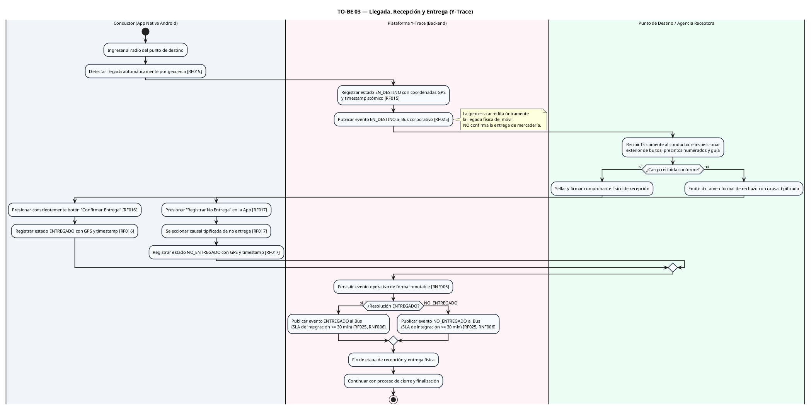
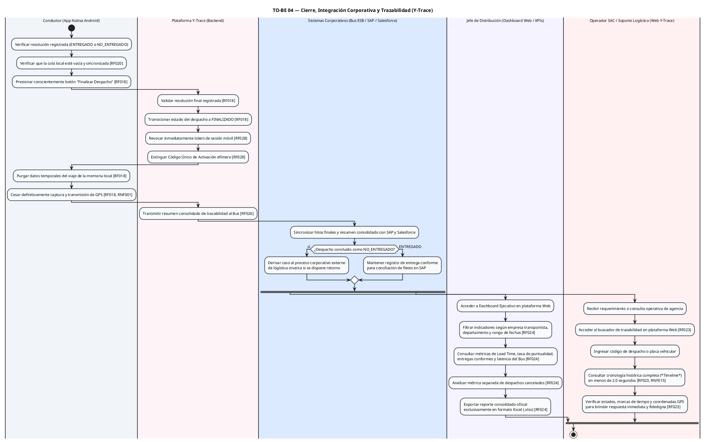

# 1. TO-BE 01 — Preparación, Habilitación y Activación

Este diagrama modela el proceso de control previo en andén, emisión del Código Único de Activación efímero y vinculación de la sesión operativa móvil en la App Nativa Android (soporte a **CUN-01**).



---

# 2. TO-BE 02 — Salida, Traslado, Monitoreo y Contingencias

Este diagrama modela el inicio de viaje (`EN_RUTA`), la telemetría periódica GPS en segundo plano, la persistencia offline (SQLite Room), la supervisión en grilla web y la resolución de contingencias viales comunicadas por telefonía externa, incluyendo la Cancelación Forzada del Seguimiento (`RF009`) cuando el viaje no puede continuar (soporte a **CUN-02** y **CUN-03**).



---

# 3. TO-BE 03 — Llegada, Recepción y Entrega

Este diagrama modela la acreditación de arribo por geocerca (`EN_DESTINO`), la inspección física en destino y la confirmación manual consciente de `ENTREGADO` o `NO_ENTREGADO` por el conductor (soporte a **CUN-04**).



---

# 4. TO-BE 04 — Cierre, Integración Corporativa y Trazabilidad

Este diagrama modela la finalización formal (`FINALIZADO`), la revocación de credenciales móviles, la transmisión del resumen consolidado al Bus corporativo y la explotación de trazabilidad por el **Jefe de Distribución** (KPIs/Excel) y el **Operador SAC** (consulta histórica) (soporte a **CUN-05**).



---

## 5. Articulación Secuencial y de Control entre Procesos TO-BE

El siguiente esquema ilustra la relación operativa entre los cuatro diagramas, reflejando fielmente la bifurcación hacia `DESPACHO_CANCELADO` ante contingencias insalvables en ruta sin pasar obligatoriamente por entrega:

```text
                    TO-BE 01
      Preparación / Habilitación / Activación
                        │
                        ▼
           SESIÓN OPERATIVA ESTABLECIDA
                        │
                        ▼
                    TO-BE 02
  Salida / Traslado / Monitoreo / Contingencias
                        │
       ┌────────────────┴────────────────────────┐
       │ (Traslado exitoso)                      │ (Contingencia insalvable)
       ▼                                         ▼
   EN_DESTINO                           Cancelación Forzada (RF009)
       │                                         │
       ▼                                         ▼
   TO-BE 03                             DESPACHO_CANCELADO
Llegada / Recepción / Entrega             (Revocación de sesión,
       │                                  cese GPS y resumen al Bus)
       ▼
ENTREGADO o NO_ENTREGADO
       │
       ▼
   TO-BE 04
Cierre / Integración Corporativa
       │
       ├─────────────────────────────────────────┐
       ▼                                         ▼
Jefe de Distribución                       Operador SAC
(Dashboard KPIs / Excel)            (Consulta Histórica < 2 s)
       │
       ▼
   FINALIZADO
```
