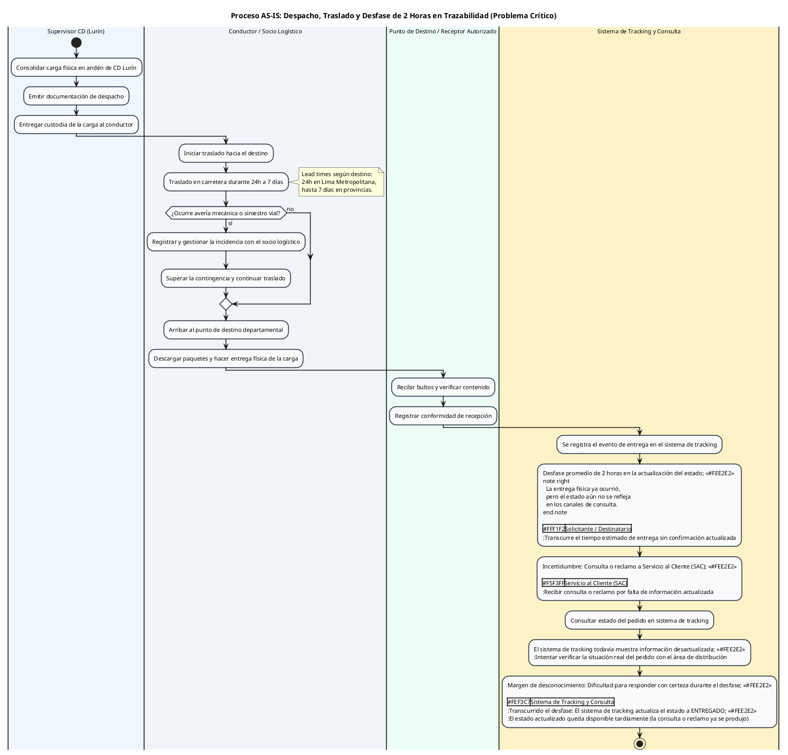

# Diagrama de Actividades AS-IS: Flujo del Negocio Actual Enfocado en el Problema Crítico a Resolver

> **Ubicación:** `diagram de actividades/01_DIAGRAMA_ACTIVIDADES_AS_IS_PROBLEMA_CRITICO.md`  
> **Curso:** Diseño e Implementación de Arquitectura Empresarial (UTP) — Entregable APF1 (Semana 6 - 7)  
> **Proyecto:** Sistema Web y Móvil para la Gestión y Trazabilidad de Despachos y Entregas de Yanbal Perú (Y-Trace)  
> **Fuente Operativa:** Entrevista oficial al **Ing. Joao Condorpusa Mendoza** (Encargado del Área de Distribución de Yanbal Perú), problemas tipificados **PR-03, PR-04 y PR-05**.  
> **Estándar de Modelado:** UML 2.5 / Metodología RUP (Diagrama de Actividades con Particiones / *Swimlanes*).

---

## 1. Diagnóstico del Problema Crítico del Negocio Actual (AS-IS)

En la entrevista en profundidad, el **Ing. Joao Condorpusa Mendoza** explicó con exactitud la problemática del proceso actual: **el problema no es la carencia de un sistema de tracking, sino que la información no se actualiza en tiempo real, presentando un desfase promedio de 2 horas**:

> *"Nuestro mayor reto ahora es hacer las **actualizaciones de los estados de forma en vivo, o sea, en línea, con un desfase menor a media hora**, podríamos mencionarlo. Actualmente **nuestro sistema de tracking nos arroja una trazabilidad o un estatus de seguimiento en promedio de dos horas**.  
> O sea, en dos horas se puede actualizar el estatus de un pedido. Si es que, digamos, el pedido ya fue entregado, el sistema todavía se actualiza hasta en un lapso de dos horas. Entonces eso nos da un **margen de desconocimiento**, se podría decir, acerca de la situación del pedido y también nos incurre en otros aspectos como para poder responder ante algún reclamo o ante la consulta del mismo cliente final a través de nuestro servicio al cliente acerca del estatus de su pedido..."*  
> — **Ing. Joao Condorpusa Mendoza** (Minutos 23:16 a 24:36 de la transcripción oficial).

### Desglose Fáctico del Problema AS-IS:
1. **Yanbal dispone de sistemas de tracking:** La empresa cuenta con plataformas como Drivin y ENSDY para la gestión del transporte y seguimiento de órdenes.
2. **PR-03: Desfase Promedio de 2 Horas:** La información de trazabilidad no se actualiza en tiempo real; el cambio de estado tarda en promedio 120 minutos en reflejarse en los canales de consulta.
3. **PR-04: Margen de Desconocimiento Temporal:** Durante ese lapso de 2 horas tras un evento en ruta o la entrega física, se genera una brecha en la que la central desconoce el estado verídico del envío.
4. **PR-05: Dificultad para Atender Consultas o Reclamos en SAC:** Ante la falta de confirmación actualizada en el horario previsto, el solicitante contacta a Servicio al Cliente, donde el personal enfrenta dificultades para responder con certeza debido a que el sistema aún muestra información desactualizada.

> [!IMPORTANT]
> **Rigor Metodológico del Modelo AS-IS:**  
> Este diagrama representa **exclusivamente el proceso actual del negocio relacionado con el problema de trazabilidad**. No incluye funcionalidades futuras de la solución Y-Trace (como código de activación, PWA, GPS de la solución ni sincronización offline), las cuales corresponden estrictamente a la arquitectura **TO-BE** del sistema.

---

## 2. Definición de Carriles de Responsabilidad (*Swimlanes*)

Para reflejar con nitidez cada responsabilidad operativa y no confundir la recepción física con la consulta a SAC, el flujo se estructura en **6 Carriles (Particiones)**:

| Carril (*Swimlane*) | Actor / Entidad Responsable | Rol en el Proceso AS-IS Actual |
| :--- | :--- | :--- |
| **1. Supervisor CD (Lurín)** | Responsable de Despacho (Yanbal) | Prepara y consolida la carga física, emite la documentación de despacho y entrega la custodia al transportista. |
| **2. Conductor / Socio Logístico** | Transportista Asociado en Ruta | Conduce hacia el destino (lead times de 24h a 7 días); realiza la entrega física y gestiona incidencias con su base. |
| **3. Punto de Destino / Receptor Autorizado** | Agencia o Receptor en Destino | Recepciona bultos, verifica contenido físico y registra la conformidad de recepción. |
| **4. Sistema de Tracking y Consulta** | Plataforma de Tracking Actual | Registra los eventos logísticos pero presenta un desfase promedio de 2 horas en propagar la actualización de estados. |
| **5. Solicitante / Destinatario** | Encargado o Consultora Solicitante | Espera la confirmación; ante la falta de actualización en el sistema en la ventana prevista, consulta a SAC. |
| **6. Servicio al Cliente (SAC)** | Operador de Atención al Cliente | Atiende la consulta o reclamo; al consultar el sistema, observa que el estado aún no refleja la entrega debido al desfase. |

---

## 3. Visualización Interactiva en Obsidian (Mermaid)

```mermaid
flowchart TD
    %% Estilos de Nodos
    classDef inicioFin fill:#1E293B,stroke:#0F172A,stroke-width:2px,color:#fff;
    classDef normal fill:#F8FAFC,stroke:#334155,stroke-width:1.5px,color:#0F172A;
    classDef cuelloBotella fill:#FEE2E2,stroke:#DC2626,stroke-width:2px,color:#7F1D1D;
    classDef decision fill:#FEF3C7,stroke:#D97706,stroke-width:1.5px,color:#78350F;
    classDef espera fill:#EDE9FE,stroke:#7C3AED,stroke-width:1.5px,color:#4C1D95;

    %% Nodos Iniciales
    INI(( )):::inicioFin --> A1["Consolidar carga física en andén de CD Lurín"]:::normal
    
    subgraph CD_LURIN ["1. Supervisor CD (Lurín)"]
        A1 --> A2["Emitir documentación de despacho"]:::normal
        A2 --> A3["Entregar custodia de la carga al conductor"]:::normal
    end

    subgraph CONDUCTOR ["2. Conductor / Socio Logístico en Tránsito"]
        A3 --> B1["Iniciar traslado hacia el punto de destino"]:::normal
        B1 --> B2["Traslado en carretera durante 24h a 7 días según destino"]:::normal
        B2 --> DEC_INC{"¿Ocurre avería mecánica<br/>o siniestro vial en ruta?"}:::decision
        DEC_INC -- "SÍ" --> B3["Registrar y gestionar la incidencia con el socio logístico"]:::cuelloBotella
        B3 --> B3B["Superar la contingencia y continuar traslado"]:::normal
        DEC_INC -- "NO" --> B4["Arribar al punto de destino departamental"]:::normal
        B3B --> B4
        B4 --> B5["Descargar paquetes y hacer entrega física de la carga"]:::normal
    end

    subgraph DESTINO ["3. Punto de Destino / Receptor Autorizado"]
        B5 --> C1["Recibir bultos y verificar contenido"]:::normal
        C1 --> C2["Registrar conformidad de recepción"]:::normal
    end

    subgraph SISTEMA_TRACKING ["4. Sistema de Tracking y Consulta"]
        C2 --> D1["Se registra el evento de entrega en el sistema de tracking"]:::normal
        D1 --> D2["Desfase promedio de 2 horas en la actualización del estado"]:::cuelloBotella
    end

    %% Flujo durante el Desfase: Consulta a SAC
    subgraph SOLICITANTE ["5. Solicitante / Destinatario"]
        D2 -->|Durante el desfase de ~2 horas| E1["Transcurre el tiempo estimado sin confirmación actualizada"]:::espera
        E1 --> E2["Incertidumbre: Solicitante consulta o reclama a SAC"]:::cuelloBotella
    end

    subgraph SAC ["6. Servicio al Cliente (SAC)"]
        E2 --> F1["Recibir consulta o reclamo por falta de información actualizada"]:::normal
        F1 --> F2["Consultar estado del pedido en el sistema de tracking"]:::normal
        F2 --> F3["El sistema todavía muestra información desactualizada (EN RUTA)"]:::cuelloBotella
        F3 --> F4["Intentar verificar la situación real del pedido con distribución"]:::cuelloBotella
        F4 --> F5["Margen de desconocimiento: Dificultad para responder con certeza"]:::cuelloBotella
    end

    %% Cierre posterior del Desfase
    subgraph SISTEMA_TRACKING_POST ["4. Sistema de Tracking y Consulta (Actualización Posterior)"]
        F5 -->|"Después del desfase (aprox 2 horas)"| D3["Transcurrido el desfase: El sistema actualiza el estado a ENTREGADO"]:::normal
        D3 --> D4["El estado actualizado queda disponible cuando la consulta o reclamo ya se produjo"]:::normal
    end

    D4 --> FIN(( )):::inicioFin
```

---

## 4. Código PlantUML Oficial con Particiones (*Swimlanes*)

---

## 5. Análisis de Ineficiencias del Proceso Actual (AS-IS)

Este análisis examina de forma objetiva las ineficiencias operativas del negocio actual:

| Hito del Proceso AS-IS | Situación Identificada en la Entrevista | Causa Raíz de la Ineficiencia Actual | Impacto Operativo en el Negocio Actual |
| :--- | :--- | :--- | :--- |
| **Salida en Andén** | Preparación y despacho físico de pedidos por lotes. | Traspaso físico sin registro digital instantáneo del inicio de ruta. | No se dispone de la hora atómica de partida del vehículo en tiempo real. |
| **Traslado en Carretera** | Traslados interprovinciales con lead times de 24h a 7 días. | La información sobre el avance o contingencias presenta retrasos en propagarse. | Margen de desconocimiento sobre la ubicación del transporte durante eventualidades viales. |
| **Gestión de Incidencias** | Ocurrencia de averías, daños o contingencias viales. | La contingencia se gestiona con el socio logístico, demorando en comunicarse a la central. | Dificultad para adoptar acciones preventivas tempranas o anticipar reprogramaciones de entrega. |
| **Momento de Entrega** | La entrega física ocurre en destino pero no se comunica al instante. | La conformidad de entrega se asienta localmente sin sincronización inmediata con la central. | El receptor o solicitante no visualiza la confirmación de entrega en los canales de consulta. |
| **Actualización de Tracking** | **Desfase promedio de 2 horas en la actualización del estado.** | Latencia entre el registro de transporte y su disponibilidad en los sistemas de consulta. | La central y el solicitante visualizan un estado desactualizado durante aproximadamente 120 minutos. |
| **Atención en SAC** | Consultas o reclamos por falta de información actualizada. | El personal de SAC consulta sistemas que aún no reflejan la entrega efectuada. | Dificultad para dar respuesta fidedigna, consultas telefónicas cruzadas y quejas de servicio. |

---

## 6. Conclusión Metodológica

1. **Enfoque Fáctico:** Modela estrictamente la secuencia de despacho $\rightarrow$ traslado $\rightarrow$ entrega $\rightarrow$ registro $\rightarrow$ desfase de 2 horas $\rightarrow$ consulta a SAC $\rightarrow$ dificultad de respuesta $\rightarrow$ actualización posterior.
2. **Separación de Responsabilidades:** Mantiene claramente diferenciados los carriles de `Punto de Destino / Receptor Autorizado` (recepción física) y `Solicitante / Destinatario` (consulta por falta de actualización).
3. **Pureza del AS-IS:** No incorpora componentes ni requerimientos de la solución futura Y-Trace, conservando el valor descriptivo del proceso empresarial actual.
