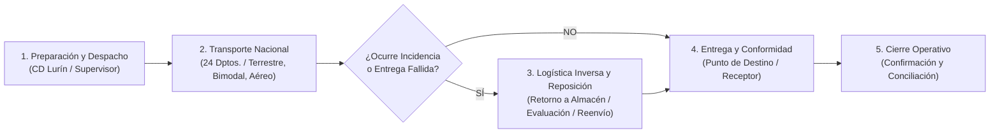
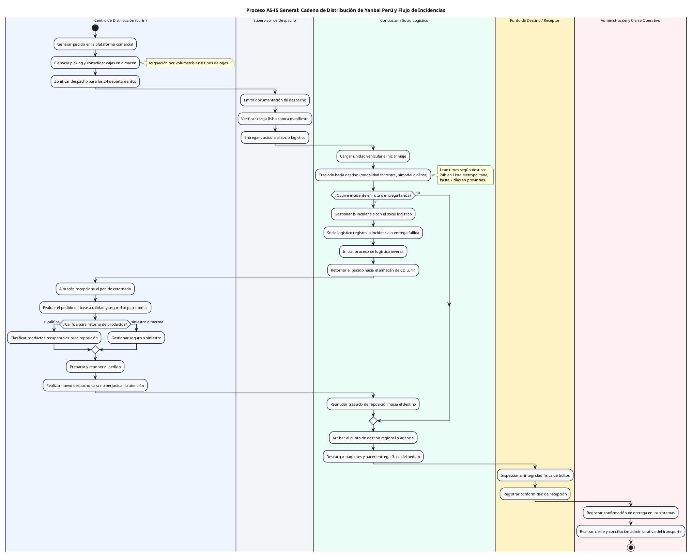

# Diagrama de Actividades AS-IS: Flujo General de los Procesos de Negocio Actuales de Distribución

> **Ubicación:** `diagram de actividades/02_DIAGRAMA_ACTIVIDADES_AS_IS_GENERAL.md`  
> **Curso:** Diseño e Implementación de Arquitectura Empresarial (UTP) — Entregable APF1 (Semana 6 - 7)  
> **Proyecto:** Sistema Web y Móvil para la Gestión y Trazabilidad de Despachos y Entregas de Yanbal Perú (Y-Trace)  
> **Fuente Operativa:** Entrevista oficial al **Ing. Joao Condorpusa Mendoza** (Encargado del Área de Distribución de Yanbal Perú).  
> **Estándar de Modelado:** UML 2.5 / Metodología RUP (Diagrama de Actividades General con Particiones / *Swimlanes*).

---

## 1. Alcance del Flujo General del Negocio Actual (AS-IS)

Mientras que el diagrama del problema crítico hace foco en la latencia de actualización del tracking y su impacto en SAC, este **Diagrama de Actividades General** describe el proceso completo actual del negocio de distribución de Yanbal de extremo a extremo, manteniendo el nivel de abstracción de procesos de negocio:

> [!NOTE]
> **Rigor Metodológico del Proceso General:**  
> Este diagrama representa **las actividades del negocio que ocurren actualmente en la realidad operativa**. Las actividades como la emisión de documentación de despacho, la entrega formal de custodia, la verificación física y el cierre administrativo forman parte del proceso del negocio y se expresan de forma afirmativa, sin incorporar requerimientos futuros de Y-Trace. Adicionalmente, cabe aclarar que **las actividades de preparación (picking/consolidación) previas a la puesta en andén en CD Lurín se encuentran fuera de la frontera tecnológica de Y-Trace** y son responsabilidad exclusiva del WMS/TMS corporativo.

---

## 2. Particiones (*Swimlanes*) del Proceso General

Las responsabilidades se organizan en **5 Carriles (Particiones)** claramente delimitados:

1. **Centro de Distribución (Lurín):** Almacén central encargado de la recepción de órdenes, preparación (picking), consolidación de cajas, zonificación y la gestión del subflujo de logística inversa (evaluación de retornos y reposición de pedidos).
2. **Supervisor de Despacho:** Responsable de verificar la carga física contra el manifiesto, emitir la documentación de despacho y entregar la custodia al transportista.
3. **Socio Logístico / Conductor:** Encargado del traslado troncal interprovincial hacia los 24 departamentos (modalidades terrestre, bimodal o aérea), la gestión de incidencias en ruta y la entrega física en destino.
4. **Punto de Destino / Receptor:** Agencia o receptor autorizado en destino que recibe los paquetes, inspecciona su estado físico y registra la conformidad de recepción.
5. **Administración y Cierre Operativo:** Área responsable del registro de confirmaciones en sistemas y de la conciliación y cierre administrativo del servicio de transporte.

---

## 3. Diagrama Visual Interactivo en Obsidian (Mermaid)

```mermaid
flowchart TD
    classDef inicioFin fill:#1E293B,stroke:#0F172A,stroke-width:2px,color:#fff;
    classDef normal fill:#F8FAFC,stroke:#334155,stroke-width:1.5px,color:#0F172A;
    classDef decision fill:#FEF3C7,stroke:#D97706,stroke-width:1.5px,color:#78350F;
    classDef inversa fill:#FEE2E2,stroke:#DC2626,stroke-width:2px,color:#7F1D1D;

    INI(( )):::inicioFin --> A1["Generar pedido en la plataforma comercial"]:::normal

    subgraph CD_LURIN ["1. Centro de Distribución (Lurín)"]
        A1 --> A2["Elaborar picking y consolidar cajas en almacén"]:::normal
        A2 --> A3["Zonificar despacho para los 24 departamentos"]:::normal
    end

    subgraph SUPERVISOR ["2. Supervisor de Despacho"]
        A3 --> B1["Emitir documentación de despacho"]:::normal
        B1 --> B2["Verificar carga física contra manifiesto"]:::normal
        B2 --> B3["Entregar custodia al socio logístico"]:::normal
    end

    subgraph CONDUCTOR ["3. Conductor / Socio Logístico"]
        B3 --> C1["Cargar unidad vehicular e iniciar traslado nacional"]:::normal
        C1 --> C2["Traslado hacia destino (modalidad terrestre, bimodal o aérea)"]:::normal
        C2 --> DEC_INC{"¿Ocurre incidencia en ruta<br/>o entrega fallida?"}:::decision
        
        %% Rama de Incidencia y Logística Inversa (Sustentada en Minutos 20:18 - 21:35)
        DEC_INC -- "SÍ" --> C3["Gestionar la incidencia con el socio logístico"]:::inversa
        C3 --> C4["Socio logístico registra la incidencia o entrega fallida"]:::inversa
        C4 --> C5["Iniciar proceso de logística inversa y retornar pedido al almacén"]:::inversa
        
        %% Rama Normal de Entrega
        DEC_INC -- "NO" --> C6["Arribar al punto de destino regional o agencia"]:::normal
        C6 --> C7["Descargar paquetes y hacer entrega física del pedido"]:::normal
    end

    %% Subflujo de Logística Inversa y Reposición en Almacén
    subgraph LOGISTICA_INVERSA ["Logística Inversa y Reposición (CD Lurín)"]
        C5 --> R1["Almacén recepciona pedido retornado"]:::inversa
        R1 --> R2["Evaluar pedido en base a calidad y seguridad patrimonial"]:::inversa
        R2 --> DEC_EVAL{"¿Califica para retorno<br/>de productos?"}:::decision
        DEC_EVAL -- "SÍ" --> R3["Clasificar productos recuperables para reposición"]:::normal
        DEC_EVAL -- "NO" --> R4["Gestionar seguro o siniestro"]:::inversa
        R3 --> R5["Preparar y reponer el pedido"]:::normal
        R4 --> R5
        R5 --> R6["Realizar nuevo despacho para no perjudicar la atención"]:::normal
        R6 -.->|Reanudar traslado de reposición| C6
    end

    subgraph DESTINO ["4. Punto de Destino / Receptor"]
        C7 --> D1["Inspeccionar integridad física de bultos"]:::normal
        D1 --> D2["Registrar conformidad de recepción"]:::normal
    end

    subgraph CIERRE ["5. Administración y Cierre Operativo"]
        D2 --> E1["Registrar confirmación de entrega en los sistemas"]:::normal
        E1 --> E2["Realizar cierre y conciliación administrativa del transporte"]:::normal
        E2 --> FIN((( ))):::inicioFin
    end
```

---

## 4. Código PlantUML Oficial con Particiones (*Swimlanes*)

---

## 5. Secuencia y Relación de Sistemas Corporativos en el Proceso

Para no confundir etapas ni tratarlos como equivalentes, los sistemas corporativos intervienen de forma cronológica en sus respectivas fases:

| Etapa Operativa | Sistema / Componente de Soporte | Función en el Negocio Actual |
| :--- | :--- | :--- |
| **1. Generación Comercial** | Maya / SAP Commerce | Ingreso comercial de pedidos y transmisión de órdenes consolidadas. |
| **2. Preparación y Picking** | SPY (Gestor de Picking in-house) | Organización del recorrido de picking y optimización de cajas por peso y volumen. |
| **3. Despacho y Custodia** | Centro de Distribución Lurín | Zonificación geográfica, emisión de documentación y entrega de custodia. |
| **4. Transporte y Seguimiento** | Socio Logístico / Sistema de Transporte (Drivin/ENSDY) | Desplazamiento interprovincial y registro de eventos de transporte. |
| **5. Retornos y Calidad** | Almacén CD Lurín / Área de Calidad | Peritaje de mercadería retornada y control patrimonial de seguros. |
| **6. Cierre Operativo** | Administración / SAP R/3 | Conciliación de conformidades y liquidación del servicio de transporte. |

---

## 6. Comparativa Estructural: Diagrama General vs. Diagrama del Problema Crítico

| Criterio | Diagrama de Actividades AS-IS General | Diagrama de Actividades AS-IS (Problema Crítico) |
| :--- | :--- | :--- |
| **Enfoque** | Proceso completo actual del negocio de distribución física, incluyendo incidencias y logística inversa. | Zoom del proceso actual enfocado en el desfase de trazabilidad de aproximadamente 2 horas y su impacto en SAC. |
| **Alcance** | Desde la generación comercial del pedido hasta el cierre y conciliación administrativa del transporte. | Desde el despacho en andén, traslado y entrega física, hasta la atención en SAC y actualización tardía del estado. |
| **Duración del Ciclo** | Ciclo integral del pedido (días de tránsito, logística inversa y cierre). | Horas críticas del viaje y momento de entrega (desfase de 2 horas en la actualización de estados). |
| **Actores Clave** | Almacén CD Lurín, Supervisor, Conductor, Punto de Destino / Receptor, Administración y Cierre. | Supervisor CD Lurín, Conductor, Punto de Destino / Receptor, Sistema de Tracking, Solicitante, Servicio al Cliente (SAC). |
| **Rol en el APF1** | Cumple con el requisito de *«Flujo general de los procesos de negocio actuales»*. | Cumple con el requisito de *«Flujo enfocado en el problema crítico a resolver»*. |
