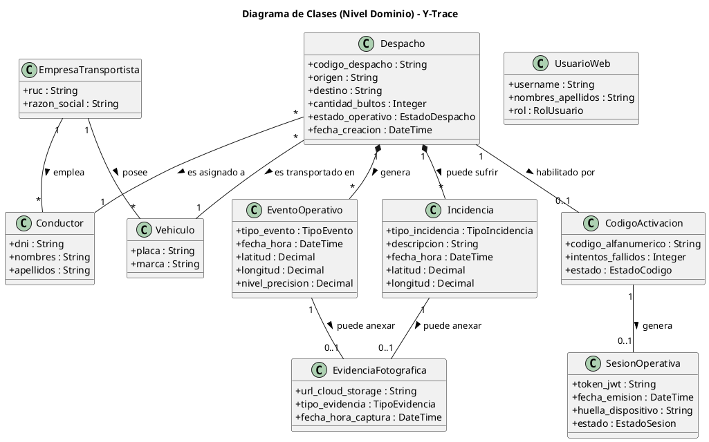

## 2.5. Diagrama de Clases (Nivel Dominio)

### 2.5.1 Entidades
*(Entidades clave del negocio, listar e incluir los atributos.)*

- **Despacho**
  - `codigo_despacho` (String)
  - `origen` (String)
  - `destino` (String)
  - `cantidad_bultos` (Integer)
  - `estado_operativo` (EstadoDespacho)
  - `fecha_creacion` (DateTime)

- **EmpresaTransportista**
  - `ruc` (String)
  - `razon_social` (String)

- **Vehiculo**
  - `placa` (String)
  - `marca` (String)

- **Conductor**
  - `dni` (String)
  - `nombres` (String)
  - `apellidos` (String)

- **CodigoActivacion**
  - `codigo_alfanumerico` (String)
  - `intentos_fallidos` (Integer)
  - `estado` (EstadoCodigo)

- **SesionOperativa**
  - `token_jwt` (String)
  - `fecha_emision` (DateTime)
  - `huella_dispositivo` (String)
  - `estado` (EstadoSesion)

- **EventoOperativo**
  - `tipo_evento` (TipoEvento)
  - `fecha_hora` (DateTime)
  - `latitud` (Decimal)
  - `longitud` (Decimal)
  - `nivel_precision` (Decimal)

- **Incidencia**
  - `tipo_incidencia` (TipoIncidencia)
  - `descripcion` (String)
  - `fecha_hora` (DateTime)
  - `latitud` (Decimal)
  - `longitud` (Decimal)

- **EvidenciaFotografica**
  - `url_cloud_storage` (String)
  - `tipo_evidencia` (TipoEvidencia)
  - `fecha_hora_captura` (DateTime)

- **UsuarioWeb**
  - `username` (String)
  - `nombres_apellidos` (String)
  - `rol` (RolUsuario)

### 2.5.2 Diccionario de datos

| Entidad | Descripción | Atributos Clave | Tipo de Dato |
| :--- | :--- | :--- | :--- |
| **Despacho** | Entidad principal del sistema. Representa una carga logística consolidada desde su disponibilidad hasta la entrega final. | `codigo_despacho` `origen` `destino` `cantidad_bultos` `estado_operativo` `fecha_creacion` | String String String Integer Enum DateTime |
| **EmpresaTransportista** | Socio logístico (tercero) encargado de la operación de traslado físico de los despachos. | `ruc` `razon_social` | String String |
| **Vehiculo** | Unidad de transporte asignada físicamente al traslado de la carga. | `placa` `marca` | String String |
| **Conductor** | Persona designada por la empresa transportista para ejecutar el traslado y operar la PWA. | `dni` `nombres` `apellidos` | String String String |
| **CodigoActivacion** | Clave efímera generada por el Supervisor para vincular al conductor con un despacho específico. | `codigo_alfanumerico` `intentos_fallidos` `estado` | String (8) Integer Enum |
| **SesionOperativa** | Vínculo técnico efímero (JWT) entre el dispositivo móvil del conductor y el viaje activo. | `token_jwt` `fecha_emision` `huella_dispositivo` `estado` | String DateTime String Enum |
| **EventoOperativo** | Hito inmutable (*append-only*) generado durante el ciclo de vida del despacho, ya sea automatizado o manual. | `tipo_evento` `fecha_hora` `latitud`, `longitud` `nivel_precision` | Enum DateTime Decimal Decimal |
| **Incidencia** | Evento anómalo en ruta reportado por el conductor que altera el flujo normal de transporte. | `tipo_incidencia` `descripcion` `fecha_hora` `latitud`, `longitud` | Enum String DateTime Decimal |
| **EvidenciaFotografica** | Elemento de respaldo opcional en la plataforma, almacenado externamente, vinculado a un hito logístico o incidencia. | `url_cloud_storage` `tipo_evidencia` `fecha_hora_captura` | String Enum DateTime |
| **UsuarioWeb** | Trabajador interno de Yanbal (Supervisor, Jefe, SAC, Administrador) autorizado a usar la Torre de Control. | `username` `nombres_apellidos` `rol` | String String Enum |

### 2.5.3 Matriz

| Entidad | 1. Disponibilidad y Andén | 2. Activación PWA | 3. Ruta y Monitoreo | 4. Llegada y Recepción | 5. Cierre y Trazabilidad |
| :--- | :---: | :---: | :---: | :---: | :---: |
| **Despacho** | Se consulta | Se asocia código | Cambia de estado | Cambia a `ENTREGADO` o `NO_ENTREGADO` | Cambia a `FINALIZADO` |
| **CodigoActivacion** | Se genera | Se valida | - | - | Se extingue / revoca |
| **SesionOperativa** | - | Se emite | Mantiene conexión | Valida transacciones | Se revoca inmediatamente |
| **EventoOperativo** | - | - | Generación GPS (cada 10 min) | Hito `EN_DESTINO` e hitos entrega | Se consolidan / auditan |
| **Incidencia** | - | - | Se genera alerta (si aplica) | - | Se analiza en auditoría |
| **EvidenciaFotografica** | - | - | Opción por incidencia | Opción en entrega / rechazo | Se guarda referencia |
| **UsuarioWeb** | Habilita despacho | - | Visualiza semáforo | Recibe alerta 60 min | Analiza Dashboard |
| **Conductor** | Recibe carga | Digita código | Conduce (GPS auto) | Confirma llegada / entrega | Presiona Finalizar |

### 2.5.4 Diagrama

