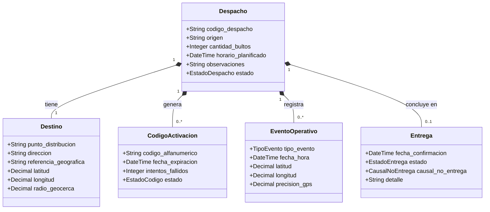
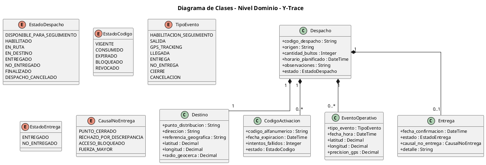

# Diagrama de Clases – Nivel Dominio — Y-Trace

## 1. Datos generales

**Proyecto:** Sistema Web y Móvil para la Gestión y Trazabilidad de Despachos y Entregas de Yanbal Perú  
**Nombre corto:** Y-Trace  
**Entregable:** APF1 — Modelado UML  
**Nivel:** Dominio

## 2. Propósito

Este documento define el **Diagrama de Clases de Nivel Dominio de Y-Trace**.

El modelo representa exclusivamente los principales conceptos del negocio de trazabilidad de despachos, sus atributos relevantes y sus relaciones.

Y-Trace comienza a intervenir cuando existe un despacho disponible para seguimiento. El despacho proviene de procesos o sistemas externos; Y-Trace no crea, programa, asigna, libera ni cancela logísticamente dicho despacho.

Por ello, el modelo se concentra en:

- Despacho.
- Destino.
- Código de activación.
- Eventos operativos.
- Resultado de entrega.

## 3. Criterio de modelado

Un modelo de dominio representa **conceptos del negocio**, no detalles de implementación.

### Se incluyen

- Clases conceptuales del negocio.
- Atributos relevantes del negocio.
- Relaciones.
- Cardinalidades.
- Enumeraciones que representan estados o categorías del dominio.

### Se excluyen

- Controller, Service y Repository.
- DTO y entidades JPA.
- API REST y endpoints.
- JWT, sesiones técnicas y Spring Security.
- Base de datos y tablas.
- SQLite (Room) y mecanismos de almacenamiento técnico.
- Cloud Storage como infraestructura.
- App móvil Android como clase.
- GPS como clase independiente.
- Mapas y navegación.
- Conductor, Vehículo y EmpresaTransportista como entidades administradas por Y-Trace.
- UsuarioWeb y roles como parte del núcleo de trazabilidad.

## 4. Diccionario de Datos del Dominio (Entidades, Atributos y Reglas)

### 4.1 Despacho (Aggregate Root)

Representa la unidad de operación y seguimiento que proviene de los sistemas centrales de Yanbal (SPY/WMS) y cuya trazabilidad controla Y-Trace desde su habilitación en andén hasta su resolución final.

| Atributo | Tipo Conceptual | Obligatoriedad | Descripción del Negocio | Restricción / Regla de Negocio |
|---|---|:---:|---|---|
| `codigo_despacho` | String | Obligatorio | Identificador unívoco del despacho de carga. | Formato canónico `D-YYYY-NNN`, inmutable, no nulo. |
| `origen` | String | Obligatorio | Instalación física de partida de la carga. | Valor predeterminado `"CD Lurín"`. |
| `cantidad_bultos` | Integer | Obligatorio | Total de bultos/cajas consolidadas en la unidad. | Entero positivo $> 0$. |
| `horario_planificado` | DateTime | Obligatorio | Momento estimado para la salida del transporte. | Estampa temporal válida con zona horaria local. |
| `observaciones` | String | Opcional | Indicaciones operativas de ruta o manipulación. | Longitud máxima 255 caracteres. |
| `estado` | EstadoDespacho | Obligatorio | Estado situacional del despacho en Y-Trace. | Inicia en `DISPONIBLE_PARA_SEGUIMIENTO`. |

### 4.2 Destino

Representa la instalación física (agencia departamental o centro de distribución secundario) hacia donde se traslada la carga.

| Atributo | Tipo Conceptual | Obligatoriedad | Descripción del Negocio | Restricción / Regla de Negocio |
|---|---|:---:|---|---|
| `punto_distribucion` | String | Obligatorio | Nombre institucional de la sede receptora. | Sede válida en los 24 departamentos (ej. *"Agencia Arequipa"*). |
| `direccion` | String | Obligatorio | Dirección física formal mostrada al transportista. | Cadena de texto descriptiva y verificable. |
| `referencia_geografica` | String | Opcional | Hito urbano o vial de proximidad. | Texto descriptivo de apoyo visual. |
| `latitud` | Decimal | Obligatorio | Coordenada geográfica de latitud del punto. | Rango geográfico de Perú ($-18.35$ a $-0.03$). |
| `longitud` | Decimal | Obligatorio | Coordenada geográfica de longitud del punto. | Rango geográfico de Perú ($-81.33$ a $-68.65$). |
| `radio_geocerca` | Decimal | Obligatorio | Radio perimétrico para detección de arribo. | Valor en metros $> 0$ (típicamente $500.0\text{ m}$). |

> **Regla de Negocio:** La llegada y la entrega son hechos conceptualmente distintos. La llegada acredita la presencia física en destino mediante geocerca (`EN_DESTINO`); no confirma por sí sola la conformidad ni entrega de la carga.

### 4.3 CodigoActivacion

Representa el mecanismo temporal y efímero mediante el cual se habilita la operación móvil del transportista para un despacho existente en andén.

| Atributo | Tipo Conceptual | Obligatoriedad | Descripción del Negocio | Restricción / Regla de Negocio |
|---|---|:---:|---|---|
| `codigo_alfanumerico` | String | Obligatorio | Token alfanumérico entregado al conductor. | Exactamente 8 caracteres, alfabeto sin ambigüedad. |
| `fecha_expiracion` | DateTime | Obligatorio | Momento en que caduca la validez del código. | Ventana estricta de 120 minutos (2 horas) tras emisión. |
| `intentos_fallidos` | Integer | Obligatorio | Contador de ingresos erróneos en la app móvil. | Entero $\ge 0$. Al llegar a 5 pasa a `BLOQUEADO` (RF027). |
| `estado` | EstadoCodigo | Obligatorio | Situación operativa del código. | Valores: `VIGENTE`, `CONSUMIDO`, `EXPIRADO`, `BLOQUEADO`, `REVOCADO`. |

> **Regla de Negocio:** Un despacho puede tener más de un código a lo largo de su trazabilidad cuando sea necesario generar una nueva habilitación después de la invalidación o bloqueo de un código anterior. Solo puede existir un código `VIGENTE` a la vez por despacho.

### 4.4 EventoOperativo

Representa un suceso transaccional inmutable registrado durante el ciclo de vida del despacho. La telemetría GPS forma parte de sus atributos; no se modela una clase técnica `GPS`.

| Atributo | Tipo Conceptual | Obligatoriedad | Descripción del Negocio | Restricción / Regla de Negocio |
|---|---|:---:|---|---|
| `tipo_evento` | TipoEvento | Obligatorio | Categoría operativa del suceso. | Perteneciente al catálogo oficial `TipoEvento`. |
| `fecha_hora` | DateTime | Obligatorio | Marca de tiempo atómica de ocurrencia (`captured_at`). | Timestamp ISO 8601 inmutable (*append-only*). |
| `latitud` | Decimal | Opcional | Coordenada satelital de latitud en el suceso. | Decimal con al menos 4 cifras decimales. |
| `longitud` | Decimal | Opcional | Coordenada satelital de longitud en el suceso. | Decimal con al menos 4 cifras decimales. |
| `precision_gps` | Decimal | Opcional | Radio de exactitud satelital reportado. | Valor en metros reportado por el receptor GPS. |

### 4.5 Entrega

Representa el resultado formal de la recepción de la carga en el punto de destino tras la inspección física.

| Atributo | Tipo Conceptual | Obligatoriedad | Descripción del Negocio | Restricción / Regla de Negocio |
|---|---|:---:|---|---|
| `fecha_confirmacion` | DateTime | Obligatorio | Momento exacto de la resolución de entrega. | Registrado tras ingresar a la geocerca de destino. |
| `estado` | EstadoEntrega | Obligatorio | Dictamen de recepción de la carga. | Valores permitidos: `ENTREGADO` o `NO_ENTREGADO`. |
| `causal_no_entrega` | CausalNoEntrega | Condicional | Motivo tipificado de rechazo o no entrega. | Obligatorio si `estado = NO_ENTREGADO`; `null` si `ENTREGADO`. |
| `detalle` | String | Opcional | Observaciones complementarias de la recepción. | Longitud máxima de 500 caracteres. |

---

## 5. Enumeraciones

### EstadoDespacho

```text
DISPONIBLE_PARA_SEGUIMIENTO
HABILITADO
EN_RUTA
EN_DESTINO
ENTREGADO
NO_ENTREGADO
FINALIZADO
DESPACHO_CANCELADO
```

`DESPACHO_CANCELADO` indica la cancelación forzada del seguimiento del despacho ejecutada por el Supervisor Web ante contingencia externa insalvable o decisión operativa.

### EstadoCodigo

```text
VIGENTE
CONSUMIDO
EXPIRADO
BLOQUEADO
REVOCADO
```

### TipoEvento

```text
HABILITACION_SEGUIMIENTO
SALIDA
GPS_TRACKING
LLEGADA
ENTREGA
NO_ENTREGA
CIERRE
CANCELACION
```

### EstadoEntrega

```text
ENTREGADO
NO_ENTREGADO
```

### CausalNoEntrega

```text
PUNTO_CERRADO
RECHAZO_POR_DISCREPANCIA
ACCESO_BLOQUEADO
FUERZA_MAYOR
```

## 6. Relaciones

| Relación | Cardinalidad | Significado |
|---|---|---|
| Despacho — Destino | 1 : 1 | Cada despacho modelado tiene un destino. |
| Despacho — CodigoActivacion | 1 : 0..* | Puede existir cero o varios códigos a lo largo de la operación. |
| Despacho — EventoOperativo | 1 : 0..* | Un despacho genera múltiples eventos. |
| Despacho — Entrega | 1 : 0..1 | Un despacho puede tener un resultado de entrega. |

---

## 7. Diagrama Visual Interactivo en Obsidian (Mermaid)



---

## 8. Código Oficial PlantUML



## 8. Lectura conceptual

```text
                    DESPACHO
                        |
          +-------------+-------------+
          |             |             |
          v             v             v
       DESTINO     CODIGO DE       EVENTOS
                   ACTIVACION      OPERATIVOS
                                      |
                                      |
                                      v
                                   ENTREGA
```

El flujo conceptual de la trazabilidad es:

```text
DISPONIBLE_PARA_SEGUIMIENTO
    ↓
HABILITADO
    ↓
EN_RUTA
    ↓
EN_DESTINO
    ↓
ENTREGADO / NO_ENTREGADO
    ↓
FINALIZADO / DESPACHO_CANCELADO
```

## 9. Elementos que permanecen fuera del dominio

**Conductor:** actor externo que utiliza la aplicación móvil Android mediante un código temporal; no se modela como entidad administrada.

## 10. Elementos que permanecen fuera del dominio

* **Conductor:** actor externo que utiliza la aplicación móvil Android mediante un código temporal; no se modela como entidad administrada.
* **Vehículo:** información contextual del traslado; no se modela como entidad de gestión de flota.
* **EmpresaTransportista:** información contextual para la operación; no se modela como entidad administrada.
* **GPS:** sus datos forman parte de los atributos de `EventoOperativo`.
* **Usuario Web:** el acceso y los 4 roles institucionales se modelan en los Casos de Uso del Sistema (CUS); no forman parte del núcleo conceptual del dominio de trazabilidad.
* **Aplicación móvil Android, mapa y navegación:** representan interfaz o soporte operativo, no conceptos del dominio.
* **JWT, sesiones, APIs y almacenamiento técnico:** pertenecen a diseño y arquitectura de software, no al modelo de dominio.

---

## 11. Matriz de Entidades del Dominio (Exigencia Oficial APF1)

Conforme a la rúbrica oficial (*«Obligatorio: Elaborar el diccionario de datos y matriz de entidades»*), se documenta la matriz de interacciones conceptuales entre las entidades y su participación en los macro-procesos del negocio:

### 11.1 Matriz de Relaciones e Interacción entre Entidades

| Entidad Origen | Entidad Destino | Tipo de Relación | Multiplicidad | Regla Semántica de Negocio |
| :--- | :--- | :---: | :---: | :--- |
| **`Despacho`** | `Destino` | Composición Fuerte (`*--`) | $1 : 1$ | Todo despacho tiene asignado exactamente un punto geográfico de destino para su entrega física B2B. |
| **`Despacho`** | `CodigoActivacion` | Composición Fuerte (`*--`) | $1 : 0..*$ | Un despacho puede tener cero o más códigos generados secuencialmente a lo largo de su ciclo de vida (tras expiración o bloqueo), pero solo uno activo a la vez. |
| **`Despacho`** | `EventoOperativo` | Composición Fuerte (`*--`) | $1 : 0..*$ | Un despacho acumula una colección cronológica e inmutable de eventos operativos (salida, telemetría periódica GPS, llegada a geocerca, cancelación). |
| **`Despacho`** | `Entrega` | Composición Fuerte (`*--`) | $1 : 0..1$ | Un despacho culmina como máximo en un único resultado formal de recepción física (`ENTREGADO` o `NO_ENTREGADO`), o ninguno si fue cancelado antes de arribar. |

### 11.2 Matriz de Participación: Procesos de Negocio (CUN) vs. Entidades del Dominio

Esta matriz describe cómo interactúan los macro-procesos operacionales de Yanbal con las entidades conceptuales:

| Caso de Uso del Negocio (CUN) | `Despacho` | `Destino` | `CodigoActivacion` | `EventoOperativo` | `Entrega` |
| :--- | :---: | :---: | :---: | :---: | :---: |
| **CUN-01: Despacho y Salida CD** | Consulta / Actualiza (`HABILITADO`) | Consulta | **Crea / Consume** | **Crea** (`SALIDA`) | — |
| **CUN-02: Traslado y Monitoreo en Ruta** | Consulta / Actualiza (`EN_RUTA`) | Consulta | — | **Crea** (`GPS_TRACKING`) | — |
| **CUN-03: Cancelación Forzada del Seguimiento** | Actualiza (`DESPACHO_CANCELADO`) | Consulta | Invalida (`REVOCADO`) | **Crea** (`CANCELACION`) | — |
| **CUN-04: Entrega y Recepción en Destino** | Actualiza (`FINALIZADO`) | Consulta | Invalida (`REVOCADO`) | **Crea** (`LLEGADA`, `CIERRE`) | **Crea** (`ENTREGADO` / `NO_ENTREGADO`) |
| **CUN-05: Consulta de Trazabilidad y Rendimiento** | Consulta | Consulta | Consulta | Consulta | Consulta |

### 11.3 Trazabilidad Funcional

| Funcionalidad del Negocio | Entidades / Conceptos Participantes |
|---|---|
| Consultar despachos disponibles para seguimiento | `Despacho` |
| Habilitar seguimiento en andén | `Despacho`, `CodigoActivacion` |
| Activar operación móvil | `CodigoActivacion`, `Despacho` |
| Mostrar punto de destino | `Destino` |
| Registrar salida de CD Lurín | `EventoOperativo` |
| Registrar telemetría GPS periódica | `EventoOperativo` |
| Registrar llegada por geocerca | `EventoOperativo`, `Destino` |
| Confirmar entrega conforme | `Entrega`, `EventoOperativo` |
| Registrar no entrega con causal | `Entrega`, `EventoOperativo` |
| Cancelar seguimiento de despacho | `Despacho`, `EventoOperativo`, `CodigoActivacion` |
| Consultar trazabilidad histórica y timeline | `Despacho`, `EventoOperativo`, `Entrega` |

---

## 12. Criterio Final de Congelamiento

La regla para mantener este diagrama en **nivel dominio** es:

> **Representar qué conceptos existen en el negocio de trazabilidad de Y-Trace y cómo se relacionan, sin modelar cómo se implementan, autentican, almacenan, transmiten o presentan.**

El núcleo final congelado queda compuesto por:

```text
Despacho
Destino
CodigoActivacion
EventoOperativo
Entrega
```
