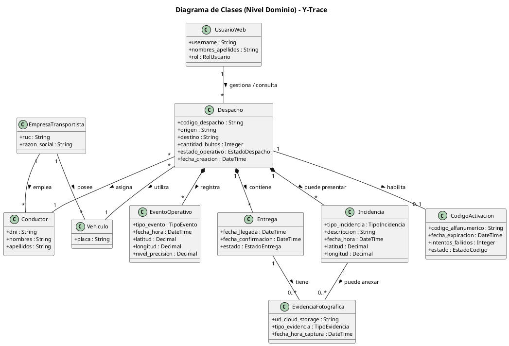

# Modelo de Dominio y Diccionario de Datos: Y-Trace

## 1. Introducción

El presente documento define el **Modelo de Dominio de Y-Trace** para el proyecto:

**Sistema Web y Móvil para la Gestión y Trazabilidad de Despachos y Entregas de Yanbal Perú**

El modelo representa las principales entidades del negocio involucradas en el proceso de despacho, asignación de recursos, activación de la operación, seguimiento GPS, llegada al destino, entrega, registro de incidencias y evidencias.

El modelo corresponde al **nivel de dominio**, por lo que se describen conceptos y atributos relevantes del negocio. No se incluyen detalles de implementación como controladores, servicios, repositorios, tablas físicas de base de datos, JWT, huella del dispositivo, IMEI o biometría.

> **Nota:** Los atributos `cantidad_bultos`, `origen` y `destino` deben mantenerse únicamente si están respaldados por la matriz de requerimientos y la documentación del proyecto.

---

## 2. Diagrama de Clases de Nivel Dominio



---

## 3. Entidades principales del dominio

### 3.1 Despacho

Representa la operación de despacho que será trazada desde su habilitación hasta su finalización.

**Atributos:**

| Atributo | Tipo | Descripción |
|---|---|---|
| `codigo_despacho` | String | Identificador único del despacho. |
| `origen` | String | Punto de origen del despacho. |
| `destino` | String | Punto o destino asociado al despacho. |
| `cantidad_bultos` | Integer | Cantidad de bultos asociados al despacho, si está contemplada en los requerimientos. |
| `estado_operativo` | EstadoDespacho | Estado actual de la operación. |
| `fecha_creacion` | DateTime | Fecha y hora de creación del despacho. |

**Estados considerados:**

- `DISPONIBLE`
- `HABILITADO`
- `EN_RUTA`
- `CON_INCIDENCIA`
- `EN_DESTINO`
- `ENTREGADO`
- `NO_ENTREGADO`
- `FINALIZADO`
- `DESPACHO_CANCELADO`

---

### 3.2 EmpresaTransportista

Representa a la empresa transportista responsable de proporcionar los recursos utilizados para la operación de transporte.

**Atributos:**

| Atributo | Tipo | Descripción |
|---|---|---|
| `ruc` | String | Identificador tributario de la empresa. |
| `razon_social` | String | Nombre legal de la empresa transportista. |

---

### 3.3 Vehiculo

Representa el vehículo asignado para realizar un despacho.

**Atributos:**

| Atributo | Tipo | Descripción |
|---|---|---|
| `placa` | String | Identificador de matrícula del vehículo. |

---

### 3.4 Conductor

Representa al conductor responsable de ejecutar la operación de transporte y utilizar la aplicación móvil durante el despacho.

**Atributos:**

| Atributo | Tipo | Descripción |
|---|---|---|
| `dni` | String | Documento de identidad del conductor. |
| `nombres` | String | Nombres del conductor. |
| `apellidos` | String | Apellidos del conductor. |

---

### 3.5 CodigoActivacion

Representa el código utilizado por el conductor para habilitar su participación en un despacho.

El código es de **un solo uso** y posee una fecha de expiración.

**Atributos:**

| Atributo | Tipo | Descripción |
|---|---|---|
| `codigo_alfanumerico` | String | Código generado para activar el despacho. |
| `fecha_expiracion` | DateTime | Fecha y hora límite para utilizar el código. |
| `intentos_fallidos` | Integer | Cantidad de intentos de validación fallidos. |
| `estado` | EstadoCodigo | Estado actual del código. |

**Estados considerados:**

- `VIGENTE`: puede ser utilizado.
- `CONSUMIDO`: fue utilizado correctamente y no puede reutilizarse.
- `EXPIRADO`: superó su fecha de expiración sin ser utilizado.
- `BLOQUEADO`: alcanzó el límite de intentos fallidos.
- `REVOCADO`: fue invalidado antes de su utilización.

**Ciclo básico:**

```text
VIGENTE
   ├── activación correcta ──> CONSUMIDO
   ├── fecha de expiración ──> EXPIRADO
   ├── demasiados intentos ──> BLOQUEADO
   └── revocación ───────────> REVOCADO
```

---

### 3.6 EventoOperativo

Representa un evento registrado durante la operación del despacho y permite mantener la trazabilidad temporal y geográfica.

**Atributos:**

| Atributo | Tipo | Descripción |
|---|---|---|
| `tipo_evento` | TipoEvento | Tipo de evento registrado. |
| `fecha_hora` | DateTime | Momento en que ocurrió o fue registrado el evento. |
| `latitud` | Decimal | Coordenada geográfica de latitud. |
| `longitud` | Decimal | Coordenada geográfica de longitud. |
| `nivel_precision` | Decimal | Nivel de precisión de la ubicación GPS registrada. |

**Tipos de evento considerados:**

- `SALIDA`
- `LLEGADA`
- `ENTREGA`
- `RECHAZO`
- `GPS_TRACKING`

---

### 3.7 Entrega

Representa el resultado de la operación en el punto de destino.

**Atributos:**

| Atributo | Tipo | Descripción |
|---|---|---|
| `fecha_llegada` | DateTime | Fecha y hora registrada al llegar al destino. |
| `fecha_confirmacion` | DateTime | Fecha y hora de confirmación del resultado de la entrega. |
| `estado` | EstadoEntrega | Estado correspondiente al resultado de la entrega. |

La entidad permite separar conceptualmente el resultado de la entrega de los eventos de trazabilidad que ocurren durante el recorrido.

---

### 3.8 Incidencia

Representa una situación ocurrida durante la operación que puede afectar el recorrido o el resultado del despacho.

**Atributos:**

| Atributo | Tipo | Descripción |
|---|---|---|
| `tipo_incidencia` | TipoIncidencia | Categoría de la incidencia. |
| `descripcion` | String | Detalle de la incidencia registrada. |
| `fecha_hora` | DateTime | Fecha y hora de ocurrencia o registro. |
| `latitud` | Decimal | Ubicación geográfica de la incidencia. |
| `longitud` | Decimal | Ubicación geográfica de la incidencia. |

**Tipos considerados:**

- `MECANICA`
- `ACCIDENTE`
- `BLOQUEO_VIAL`
- `CLIMA`

---

### 3.9 EvidenciaFotografica

Representa una fotografía utilizada como evidencia de una situación relacionada con la entrega o una incidencia.

**Atributos:**

| Atributo | Tipo | Descripción |
|---|---|---|
| `url_cloud_storage` | String | Ubicación de la fotografía almacenada en la nube. |
| `tipo_evidencia` | TipoEvidencia | Clasificación de la evidencia. |
| `fecha_hora_captura` | DateTime | Fecha y hora en que se capturó la evidencia. |

**Tipos considerados:**

- `GUIA_SELLADA`
- `CARGA_RECHAZADA`
- `SINIESTRO`

---

### 3.10 UsuarioWeb

Representa a los usuarios internos que utilizan la plataforma web para gestionar y consultar la trazabilidad.

**Atributos:**

| Atributo | Tipo | Descripción |
|---|---|---|
| `username` | String | Identificador del usuario en la plataforma. |
| `nombres_apellidos` | String | Nombre completo del usuario. |
| `rol` | RolUsuario | Rol que determina sus funciones dentro de la plataforma. |

**Roles considerados:**

- `ADMIN`
- `SUPERVISOR`
- `JEFE`
- `SAC`

---

## 4. Relaciones del modelo

| Relación | Cardinalidad | Descripción |
|---|---:|---|
| EmpresaTransportista - Vehiculo | 1 : * | Una empresa transportista puede disponer de varios vehículos. |
| EmpresaTransportista - Conductor | 1 : * | Una empresa transportista puede contar con varios conductores. |
| Despacho - Vehiculo | * : 1 | Un vehículo puede participar en distintos despachos; cada despacho utiliza un vehículo asignado. |
| Despacho - Conductor | * : 1 | Un conductor puede participar en distintos despachos; cada despacho tiene un conductor asignado. |
| Despacho - CodigoActivacion | 1 : 0..1 | Un despacho puede tener como máximo un código de activación vigente/asociado. |
| Despacho - EventoOperativo | 1 : * | Un despacho registra múltiples eventos operativos. |
| Despacho - Entrega | 1 : * | Un despacho contiene uno o más registros de entrega según el proceso definido. |
| Despacho - Incidencia | 1 : * | Un despacho puede presentar múltiples incidencias. |
| Entrega - EvidenciaFotografica | 1 : 0..* | Una entrega puede tener ninguna o varias evidencias fotográficas. |
| Incidencia - EvidenciaFotografica | 1 : 0..* | Una incidencia puede tener ninguna o varias evidencias fotográficas. |
| UsuarioWeb - Despacho | 1 : * | Un usuario web puede gestionar o consultar múltiples despachos. |

> Las cardinalidades relacionadas con múltiples destinos o múltiples entregas deben validarse contra el proceso real documentado. Si un despacho representa exclusivamente una única entrega, la relación `Despacho - Entrega` puede ajustarse a `1 : 1`.

---

# 5. Diccionario de Datos

## 5.1 Despacho

| Campo | Tipo | Dominio / valores | Observación |
|---|---|---|---|
| `codigo_despacho` | String | Identificador único | Identifica el despacho. |
| `origen` | String | Ubicación de origen | Mantener si está respaldado por los requisitos. |
| `destino` | String | Ubicación de destino | Mantener si está respaldado por los requisitos. |
| `cantidad_bultos` | Integer | Entero >= 0 | Mantener únicamente si está respaldado por los requisitos. |
| `estado_operativo` | Enum | Estados del despacho | Representa el estado actual. |
| `fecha_creacion` | DateTime | Fecha y hora | Momento de creación del despacho. |

## 5.2 EmpresaTransportista

| Campo | Tipo | Dominio / valores | Observación |
|---|---|---|---|
| `ruc` | String | RUC | Identifica a la empresa transportista. |
| `razon_social` | String | Texto | Razón social de la empresa. |

## 5.3 Vehiculo

| Campo | Tipo | Dominio / valores | Observación |
|---|---|---|---|
| `placa` | String | Placa vehicular | Identifica el vehículo. |

## 5.4 Conductor

| Campo | Tipo | Dominio / valores | Observación |
|---|---|---|---|
| `dni` | String | DNI | Identifica al conductor. |
| `nombres` | String | Texto | Nombres del conductor. |
| `apellidos` | String | Texto | Apellidos del conductor. |

## 5.5 CodigoActivacion

| Campo | Tipo | Dominio / valores | Observación |
|---|---|---|---|
| `codigo_alfanumerico` | String | Código único | De un solo uso. |
| `fecha_expiracion` | DateTime | Fecha y hora | Define la vigencia temporal. |
| `intentos_fallidos` | Integer | Entero >= 0 | Registra intentos incorrectos. |
| `estado` | Enum | VIGENTE, CONSUMIDO, EXPIRADO, BLOQUEADO, REVOCADO | Controla el ciclo de vida del código. |

## 5.6 EventoOperativo

| Campo | Tipo | Dominio / valores | Observación |
|---|---|---|---|
| `tipo_evento` | Enum | SALIDA, LLEGADA, ENTREGA, RECHAZO, GPS_TRACKING | Identifica el evento. |
| `fecha_hora` | DateTime | Fecha y hora | Momento del evento. |
| `latitud` | Decimal | Coordenada geográfica | Ubicación registrada. |
| `longitud` | Decimal | Coordenada geográfica | Ubicación registrada. |
| `nivel_precision` | Decimal | Valor de precisión GPS | Precisión de la ubicación. |

## 5.7 Entrega

| Campo | Tipo | Dominio / valores | Observación |
|---|---|---|---|
| `fecha_llegada` | DateTime | Fecha y hora | Registro de llegada al destino. |
| `fecha_confirmacion` | DateTime | Fecha y hora | Registro de confirmación del resultado. |
| `estado` | Enum | Según proceso definido | Resultado de la entrega. |

## 5.8 Incidencia

| Campo | Tipo | Dominio / valores | Observación |
|---|---|---|---|
| `tipo_incidencia` | Enum | MECANICA, ACCIDENTE, BLOQUEO_VIAL, CLIMA | Clasificación de la incidencia. |
| `descripcion` | String | Texto | Descripción de lo ocurrido. |
| `fecha_hora` | DateTime | Fecha y hora | Momento de ocurrencia o registro. |
| `latitud` | Decimal | Coordenada geográfica | Ubicación de la incidencia. |
| `longitud` | Decimal | Coordenada geográfica | Ubicación de la incidencia. |

## 5.9 EvidenciaFotografica

| Campo | Tipo | Dominio / valores | Observación |
|---|---|---|---|
| `url_cloud_storage` | String | URL/ruta de almacenamiento | Referencia a la evidencia almacenada. |
| `tipo_evidencia` | Enum | GUIA_SELLADA, CARGA_RECHAZADA, SINIESTRO | Clasificación de la fotografía. |
| `fecha_hora_captura` | DateTime | Fecha y hora | Momento de captura. |

## 5.10 UsuarioWeb

| Campo | Tipo | Dominio / valores | Observación |
|---|---|---|---|
| `username` | String | Identificador de usuario | Identifica al usuario web. |
| `nombres_apellidos` | String | Texto | Nombre completo. |
| `rol` | Enum | ADMIN, SUPERVISOR, JEFE, SAC | Rol funcional del usuario. |

---

# 6. Matriz de Entidades y Participación en el Proceso

| Entidad | Participación en el proceso |
|---|---|
| **Despacho** | Representa la operación principal. Se crea, asigna a recursos, se habilita, se actualiza durante el recorrido, registra el resultado y se finaliza. |
| **EmpresaTransportista** | Proporciona los vehículos y conductores que participan en las operaciones de transporte. |
| **Vehiculo** | Es asignado a un despacho y participa físicamente en el recorrido. |
| **Conductor** | Ejecuta el despacho, utiliza el código de activación, realiza el recorrido, transmite la ubicación y registra los eventos correspondientes. |
| **CodigoActivacion** | Permite al conductor habilitar la operación. Se valida, consume, expira, bloquea o revoca según corresponda. |
| **EventoOperativo** | Registra los acontecimientos relevantes de la operación y su ubicación temporal/geográfica. |
| **Entrega** | Consolida el resultado de la llegada al destino y la confirmación de la entrega. |
| **Incidencia** | Registra situaciones que ocurren durante el recorrido y pueden afectar la operación. |
| **EvidenciaFotografica** | Conserva evidencia relacionada con entregas, rechazos o incidencias. |
| **UsuarioWeb** | Gestiona y consulta los despachos mediante la plataforma web y visualiza la trazabilidad. |

---

# 7. Matriz de Trazabilidad: Requerimiento - Entidad - Atributos

| Requerimiento / función | Entidad relacionada | Atributos principales |
|---|---|---|
| Registrar y gestionar despacho | Despacho | `codigo_despacho`, `origen`, `destino`, `estado_operativo`, `fecha_creacion` |
| Asociar vehículo al despacho | Despacho / Vehiculo | `placa` |
| Asociar conductor al despacho | Despacho / Conductor | `dni`, `nombres`, `apellidos` |
| Generar código de activación | CodigoActivacion | `codigo_alfanumerico`, `fecha_expiracion`, `estado` |
| Validar código de activación | CodigoActivacion | `codigo_alfanumerico`, `intentos_fallidos`, `estado` |
| Controlar vigencia del código | CodigoActivacion | `fecha_expiracion`, `estado` |
| Registrar salida y eventos operativos | EventoOperativo | `tipo_evento`, `fecha_hora`, `latitud`, `longitud`, `nivel_precision` |
| Realizar seguimiento GPS | EventoOperativo | `tipo_evento`, `fecha_hora`, `latitud`, `longitud`, `nivel_precision` |
| Registrar llegada al destino | Entrega / EventoOperativo | `fecha_llegada`, `fecha_hora`, `estado` |
| Registrar resultado de entrega | Entrega | `fecha_confirmacion`, `estado` |
| Registrar incidencia | Incidencia | `tipo_incidencia`, `descripcion`, `fecha_hora`, `latitud`, `longitud` |
| Registrar evidencia fotográfica | EvidenciaFotografica | `url_cloud_storage`, `tipo_evidencia`, `fecha_hora_captura` |
| Consultar trazabilidad | Despacho / EventoOperativo / Entrega / Incidencia | Identificador, estados, eventos, fechas y ubicaciones |
| Gestionar y consultar desde la Torre de Control | UsuarioWeb / Despacho | `username`, `rol`, datos del despacho y su trazabilidad |

---

# 8. Consideraciones de modelado

1. **El modelo es conceptual.** Los atributos representan información relevante del negocio y no necesariamente corresponden uno a uno con columnas físicas de una base de datos.

2. **No se incluye `SesionOperativa`.** Los detalles de autenticación técnica, como JWT, pertenecen al diseño técnico y no son una entidad necesaria del dominio.

3. **No se incluye información del dispositivo.** No forman parte del modelo atributos como nombre del dispositivo, modelo, IMEI, huella del dispositivo o biometría, debido a que no están contemplados en el alcance definido para la aplicación móvil.

4. **El código de activación es de un solo uso.** Una vez validado correctamente, pasa a `CONSUMIDO` y no debe reutilizarse.

5. **La expiración es independiente del consumo.** Un código no utilizado puede pasar de `VIGENTE` a `EXPIRADO` al alcanzar su fecha límite.

6. **Las incidencias pueden contener evidencia fotográfica.** Esto permite documentar situaciones como accidentes, rechazos o siniestros.

7. **El seguimiento GPS se representa mediante eventos.** `GPS_TRACKING` permite conservar posiciones sucesivas durante el recorrido.

8. **Los atributos deben estar respaldados por los requerimientos.** Si un atributo no aparece en la documentación funcional, debe eliminarse o justificarse antes de considerarlo definitivo.

9. **La cardinalidad de Entrega debe validarse.** Si el proceso contempla múltiples destinos dentro de un mismo despacho, la relación `Despacho - Entrega` puede representar múltiples entregas. Si cada despacho corresponde a una única entrega, debe ajustarse a `1 : 1`.

---

# 9. Elementos fuera del Modelo de Dominio

Los siguientes elementos no se incluyen como entidades del nivel dominio porque corresponden principalmente a aspectos de implementación tecnológica:

- JWT.
- Sesiones técnicas.
- Huella del dispositivo.
- IMEI.
- Nombre o modelo del dispositivo.
- Biometría.
- Controladores REST.
- Servicios de Spring Boot.
- Repositorios.
- Entidades JPA.
- Tablas físicas de PostgreSQL.
- Configuración de infraestructura.
- APIs internas.
- Configuración de almacenamiento cloud.

Estos elementos pueden documentarse posteriormente en los modelos de **análisis, diseño y arquitectura técnica**, si forman parte del alcance de esos entregables.

---

# 10. Resumen del modelo

El dominio de Y-Trace se centra en `Despacho` como entidad principal. El despacho se relaciona con los recursos de transporte (`Vehiculo`, `Conductor` y `EmpresaTransportista`), se habilita mediante `CodigoActivacion` y genera información de trazabilidad mediante `EventoOperativo`.

Durante la operación pueden registrarse `Incidencia` y `EvidenciaFotografica`. Al llegar al destino, `Entrega` permite representar el resultado de la operación. Finalmente, `UsuarioWeb` representa a los usuarios internos que gestionan y consultan la información desde la Torre de Control.

La estructura busca mantener una separación clara entre el **negocio de trazabilidad de despachos** y los detalles técnicos de implementación.
