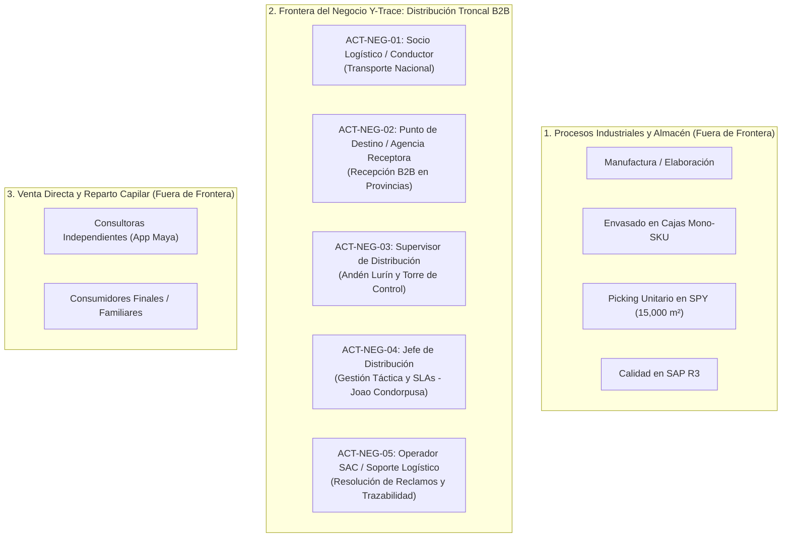
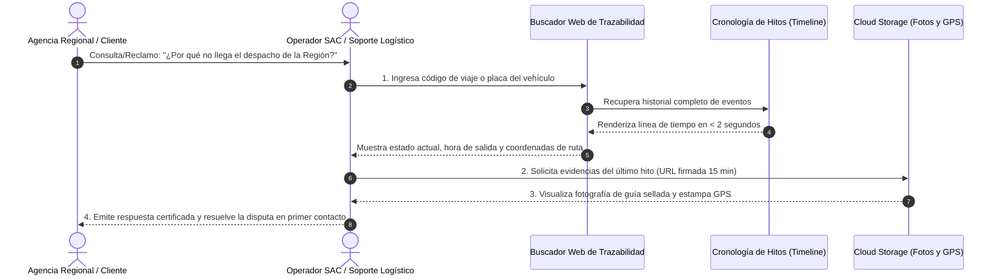

# Informe Técnico: Justificación de Actores del Negocio (CUN) y Guía Maestra de Sustentación

> **Ubicación:** `detalles/respuesta/INFORME_JUSTIFICACION_ACTORES_CUN_Y_GUIA_SUSTENTACION.md`  
> **Proyecto Oficial:** Sistema Web y Móvil para la Gestión y Trazabilidad de Despachos y Entregas de Yanbal Perú (Y-Trace)  
> **Marco Metodológico:** Rational Unified Process (RUP) — Modelado del Negocio (Sesión 4 UTP / Arquitectura Empresarial)  
> **Fuente de Verdad Operativa:** Entrevista oficial al **Ing. Joao Condorpusa Mendoza** (Encargado del Área de Distribución de Yanbal Perú), transcripción textual y base de conocimiento en `informacion/`.

---

## 1. Resumen Ejecutivo y Validación de Implementación

Tras una rigurosa auditoría de la base de requerimientos, la transcripción de la entrevista y el modelo de procesos en `Diagrama de Casos de Uso del Negocio (CUN)`:

1. **El modelo CUN está 100% bien implementado y metodológicamente consolidado.**
2. Cumple textualmente con los requerimientos académicos de la Sesión 4:
   - Identificación de actores del negocio con estereotipos RUP (`<<business actor>>`).
   - Identificación de los 5 macro-procesos capitales (`<<business use case>>`).
   - Matriz completa de atribuciones, roles, actividades, entradas y salidas de información.
3. No comete el error habitual de confundir casos de uso de negocio con pantallas de software.
4. Posee trazabilidad bidireccional contra los **34 Requerimientos Funcionales** activos del sistema (RF001 a RF034).

---

## 2. Diferencia Conceptual Rigurosa: Diagrama CUN vs. Diagrama de Casos de Uso del Sistema (CUS)

En la rúbrica de Ingeniería de Requerimientos y Modelado UML existen dos diagramas de casos de uso claramente diferenciados:

```
┌─────────────────────────────────────────────────────────────────────────────────────────────────┐
│                                 COMPARATIVA CONCEPTUAL (RUP / UML)                              │
├────────────────────────────────┬────────────────────────────────────────────────────────────────┤
│ CASOS DE USO DEL NEGOCIO (CUN) │ CASOS DE USO DEL SISTEMA (CUS)                                 │
├────────────────────────────────┼────────────────────────────────────────────────────────────────┤
│ • Nivel: Organizacional /      │ • Nivel: Interacción Usuario-Software                          │
│   Macro-procesos empresariales │ • Foco: ¿Qué funciones computacionales ejecuta el sistema?     │
│ • Foco: ¿Qué hace la empresa?  │ • Depende de pantallas, formularios, clics, APIs y base datos. │
│ • Independiente de la UI.      │ • Se derivan de los 34 Requerimientos Funcionales (RF).        │
│ • Son solo 5 CUN en Y-Trace.   │ • Notación UML estándar: Óvalos simples sin barra diagonal.    │
│ • Notación RUP: Barra diagonal │ • Estereotipos: <<include>>, <<extend>>, actores de software.   │
│   en actores y óvalos.         │                                                                │
└────────────────────────────────┴────────────────────────────────────────────────────────────────┘
```

* **El CUN** modela la realidad logística humana: transportar mercadería, inspeccionar bultos en andén, atender siniestros viales en carretera y calificar transportistas.
* **El CUS** modelará cómo el conductor presiona un botón en la PWA para transmitir telemetría, cómo el supervisor genera un token de activación de 8 caracteres o cómo el sistema publica un evento al Bus corporativo en menos de 30 minutos.

---

## 3. ¿Por qué se escogieron exactamente esos 5 Actores? Criterio y Delimitación de Frontera

En la entrevista se mencionan más de 12 roles organizacionales (operarios de manufactura, acondicionadores de envases, operarios de picking en SPY, inspectores de calidad en cuarentena, analistas de siniestros de seguridad patrimonial, consultoras independientes y clientes finales).

El criterio metodológico para filtrarlos a exactamente 5 actores del negocio responde a la **Frontera de Distribución B2B (Punto a Punto)**:



### Razones de Exclusión:
1. **Exclusión de Procesos Industriales y Almacén (Manufactura, Envasado, SPY):** Yanbal ya opera con SAP R3 y su WMS in-house SPY. Modelar estos procesos transformaría el proyecto en un software de planta química o de almacén general, perdiendo el foco en la distribución.
2. **Exclusión del Reparto Minorista Capilar (B2C a Consultoras):** La entrega casa por casa a consultoras se rige por ruteo capilar externo en vehículos menores (TMS Driving). El dolor capital declarado por el Ing. Joao Condorpusa reside en la **red troncal interprovincial hacia los 24 departamentos** (camiones de carga pesada Lurín $\rightarrow$ agencias departamentales).
3. **Exclusión de Sistemas Informáticos:** En RUP, herramientas como SAP R3, SPY, Driving, NSDG, Maya o el Bus ESB son aplicaciones de software, **no actores del negocio**.

### Criterio de Inclusión:
Los 5 actores seleccionados cubren de forma estricta e insustituible los 5 roles fundamentales de la cadena de valor del transporte:
- **Quién transporta:** Socio Logístico / Conductor (Externo).
- **Quién recibe en provincia:** Punto de Destino / Agencia Receptora (Externo).
- **Quién despacha y vigila la ruta en vivo:** Supervisor de Distribución (Interno operativo).
- **Quién audita contratos y gestiona SLAs:** Jefe de Distribución (Interno táctico).
- **Quién responde reclamos e investiga entregas:** Operador SAC / Soporte Logístico (Interno post-entrega).

---

## 4. Evidencia y Respaldo Documental de los 5 Actores (Entrevista al Ing. Joao Condorpusa)

Cada actor está respaldado por declaraciones directas y marcas de tiempo extraídas de la transcripción oficial:

| Actor del Negocio | Clasificación | Por qué fue escogido | Cita Textual de Respaldo en la Entrevista | Minuto / Segundo | Archivo de Respaldo |
| :--- | :---: | :--- | :--- | :---: | :--- |
| **ACT-NEG-01: Socio Logístico / Conductor** | `<<business actor>>`<br/>(Externo) | Transportista tercero que asume la custodia legal, conduce la unidad pesada por carretera, emite GPS y entrega la carga. | *"...y desde el centro de distribución se hace la cadena logística para el despacho de los pedidos hacia el cliente final, a través de **proveedores logísticos asociados**... Hacemos la distribución en los **24 departamentos del país** por diferentes modalidades: terrestre, bimodal, aéreo..."* | **1:24** y **19:23** | `informacion/00 - Fuente/Transcripción original.md` (Líneas 25 y 101); `informacion/02 - Transporte/Transporte y logística.md` |
| **ACT-NEG-02: Punto de Destino / Agencia Receptora** | `<<business actor>>`<br/>(Externo) | Encargado en la sede departamental que recepciona físicamente pallets/bultos, inspecciona precintos y otorga conformidad o rechazo formal. | *"Zonificado llámese la canalización a través de la dirección de entrega para ser **distribuido por regiones**... Manejamos lead times con promesa de entrega: **24 horas para Lima y hasta 7 días a nivel de provincias**."* | **19:15** y **22:38** | `informacion/00 - Fuente/Transcripción original.md` (Líneas 101 y 115); `Diagrama de Casos de Uso del Negocio (CUN)/05_CUN_04_ENTREGA_Y_RECEPCION_DESTINO.md` |
| **ACT-NEG-03: Supervisor de Distribución** | `<<business actor>>`<br/>(Interno) | Operador interno en CD Lurín que controla el andén, genera el código de habilitación de 8 caracteres y vigila la Torre de Control. | *"Luego de haber sido elaborado, **pasa a la zona de despacho** donde ya tiene amarrada la información comercial... y otros datos referenciales que nos sirve para hacer trazabilidad... los roles operativos tienen la limitación de ejecutar una tarea operativa..."* | **17:34**, **19:04** y **26:09** | `informacion/00 - Fuente/Transcripción original.md` (Líneas 91, 103 y 131); `informacion/08 - Actores/Actores y responsabilidades.md` |
| **ACT-NEG-04: Jefe de Distribución** | `<<business actor>>`<br/>(Interno) | Responsable táctico de Supply Chain (rol de Joao Condorpusa). Fiscaliza *Lead Times*, penalidades a transportistas e informes consolidados en Excel. | *"...ingeniero Joao Condorpusa Mendoza, encargado del área de distribución... **nuestro mayor reto ahora es hacer las actualizaciones de los estados con un desfase menor a 30 minutos**... los roles de dirección netamente plantean la estrategia de trabajo..."* | **0:21**, **23:16** y **26:43** | `informacion/00 - Fuente/Transcripción original.md` (Líneas 19, 119 y 131); `informacion/08 - Actores/Actores y responsabilidades.md` |
| **ACT-NEG-05: Operador SAC / Soporte Logístico** | `<<business actor>>`<br/>(Interno) | Atiende reclamos y consultas de agencias, examina la cronología de hitos y valida evidencias fotográficas/GPS para mitigar disputas. | *"Entonces eso nos da un margen de desconocimiento... y también **nos incurre en otros aspectos como para poder responder ante algún reclamo o ante la consulta del mismo cliente final a través de nuestro servicio al cliente (CELLFORCE / Salesforce)**..."* | **24:09 a 24:36** y **28:44** | `informacion/00 - Fuente/Transcripción original.md` (Líneas 121 y 139); `informacion/07 - Problemas/Problemas y necesidades.md` (Problema PR-04) |

---

## 5. Análisis Especial: ¿Por qué existe "Soporte" (Operador SAC) y qué hace ese Actor?

### 5.1 La Causa Raíz en la Realidad Operativa
En la entrevista oficial, el Ing. Joao Condorpusa declara que el **dolor número uno de Yanbal es la ventana ciega de 2 horas en el tracking**. 
Cuando una carga interprovincial sufre un retraso, bloqueo de carretera o desvío, la agencia de destino o el cliente no tienen visibilidad y llaman alarmados al centro de contacto. 

Históricamente, el personal de atención y soporte sufría dos problemas:
1. Sus pantallas en Salesforce tenían datos desfasados por hasta 2 horas.
2. Para saber dónde estaba la carga, debían recurrir a llamadas telefónicas informales a los choferes en plena ruta, interrumpiendo la conducción o encontrando teléfonos fuera de cobertura.

### 5.2 ¿Qué hace exactamente en el proceso CUN-05?
El Operador SAC / Soporte Logístico interviene activamente en el proceso **CUN-05: Auditoría de Trazabilidad y Rendimiento de Distribución** realizando 4 tareas sustantivas:



1. **Búsqueda Indexada Instantánea:** Localiza expedientes logísticos por código alfanumérico o placa vehicular con tiempos de respuesta menores a 2 segundos.
2. **Inspección de la Línea de Tiempo (*Timeline*):** Revisa cronológicamente cuándo salió de Lurín, qué puntos de telemetría registró en carretera y a qué hora exacta ingresó a la geocerca de destino.
3. **Validación de Evidencias Certificadas:** Accede a coordenadas GPS atómicas y fotografías de comprobación (guías selladas o pallets estibados) alojadas de forma segura en la nube.
4. **Resolución en Primer Contacto:** Resuelve dudas y desvirtúa falsos reclamos de extravío con respaldo probatorio sin molestar a los transportistas en ruta.

---

## 6. ¿Cómo afectan estos Actores al Sistema de Software?

En el paso del Modelo del Negocio a la Ingeniería de Software, los actores del negocio se traducen directamente en perfiles, permisos RBAC y tipos de interfaces dentro de la arquitectura de Y-Trace:

| Actor del Negocio | Rol / Interfaz de Software en Y-Trace | Cómo Afecta al Sistema (Transacciones y Capacidades) | Requerimientos Funcionales Vinculados |
| :--- | :--- | :--- | :---: |
| **Socio Logístico / Conductor** | **Usuario Móvil (PWA Android)** | Inicia sesión sin contraseña mediante Código de Activación efímero de 8 caracteres; transmite telemetría GPS cada 10 min en segundo plano; almacena datos en IndexedDB offline; captura fotos de evidencias y confirma entrega/rechazo. | RF010 a RF023 |
| **Supervisor de Distribución** | **Operador de Torre de Control (Web)** | Gestiona despachos en andén; genera códigos efímeros; monitorea la flota mediante grilla operativa con semaforización visual; atiende alertas de siniestro/timeout y ejecuta cierres forzados administrativos en bitácora inmutable. | RF007 a RF009, RF024, RF026 |
| **Jefe de Distribución** | **Usuario Ejecutivo / Analítico (Web)** | Consume el Dashboard de KPIs (*Lead Time*, puntualidad, latencia de integración $\le$ 30 min); fiscaliza el aislamiento de datos multitransportista y exporta consolidados exclusivamente en formato Excel (`.xlsx`). | RF028, RF034 |
| **Operador SAC / Soporte Logístico** | **Usuario de Consulta Rápida (Web)** | Utiliza el buscador indexado de despachos; visualiza el *timeline* cronológico completo en $<$ 2 s y accede a URLs firmadas temporales (15 min) para ver fotos de evidencias en Cloud Storage. | RF025, RF027 |
| **Punto de Destino / Agencia** | **Entidad Condicionante de Validación** | No requiere credenciales web propias (para evitar costos administrativos en 24 regiones). Afecta al sistema al validar o rechazar físicamente la carga, forzando la captura de firma, sello y causales tipificadas por el conductor. | RF015, RF016, RF017 |

---

## 7. Guía Maestra para la Exposición Oral (Defensa ante el Jurado)

### 7.1 Discurso Estructurado de Presentación (3 a 4 Minutos)

* **Introducción y Enfoque (1 minuto):**  
  > *"Buenas tardes, profesor y miembros del jurado. Hoy sustentamos el **Modelo de Casos de Uso del Negocio (CUN)** para el proyecto **Y-Trace** de **Yanbal Perú**.*  
  > *Nuestra arquitectura se fundamenta directamente en las declaraciones operativas del **Ing. Joao Condorpusa Mendoza**, Encargado del Área de Distribución nacional. En la entrevista, el Ing. Joao identificó que el dolor número uno de la empresa es un **desfase de hasta 2 horas en el seguimiento de pedidos** hacia los 24 departamentos del país.*  
  > *Bajo la metodología RUP, definimos una frontera de negocio rigurosa: **Distribución Troncal B2B y Trazabilidad Nacional**. Dejamos fuera deliberadamente la manufactura y el picking de almacén para enfocarnos en resolver la brecha de transporte."*

* **Defensa de los 5 Actores (1.5 minutos):**  
  > *"Identificamos exactamente **5 Actores del Negocio (`<<business actor>>`)**, segregados en externos e internos:*  
  > *1. El **Socio Logístico / Conductor**, contratista tercero que traslada la carga pesada y emite telemetría GPS.*  
  > *2. El **Punto de Destino / Agencia Receptora**, encargado regional en los 24 departamentos que recibe y valida físicamente los bultos.*  
  > *3. El **Supervisor de Distribución**, operador interno que en andén entrega el código efímero de salida y vigila la Torre de Control.*  
  > *4. El **Jefe de Distribución**, nivel táctico encarnado por Joao Condorpusa, quien mide el Lead Time de 24h a 7 días y penaliza retrasos.*  
  > *5. El **Operador SAC / Soporte Logístico**, actor interno esencial que atiende reclamos en Salesforce y consulta evidencias fotográficas en menos de 2 segundos.*  
  > *Cada actor responde a una cita textual de la entrevista y representa un eslabón insustituible de la cadena."*

* **Cierre y Trazabilidad al Software (1 minuto):**  
  > *"Estos actores articulan **5 Casos de Uso del Negocio (CUN)**: Despacho en CD, Traslado Interprovincial, Gestión de Incidencias, Entrega en Destino y Auditoría de Rendimiento.*  
  > *Es fundamental remarcar que este diagrama modela los procesos de la empresa y no pantallas de software. Cada CUN se encuentra mapeado bidireccionalmente contra nuestros **34 Requerimientos Funcionales**, los cuales darán soporte a los Casos de Uso del Sistema (CUS) en la siguiente entrega. Quedamos a su disposición para las preguntas."*

---

### 7.2 Banco de Preguntas Trampa del Jurado y Respuestas Maestras

#### Pregunta 1: "¿Por qué en su diagrama solo hay 5 casos de uso si su sistema tiene más de 30 requerimientos funcionales?"
* **Respuesta Maestra:**  
  > *"Profesor, porque estamos en la disciplina de **Modelado del Negocio** bajo RUP (Sesión 4). Los CUN representan macro-procesos operacionales de la empresa, no funciones computacionales individuales. Convertir cada requerimiento funcional en un CUN sería cometer el error de diseñar 'CUNs de pantalla' o 'CUNs botón' (como 'CUN Autenticarse' o 'CUN Guardar GPS'). Los 34 requerimientos funcionales son los servicios de software que dan soporte a estos 5 macro-procesos y que darán origen a los Casos de Uso del Sistema (CUS)."*

#### Pregunta 2: "¿Qué hace 'Soporte / SAC' en un sistema que es de camiones y transporte?"
* **Respuesta Maestra:**  
  > *"En el minuto 24:09 de la entrevista, el Ing. Joao Condorpusa explicó textualmente que el retraso de 2 horas en el tracking impacta directamente en el área de Servicio al Cliente, porque las agencias y clientes reclaman sin que el operador sepa qué pasó con la carga. El Operador SAC interviene en el proceso **CUN-05** como el actor interno que consulta la línea de tiempo y valida las evidencias de entrega (fotos y coordenadas GPS) para resolver disputas en el primer contacto sin tener que llamar por teléfono a los choferes en plena ruta."*

#### Pregunta 3: "¿Por qué no están como actores las Consultoras de Yanbal ni los Clientes Finales?"
* **Respuesta Maestra:**  
  > *"Porque la frontera del proyecto se definió rigurosamente como **Distribución Troncal B2B Punto a Punto** (desde CD Lurín hacia las Agencias Departamentales en los 24 departamentos). Las consultoras corresponden al reparto capilar domiciliario (B2C), el cual ya se rige por herramientas de ruteo menor como Driving. Nuestro sistema ataca el transporte pesado intercentros, que es donde se genera el desfase crítico de 2 horas."*

#### Pregunta 4: "¿Por qué no veo a SAP R3, Driving ni al Bus de Integración en el diagrama de actores?"
* **Respuesta Maestra:**  
  > *"Porque según el estándar de modelado de RUP y UML, los sistemas informáticos, bases de datos o middlewares **nunca son Actores del Negocio (`<<business actor>>`)**. Los actores del negocio son exclusivamente personas, roles o entidades organizacionales que ejecutan procesos o reciben su valor. Esos sistemas externos aparecerán en la siguiente fase en los diagramas de arquitectura de software y casos de uso del sistema."*
