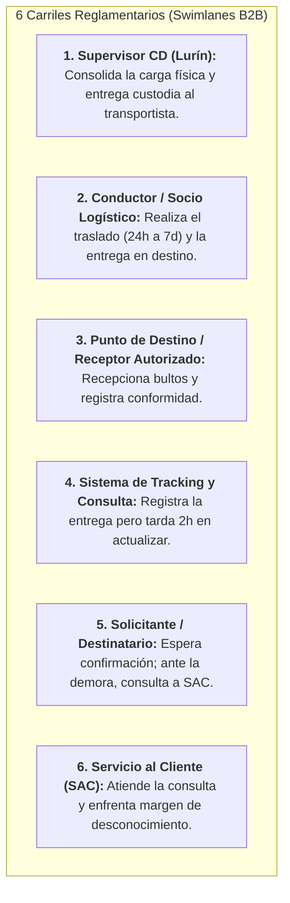

# Informe Técnico: Justificación, Análisis Metodológico y Defensa de los Diagramas de Actividades AS-IS

> **Ubicación:** `respuesta/INFORME_JUSTIFICACION_Y_ANALISIS_DIAGRAMAS_ACTIVIDADES_AS_IS.md`  
> **Destinatario:** Equipo del Proyecto Y-Trace / Sustentación Académica APF1 (Semanas 6 y 7 UTP)  
> **Curso:** Diseño e Implementación de Arquitectura Empresarial  
> **Proyecto:** Sistema Web y Móvil para la Gestión y Trazabilidad de Despachos y Entregas de Yanbal Perú (Y-Trace)  
> **Fuentes de Verdad:**  
> - Entrevista oficial al **Ing. Joao Condorpusa Mendoza** (Encargado del Área de Distribución de Yanbal Perú).  
> - Base de Conocimiento y especificaciones arquitecturales del proyecto Y-Trace.  
> **Archivos Vinculados:**  
> - [[00_INDICE_Y_GUIA_DIAGRAMAS_ACTIVIDADES]] — Índice maestro y guía metodológica  
> - [[01_DIAGRAMA_ACTIVIDADES_AS_IS_PROBLEMA_CRITICO]] — Diagrama oficial del problema crítico (Zoom del desfase de 2h - 6 Carriles)  
> - [[02_DIAGRAMA_ACTIVIDADES_AS_IS_GENERAL]] — Diagrama oficial del flujo general completo y logística inversa (5 Carriles)  
> - [[02 - Guía Oficial de Propuesta de Proyecto Final]] — Rúbrica oficial UTP (Capítulo 3.3, numeral 3)  

---

## 1. Resumen Ejecutivo y Marco Normativo UTP (APF1)

En la entrega del **Avance de Proyecto Final 1 (APF1)**, la **Guía Oficial de la UTP (Capítulo 3.3, numeral 3)** exige de manera obligatoria y taxativa la presentación de **ambos diagramas de actividades AS-IS**:

> *«3. **Diagramas de Actividades AS-IS:**  
>    - Flujo de los procesos de negocio actuales enfocados en el problema crítico a resolver.  
>    - Flujo general de los procesos de negocio actuales.»*

Por ende, **se conservan ambos diagramas**, cumpliendo propósitos complementarios dentro de la arquitectura empresarial:

1. **Conservación y Enfoque Diferenciado:**
   - **Diagrama 01 (Problema Crítico):** Realiza un *zoom* sobre el **desfase promedio de aproximadamente 2 horas en la actualización del tracking actual**, modelando cómo esa brecha temporal genera un margen de desconocimiento que dificulta responder consultas y reclamos en Servicio al Cliente (SAC).
   - **Diagrama 02 (Flujo General):** Modela el proceso de negocio de distribución que **realmente ocurre hoy en la empresa**, abarcando la preparación en almacén, despacho, transporte (24 departamentos, modalidades terrestre, bimodal y aérea), entrega y el **subflujo formal de logística inversa y reposición** ante siniestros o entregas fallidas.
2. **Frontera Metodológica Estricta (AS-IS vs. TO-BE):**
   - Los diagramas AS-IS representan **lo que ocurre hoy en el negocio**. No contienen funcionalidades nuevas de la solución de software futura Y-Trace (tales como código de activación, App Nativa, GPS de la solución ni sincronización offline en `SQLite (Room)`). Dichos elementos corresponden exclusivamente al modelo **TO-BE** del sistema.
   - **No se elimina una actividad del AS-IS solo porque no exista como requerimiento funcional.** Los 34 Requerimientos Funcionales (RF) describen lo que construirá el equipo de software; el AS-IS describe el proceso operativo actual tal como funciona en la empresa.
3. **El Problema Central del Negocio:**
   - Yanbal **sí tiene tracking** (opera con plataformas como Drivin y ENSDY); el problema radica en que la información **presenta un desfase promedio de 2 horas en actualizarse hacia los canales de consulta**.
   - Por ello, **Y-Trace no busca reemplazar el tracking corporativo ni crearlo desde cero**, sino mejorar la captura y comunicación oportuna de los eventos logísticos para **reducir ese desfase a un objetivo máximo de 30 minutos** (SLA corporativo meta).

---

## 2. Diferencia Conceptual: Diagrama General vs. Diagrama del Problema Crítico

```
┌──────────────────────────────────────────────────────────────────────────────────────────────────┐
│                             COMPARATIVA CONCEPTUAL DE DIAGRAMAS AS-IS                            │
├────────────────────────────────┬─────────────────────────────────────────────────────────────────┤
│ DIAGRAMA AS-IS GENERAL         │ DIAGRAMA AS-IS DEL PROBLEMA CRÍTICO                             │
├────────────────────────────────┼─────────────────────────────────────────────────────────────────┤
│ • Lente: Visión Macroscópica.  │ • Lente: Visión Microscópica y de Causa-Efecto.                 │
│ • Alcance: Proceso completo    │ • Alcance: Zoom del proceso actual donde se evidencia el        │
│   actual del negocio de        │   desfase de trazabilidad de aproximadamente 2 horas y su       │
│   distribución física y        │   impacto en Servicio al Cliente (SAC).                         │
│   logística inversa.           │ • Temporalidad: Horas críticas del viaje y momento de entrega.  │
│ • Temporalidad: Días a semanas │ • Pregunta clave: ¿Por qué la entrega ya ocurrió físicamente,   │
│   (desde pedido comercial      │   pero el sistema sigue desfasado dificultando la atención?     │
│   hasta cierre y liquidación). │ • Carriles: 6 actores operativos, transportistas y sistemas.    │
│ • Carriles: 5 áreas clave.     │                                                                 │
└────────────────────────────────┴─────────────────────────────────────────────────────────────────┘
```

---

## 3. Explicación Detallada del Diagrama 1: Flujo Enfocado en el Problema Crítico

### 3.1 Los 6 Carriles de Responsabilidad (*Swimlanes*)

Para evitar confusiones entre la recepción física del pedido y la consulta por demora a SAC, el flujo se estructura en **6 Carriles (Particiones)** claramente delimitados:



### 3.2 Secuencia Cronológica del Desfase (Paso a Paso)

El flujo modela con nitidez que la consulta ocurre **mientras el sistema todavía se encuentra desactualizado**, y que la actualización a `ENTREGADO` ocurre con posterioridad:

```
[Entrega física en destino]
           │
           ▼
[Registro del evento en tracking]
           │
           ▼
[DESFASE PROMEDIO DE ~2 HORAS]
           │
           ├── (Durante el desfase) ──────────────────────────────────────────────────┐
           │                                                                          │
           │                                                       [Solicitante consulta a SAC]
           │                                                                          │
           │                                                                          ▼
           │                                                       [SAC consulta estado en sistema]
           │                                                                          │
           │                                                                          ▼
           │                                                       [Sistema aún desactualizado]
           │                                                                          │
           │                                                                          ▼
           │                                                       [SAC verifica con distribución]
           │                                                                          │
           │                                                                          ▼
           │                                                       [Margen de desconocimiento temporal]
           │                                                                          │
           ▼ (Transcurridas las 2 horas)                                              │
[Tracking actualiza a ENTREGADO tardíamente] ◄────────────────────────────────────────┘
```

1. **Andén de CD Lurín (Despacho):**  
   El Supervisor de Despacho consolida la carga física en el andén de CD Lurín, emite la documentación de despacho y hace entrega de la custodia de la carga al conductor del socio logístico.
2. **Carretera Nacional (Traslado de 24h a 7 días):**  
   El conductor inicia el traslado hacia el destino (24 horas en Lima Metropolitana y hasta 7 días en provincias).  
   *Nodo de contingencia:* Si ocurre una avería mecánica o siniestro vial en ruta, se registra y gestiona la incidencia con el socio logístico, superando la contingencia para continuar el traslado hacia el destino.
3. **Punto de Destino Departamental (Entrega física):**  
   El conductor arriba a la agencia o punto de destino, descarga los paquetes y hace entrega física de la carga. El receptor autorizado verifica el contenido de los bultos y registra la conformidad de recepción.
4. **Sistema de Tracking y Consulta (El Desfase Promedio de 2 Horas):**  
   Se registra el evento de entrega en el sistema de tracking actual. No obstante, **se produce el desfase promedio de 2 horas en la actualización del estado hacia los canales de consulta**. Durante este intervalo, la entrega ya se consumó en la realidad física, pero el estado digital permanece pendiente de actualización.
5. **Solicitante / Destinatario (Consulta durante el Desfase):**  
   Transcurre el tiempo estimado de entrega sin que se visualice la confirmación actualizada en el sistema. Surge la incertidumbre y el solicitante se comunica con Servicio al Cliente (SAC) para consultar o reclamar por la falta de información actualizada.
6. **Servicio al Cliente (Consulta Desfasada y Dificultad de Respuesta):**  
   El operador de SAC recibe la consulta y revisa el sistema: **el estado consultado aún no refleja la entrega debido al desfase de actualización**.  
   El operador intenta verificar la situación real del pedido con el área de distribución, pero enfrenta el **margen de desconocimiento temporal**, dificultando brindar una respuesta certera durante ese lapso.
7. **Actualización Posterior del Sistema:**  
   Transcurrido el desfase promedio de 2 horas, el sistema actualiza posteriormente el estado a **ENTREGADO**, quedando disponible cuando la consulta, reclamo o fricción en la atención ya se produjo.

---

## 4. Explicación Detallada del Diagrama 2: Flujo General y Logística Inversa

El Diagrama General abarca la visión completa del macro-proceso logístico actual de Yanbal a nivel de procesos de negocio, organizado en **5 Carriles (Particiones)**:

### 4.1 Secuencia del Flujo General

1. **Centro de Distribución (Lurín):**  
   - Generar pedido en la plataforma comercial.  
   - Elaborar picking y consolidar cajas en almacén (asignación en 8 formatos por volumetría).  
   - Zonificar despacho para los 24 departamentos.
2. **Supervisor de Despacho:**  
   - Emitir documentación de despacho.  
   - Verificar carga física contra manifiesto.  
   - Entregar custodia al socio logístico.
3. **Conductor / Socio Logístico:**  
   - Cargar unidad vehicular e iniciar viaje interprovincial (modalidades terrestre, bimodal o aérea; lead times de 24h a 7 días).
4. **Subflujo de Logística Inversa y Reposición en Almacén (Minutos 20:18 a 21:35):**  
   Si durante el transporte ocurre un siniestro, daño, avería o entrega fallida:  
   - Gestionar la incidencia con el socio logístico.  
   - Socio logístico registra la incidencia o entrega fallida.  
   - Iniciar proceso de logística inversa y retornar el pedido hacia el almacén de CD Lurín.  
   - El almacén recepciona el pedido retornado y evalúa en base a calidad y seguridad patrimonial.  
   - *Bifurcación:* Si califica para retorno, clasificar productos recuperables para reposición; si es siniestro o merma, gestionar seguro o siniestro.  
   - Preparar y reponer el pedido, realizando un nuevo despacho hacia el destino para no perjudicar la atención.  
   - El conductor reanuda el traslado de reposición hacia el destino.
5. **Punto de Destino / Receptor:**  
   - Inspeccionar integridad física de bultos y registrar conformidad de recepción.
6. **Administración y Cierre Operativo:**  
   - Registrar confirmación de entrega en los sistemas y realizar el cierre y conciliación administrativa del transporte.

---

## 5. Secuencia y Relación de Sistemas Corporativos en el Negocio

Para no confundir etapas ni tratarlos como equivalentes en un mismo nodo, los sistemas corporativos intervienen cronológicamente en sus respectivas fases:

| Etapa Operativa | Sistema / Componente de Soporte | Función en el Negocio Actual |
| :--- | :--- | :--- |
| **1. Generación Comercial** | Maya / SAP Commerce | Ingreso comercial de pedidos y transmisión de órdenes consolidadas. |
| **2. Preparación y Picking** | SPY (Gestor de Picking in-house) | Organización del recorrido de picking y optimización de cajas por peso y volumen. |
| **3. Despacho y Custodia** | Centro de Distribución Lurín | Zonificación geográfica, emisión de documentación y entrega de custodia. |
| **4. Transporte y Seguimiento** | Socio Logístico / Sistema de Transporte (Drivin/ENSDY) | Desplazamiento interprovincial y registro de eventos de transporte. |
| **5. Retornos y Calidad** | Almacén CD Lurín / Área de Calidad | Peritaje de mercadería retornada y control patrimonial de seguros. |
| **6. Cierre Operativo** | Administración / SAP R/3 | Conciliación de conformidades y liquidación del servicio de transporte. |

---

## 6. Trazabilidad: De los Problemas AS-IS a la Propuesta TO-BE

Los diagramas AS-IS justifican la necesidad del software sin mezclar ambos niveles:
- Las **demoras en conocer el avance y contingencias en ruta** justifican que el TO-BE capture telemetría periódica con soporte offline.
- El **desfase promedio de 2 horas en el tracking actual** justifica que el TO-BE publique eventos al Bus corporativo en un tiempo $\le$ 30 minutos (**RF027**).
- El **proceso de incidencias y logística inversa** demuestra la importancia de contar con un canal estandarizado de reportes tipificados.
- La **falta de confirmación inmediata en destino** justifica incorporar confirmación consciente con evidencias de estado.
- La **dificultad para responder con certeza en SAC** justifica un buscador indexado de timeline histórico que recupere la traza en $<$ 2 segundos.

---

## 7. Guía Maestra para la Sustentación Oral (Defensa ante el Docente)

A continuación se presentan las respuestas maestras para el comité evaluador:

### Pregunta 1: "¿Por qué presentaron dos diagramas de actividades AS-IS en lugar de uno?"
> *"Profesor, cumpliendo estrictamente con el Capítulo 3.3, numeral 3 de la Guía Oficial de Propuesta de Proyecto Final de la UTP, la cátedra solicita dos diagramas: el flujo general del negocio actual y el flujo enfocado en el problema crítico a resolver.  
> El **Diagrama General** modela el ciclo de vida completo de la distribución física actual (desde la preparación en andén hasta la entrega y el subflujo de logística inversa ante siniestros), mientras que el **Diagrama del Problema Crítico** hace un zoom microscópico sobre la brecha tecnológica: los 120 minutos de desfase en la actualización del tracking actual y cómo esa latencia repercute en consultas e incertidumbre en Servicio al Cliente (SAC)"*.

### Pregunta 2: "¿Yanbal no tiene un sistema de tracking actualmente?"
> *"Sí tiene, profesor. Yanbal cuenta con sistemas de transporte y seguimiento como Drivin y ENSDY, tal como lo confirmó el Ing. Joao Condorpusa en la entrevista oficial. El problema identificado no es la ausencia de tracking, sino que la información tarda en promedio 2 horas en actualizarse hacia los sistemas centrales y comerciales. Por ello, **Y-Trace no viene a reemplazar el tracking existente**, sino a optimizar la captura y comunicación de eventos en ruta y entrega para reducir esa latencia de 2 horas a un máximo de 30 minutos"*.

### Pregunta 3: "¿Por qué el diagrama general incluye una rama hacia el almacén?"
> *"Porque en la entrevista oficial (minutos 20:18 a 21:35), el Ing. Joao Condorpusa explicó detalladamente el procedimiento formal ante siniestros, averías o entregas fallidas: el socio logístico registra la incidencia, activa el proceso de logística inversa retornando el pedido al almacén de CD Lurín, donde se evalúa por calidad y seguridad patrimonial para activar un seguro o retornar productos, procediendo de inmediato a una nueva preparación y reposición para no perjudicar la atención del destino"*.

### Pregunta 4: "¿Por qué no incluyeron la aplicación App Nativa, el código de activación ni el GPS en los diagramas de actividades?"
> *"Porque este entregable corresponde al modelado **AS-IS (el proceso actual del negocio)**. La App Nativa, el código efímero de 8 caracteres y el muestreo GPS forman parte de los requerimientos funcionales de la solución de software que vamos a construir (**TO-BE**). Mezclar funcionalidades de la solución futura dentro del proceso de negocio actual violaría las buenas prácticas de la arquitectura empresarial y de UML 2.5"*.

### Pregunta 5: "¿De dónde obtuvieron el dato del desfase de 2 horas y la meta de 30 minutos?"
> *"Proviene de forma literal y textual de los minutos 23:41 y 29:50 de la entrevista al **Ing. Joao Condorpusa Mendoza**, quien declaró que el sistema actual de tracking tarda en promedio 2 horas en reflejar el estatus de un pedido despachado o entregado, y fijó como meta de negocio conseguir una comunicación con un desfase máximo permisible de 30 minutos, el cual formalizamos en nuestro requerimiento **RF027**"*.

---

## 8. Conclusión Definitiva

El informe y los diagramas presentes en **`diagram de actividades/`**:
1. Cumplen de forma integral y rigurosa con la rúbrica del **APF1 de la UTP**, conservando ambos diagramas requeridos.
2. Reflejan con exactitud la realidad operativa: **Yanbal sí tiene tracking**, el problema es el **desfase de 2 horas en su actualización**, y **Y-Trace reduce dicha latencia a $\le 30$ minutos**.
3. Mantienen una **separación metodológica pura entre AS-IS y TO-BE**, reservando las características de la solución para la especificación del sistema.
4. Incorporan el **flujo oficial de logística inversa y reposición** descrito textualmente por la fuente operativa.
5. Se encuentran codificados en **UML 2.5 sin errores de sintaxis ni advertencias de color**, listos para Obsidian y **Visual Paradigm**.
