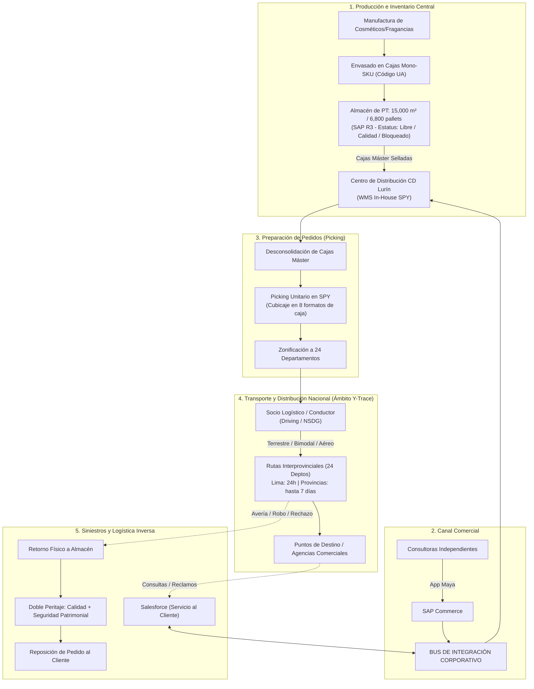
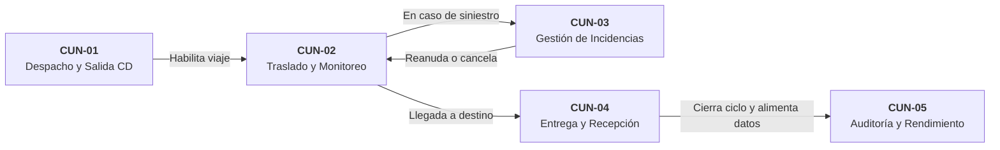

# Informe Técnico y Revisión Minuciosa: Modelo de Casos de Uso del Negocio (CUN) vs. Realidad de Yanbal y Frontera del Sistema Y-Trace

> **Ubicación:** `detalles/respuesta/INFORME_REVISION_Y_ANALISIS_CASOS_DE_USO.md`  
> **Destinatario:** Estudiante / Equipo del Proyecto de Arquitectura Empresarial (Semana 5 / Sesión 4 UTP)  
> **Proyecto:** Sistema Web y Móvil para la Gestión y Trazabilidad de Despachos y Entregas de Yanbal Perú (Y-Trace)  
> **Fuente de Verdad Operativa:** Entrevista oficial al **Ing. Joao Condorpusa Mendoza** (Encargado del Área de Distribución de Yanbal Perú) y Base de Conocimiento en `informacion/`.  
> **Garantía de Integridad:** Ningún archivo preexistente del proyecto ha sido modificado o alterado.

---

## Resumen Ejecutivo: Respuestas Directas a tus Preguntas

Antes de entrar al análisis detallado, respondemos puntualmente a tus tres dudas principales:

### 1. ¿Esto de aquí es mi diagrama de casos de uso?
> [!IMPORTANT]
> **SÍ, es tu diagrama de casos de uso, pero ESPECÍFICAMENTE es el Diagrama de Casos de Uso del NEGOCIO (CUN)**, no el Diagrama de Casos de Uso del Sistema (CUS).
> - En la metodología **RUP (Rational Unified Process)** y en la **Sesión 4 de Arquitectura Empresarial (UTP)**, el modelado inicia obligatoriamente con el **Modelo del Negocio**, donde se definen los **CUN** (`<<business use case>>` con la barra diagonal en el óvalo) y los **Actores del Negocio** (`<<business actor>>` con la barra diagonal en el actor).
> - Este diagrama modela **lo que hace la empresa como organización humana y logística**, con independencia del software.
> - Si tu entrega académica actual corresponde a la **Sesión 4 / Semana 5 (Modelado del Negocio)**, **este es exactamente el diagrama correcto y reglamentario**.
> - Si te piden el **Diagrama de Casos de Uso del Sistema (CUS)** (que suele verse en la fase de Requerimientos de Software, Semana 6/7), esos CUS se derivan de estos CUN y modelan la interacción directa del usuario con las pantallas de la plataforma Web y la App Móvil.

### 2. ¿Son estos 5 casos de uso los más importantes para el sistema?
> [!TIP]
> **Para el alcance de Distribución y Trazabilidad (Y-Trace): SÍ, son los 5 procesos capitales e indispensables.**
> Cubren el ciclo de vida completo de un despacho desde su salida hasta su cierre formal:
> 1. **CUN-01 (Despacho y Salida CD):** Control previo y traspaso de custodia en andén.
> 2. **CUN-02 (Traslado y Monitoreo en Tránsito):** Telemetría GPS en ruta interprovincial a los 24 departamentos.
> 3. **CUN-03 (Gestión de Incidencias en Ruta):** Contingencias viales, mecánicas o siniestros en carretera.
> 4. **CUN-04 (Entrega y Recepción en Destino):** Inspección física, conformidad/rechazo y evidencias.
> 5. **CUN-05 (Auditoría y Rendimiento):** Medición de *Lead Times*, KPIs contractuales y atención ágil de consultas.
>
> **Sin embargo, para el software como aplicación informática:**  
> Estos 5 CUN no son "botones" ni "pantallas"; son los **macro-procesos que el software soporta**. El sistema Y-Trace traduce estos 5 macro-procesos en **29 Requerimientos Funcionales (RF)** específicos (Autenticación RBAC, Códigos efímeros de activación, GPS background, Offline SQLite (Room), Grilla operativa con semaforización, Cancelación Forzada ante contingencias externas, Publicación al Bus corporativo $\le$ 30 min, etc.).

### 3. ¿Por qué deben estar ahí y cómo se relacionan con el negocio de Yanbal?
> En la entrevista, el Ing. Joao Condorpusa declaró que el **principal reto y dolor de Yanbal es abatir el desfase de seguimiento (tracking) que actualmente tarda hasta 2 horas**, provocando una ventana de desconocimiento, saturación de reclamos en Salesforce y falta de certeza de entrega.
> Estos 5 CUN deben estar ahí porque **atacan directamente la cadena de transporte nacional donde se produce ese desfase de 2 horas**, garantizando una reducción a **menos de 30 minutos** (meta corporativa) mediante la integración con el Bus corporativo.

---

## 1. De Qué Trata Realmente el Negocio de Yanbal

Para justificar tu arquitectura ante un profesor o jurado, debes dominar a fondo la realidad operativa de Yanbal extraída del testimonio del Ing. Joao Condorpusa:



### 1.1 El Modelo Operativo de Yanbal
- **Giro:** Empresa multinacional de venta directa de cosméticos, fragancias, bijouterie/joyería y cuidado personal.
- **Red de Distribución:** Despacha pedidos desde su Centro de Distribución principal (CD Lurín, 15,000 m², 6,800 posiciones de pallet, 2 millones de cajas instaladas) hacia todo el territorio nacional (24 departamentos) utilizando 3 modalidades de transporte: **terrestre, bimodal (fluvial/lacustre) y aéreo**.
- **Tiempos de Promesa de Entrega (*Lead Time*):**
  - **Lima Metropolitana:** 24 horas.
  - **Provincias y zonas alejadas:** Hasta 7 días.
- **Ecosistema Tecnológico Preexistente (7 Sistemas):**
  1. **SAP R3:** ERP corporativo central (control de inventario maestro y estatus de stock).
  2. **SPY (Sistema de Picking de Yanbal):** WMS in-house para control de ubicaciones y recolección unitaria en 8 formatos de caja.
  3. **Maya:** Aplicación comercial móvil/web donde las consultoras colocan sus pedidos.
  4. **SAP Commerce:** Motor transaccional de órdenes comerciales.
  5. **Driving:** TMS externo para ruteo y despacho de flotas.
  6. **NSDG:** Sistema de seguimiento y tracking desarrollado por contratista para Yanbal Perú.
  7. **Salesforce:** CRM corporativo de atención a clientes y reclamos.
  - **Bus de Integración (ESB):** Middleware que conecta e intercambia mensajes entre todos estos sistemas.

---

## 2. Los Dolores del Negocio Declarados y la Justificación de los 5 CUN

En la entrevista se revelan **tres problemas operacionales severos**. Comprenderlos es lo que justifica por qué los 5 CUN actuales están diseñados de esa forma y por qué tienen ese alcance:

| Problema Declarado en Entrevista | Causa Raíz en Yanbal | Impacto en el Negocio | ¿Cómo lo Atiende el Modelo CUN de Y-Trace? |
| :--- | :--- | :--- | :--- |
| **1. Desfase de hasta 2 horas en el tracking de pedidos** *(Problema Principal declarado por Joao Condorpusa)* | Los socios logísticos usan herramientas que sincronizan datos por lotes tardíos al Bus corporativo. | - Ventana ciega de 2 horas.<br>- Clientes reclaman a Salesforce.<br>- Desconocimiento de si el pedido fue recibido o si está demorado. | **Atendido por CUN-02 y CUN-04:** Telemetría periódica cada 10 min en ruta y publicación inmediata de eventos al Bus en $\le$ 30 min ([[RF014]], [[RF027]]). |
| **2. Incertidumbre ante contingencias y siniestros en carretera** | Los accidentes, averías o bloqueos viales en las carreteras de los 24 departamentos se reportan tarde por teléfono o WhatsApp informal. | - Pérdida de control de la carga.<br>- Retraso en activar auxilio vial o reposición.<br>- Incumplimiento del Lead Time prometido. | **Atendido por CUN-03:** Canal formal móvil de alerta inmediata de incidencias con georreferenciación, logs y publicación de alertas de siniestro al Bus corporativo ([[RF019]], [[RF028]]). |
| **3. Desfase de hasta 6 horas en merma operativa en almacén/picking** | El operario rompe un frasco durante el picking, pero lo registra al final del turno laboral. | - *Phantom inventory* (inventario fantasma).<br>- Maya vende productos rotos.<br>- Quiebre de stock y ventas perdidas. | **Delimitación de Alcance:** Pertenece al proceso interno de almacén/picking (SPY/SAP R3). Se dejó fuera deliberadamente de Y-Trace para no duplicar un WMS, enfocándose en la distribución y transporte. |

---

## 3. Análisis Minucioso de Cada Caso de Uso del Negocio (CUN)

A continuación se detalla por qué cada uno de los 5 CUN es estrictamente necesario, qué valor aporta a Yanbal y qué pasaría si no estuviera:



### CUN-01: Despacho y Salida de Carga en Centro de Distribución
* **¿Qué es?** Es el proceso formal donde el Supervisor de Distribución en CD Lurín inspecciona que la carga consolidada esté lista en andén, genera el Código Único de Activación efímero y hace el traspaso legal de custodia al conductor del transportista tercero.
* **¿Por qué debe estar ahí?**
  - Porque **en la cadena de suministros no puede haber un viaje sin un punto de partida formal**.
  - Si el conductor saliera sin este control previo, no habría constancia de a qué hora salió, con qué vehículo ni bajo qué código de viaje.
  - Resuelve la seguridad perimetral al entregar un código efímero (8 caracteres) que evita que terceros no autorizados se hagan pasar por choferes de Yanbal.

### CUN-02: Traslado Interprovincial y Monitoreo de Carga en Tránsito
* **¿Qué es?** Es el proceso de transporte físico de la carga a lo largo de las carreteras del Perú (hacia los 24 departamentos), durante el cual el sistema transmite telemetría GPS periódica y la Torre de Control supervisa el avance en la grilla operativa en vivo.
* **¿Por qué debe estar ahí?**
  - **Es el núcleo del negocio de distribución**. Si no existiera este CUN, el sistema no tendría razón de llamarse "Y-Trace" (Yanbal Trace).
  - Resuelve directamente el dolor principal del Ing. Joao Condorpusa: **la ventana de desconocimiento de 2 horas**. Con el muestreo continuo y el soporte offline (SQLite (Room) para carreteras sin cobertura celular), Yanbal nunca pierde de vista la carga.

### CUN-03: Gestión de Incidencias y Contingencias Viales en Ruta
* **¿Qué es?** Es el protocolo operacional ante cualquier evento adverso en carretera: avería mecánica del camión, bloqueo por protestas sociales, derrumbe/huayco, asalto o fallo del celular del chofer.
* **¿Por qué debe estar ahí?**
  - En la geografía peruana (rutas de sierra y selva), los traslados toman hasta 7 días y las contingencias viales son cotidianas.
  - Si no existiera este CUN, una falla mecánica dejaría el despacho sin actualización de estado sin que nadie sepa qué pasó, generando llamadas infructuosas y poniendo en riesgo la integridad del personal y de la carga cosmética de alto valor.
  - Permite sustituir dispositivos con un código de recuperación ([[RF011]]) o realizar un cierre forzado justificado en bitácora inmutable ([[RF009]]).

### CUN-04: Entrega y Recepción de Carga en Punto de Destino
* **¿Qué es?** Es la formalización de la llegada de la carga a la agencia o punto de distribución regional, donde el encargado local inspecciona los bultos/pallets, valida precintos y emite la conformidad de recepción o el rechazo tipificado, capturando evidencias (coordenadas GPS y logs).
* **¿Por qué debe estar ahí?**
  - Todo proceso logístico debe terminar con una **certificación de entrega**.
  - Evita el problema común de "arribo fantasma" (el camión se estaciona afuera pero nadie descarga mercadería).
  - La geocerca (`EN_DESTINO`) no reemplaza la validación humana; se exige la confirmación consciente (`ENTREGADO`), capturando la estampa de tiempo oficial para calcular si se cumplió o no el *Lead Time* pactado.

### CUN-05: Auditoría de Trazabilidad y Rendimiento de Distribución
* **¿Qué es?** Es el proceso post-entrega donde el Jefe de Distribución (Joao Condorpusa) evalúa en dashboards el cumplimiento de los contratos de transporte (*Lead Time*, puntualidad, siniestralidad), y donde los Operadores de SAC resuelven reclamos y consultas consultando la línea de tiempo histórica del viaje en menos de 2 segundos.
* **¿Por qué debe estar ahí?**
  - Sin este proceso, Yanbal no tendría cómo penalizar o premiar a los socios de transporte por incumplimiento de plazos.
  - El Ing. Joao Condorpusa necesita reportes ejecutivos en Excel para sustentar la gestión ante la Gerencia de Supply Chain.
  - Los operadores de Servicio al Cliente (Salesforce) necesitan una herramienta ágil para saber en segundos qué pasó con un pedido sin tener que timbrar al teléfono del conductor en plena ruta.

---

## 4. Demarcación Rigurosa: Diagrama de Casos de Uso del Negocio (CUN) vs. Diagrama de Casos de Uso del Sistema (CUS)

Esta es la distinción conceptual que tu evaluador revisará con mayor rigor metodológico. La siguiente tabla clarifica la diferencia absoluta entre ambos niveles:

```
┌──────────────────────────────────────────────────────────────────────────────────────────────────┐
│                                COMPARATIVA METODOLÓGICA (RUP / UML)                              │
├────────────────────────────────┬─────────────────────────────────────────────────────────────────┤
│ CASOS DE USO DEL NEGOCIO (CUN) │ CASOS DE USO DEL SISTEMA (CUS)                                  │
├────────────────────────────────┼─────────────────────────────────────────────────────────────────┤
│ • Nivel: Proceso Organizacional│ • Nivel: Interacción Usuario-Software                           │
│ • Foco: ¿Qué hace la empresa?  │ • Foco: ¿Qué funciones computacionales ejecuta el sistema?      │
│ • Independiente de la UI.      │ • Pantallas, clics, formularios, tokens, base de datos.         │
│ • 5 CUN en el proyecto.        │ • Múltiples CUS derivados de los 29 Requerimientos Funcionales. │
│ • Notación RUP: Barra diagonal │ • Notación UML Clásica: Óvalos simples sin barra diagonal.      │
│   en actores y óvalos.         │                                                                 │
│ • Estereotipos:                │ • Estereotipos:                                                 │
│   <<business actor>>           │   Actor estándar (Usuario Web, Conductor App Nativa, ESB)              │
│   <<business use case>>        │   Relaciones: <<include>>, <<extend>>                           │
└────────────────────────────────┴─────────────────────────────────────────────────────────────────┘
```

### 4.1 ¿Cómo se Mapean los 5 CUN a los Casos de Uso del Sistema (CUS)?

Si en tu siguiente entrega te piden el **Diagrama de Casos de Uso del Sistema (CUS)**, no tienes que inventar nada nuevo: se derivan directamente de los 5 CUN y los 29 Requerimientos Funcionales de la siguiente manera:

```mermaid
graph TB
    subgraph CUN_NEGOCIO ["Casos de Uso del Negocio (CUN)"]
        CUN1["CUN-01: Despacho y Salida CD"]
        CUN2["CUN-02: Traslado y Monitoreo"]
        CUN3["CUN-03: Gestión de Contingencias Viales"]
        CUN4["CUN-04: Entrega y Recepción"]
        CUN5["CUN-05: Auditoría y Rendimiento"]
    end

    subgraph CUS_SISTEMA ["Casos de Uso del Sistema (CUS de Software)"]
        CUS_AUTH["CUS-01: Autenticarse y Gestionar Accesos Web (RF001-RF006)"]
        CUS_CONS["CUS-02: Consultar Despachos Disponibles para Seguimiento (RF007)"]
        CUS_ACT["CUS-03: Habilitar y Activar Operación Móvil (RF008, RF010, RF027)"]
        CUS_HRUTA["CUS-04: Consultar Hoja de Ruta y Destino (RF011, RF012)"]
        CUS_GPS["CUS-05: Transmitir Telemetría GPS en Segundo Plano (RF013, RF014)"]
        CUS_OFF["CUS-06: Almacenar y Sincronizar Datos Offline FIFO (RF019, RF020, RF021)"]
        CUS_GRID["CUS-07: Monitorear Flota en Grilla Operativa con Semaforización (RF022)"]
        CUS_CANCEL["CUS-08: Ejecutar Cancelación Forzada de Seguimiento (RF009, RF028)"]
        CUS_ENT["CUS-09: Confirmar Entrega / Rechazo de Carga (RF015-RF017)"]
        CUS_CIERRE["CUS-10: Finalizar Despacho y Cerrar Sesión Móvil (RF018, RF028)"]
        CUS_TIMELINE["CUS-11: Consultar Trazabilidad y Resumen del Despacho (RF023)"]
        CUS_KPI["CUS-12: Consultar Dashboard de KPIs y Análisis por Transportista (RF024)"]
        CUS_ESB["CUS-13: Publicar Eventos y Resumen al Bus Corporativo (RF025, RF026)"]
    end

    CUN1 -.-> CUS_CONS
    CUN1 -.-> CUS_ACT
    CUN1 -.-> CUS_HRUTA
    CUN2 -.-> CUS_GPS
    CUN2 -.-> CUS_OFF
    CUN2 -.-> CUS_GRID
    CUN3 -.-> CUS_CANCEL
    CUN4 -.-> CUS_ENT
    CUN4 -.-> CUS_CIERRE
    CUN5 -.-> CUS_TIMELINE
    CUN5 -.-> CUS_KPI
    CUN2 -.-> CUS_ESB
    CUN4 -.-> CUS_ESB
```



---

## 5. Justificación de la Delimitación del Alcance (Frontera del Sistema)

Un punto clave de evaluación es: **¿Por qué Y-Trace no abarca toda la empresa Yanbal?**

En Arquitectura Empresarial, intentar modelar un sistema que abarque desde la mezcla química de lápices labiales hasta la entrega al pariente de una consultora es un error de diseño conocido como **"sistema monolítico inabarcable"**.

La delimitación adoptada en el proyecto es impecable por las siguientes razones:

```
┌──────────────────────────────────────────────────────────────────────────────────────────────────┐
│                                 FRONTERA DEL ALCANCE DE Y-TRACE                                  │
├──────────────────────────────────────────────────┬───────────────────────────────────────────────┤
│ PROCESOS EXCLUIDOS (Fuera de Y-Trace)            │ PROCESOS INCLUIDOS (Dentro de Y-Trace)        │
├──────────────────────────────────────────────────┼───────────────────────────────────────────────┤
│ ❌ Fabricación y dosificación industrial.        │ ✔️ Salida formal de andén en CD Lurín (B2B).  │
│ ❌ Picking unitario en racks (WMS SPY).          │ ✔️ Traslado interprovincial nacional (24 dep).│
│ ❌ Ruteo y zonificación de camiones (Driving).   │ ✔️ Monitoreo continuo en grilla operativa GPS. │
│ ❌ Gestión de catálogo y pedidos (Maya/SAP Com). │ ✔️ Telemetría móvil offline resiliente.       │
│ ❌ Reparto domiciliario minorista (B2C) a        │ ✔️ Alerta y gestión de siniestros en ruta.    │
│    consultoras y familiares.                     │ ✔️ Entrega formal e inspección en destino.    │
│ ❌ Evaluación pericial de seguros de siniestro.  │ ✔️ Auditoría, SLAs, KPIs y publicación al Bus.│
└──────────────────────────────────────────────────┴───────────────────────────────────────────────┘
```

### ¿Por qué se excluyó el reparto minorista B2C (entrega a consultoras)?
1. **Separación de responsabilidades de transporte:** La distribución troncal (camiones de carga pesada Lurín $\rightarrow$ 24 departamentos) es operativamente diferente al reparto capilar urbano en motofurgones o camionetas que van casa por casa.
2. **Respuesta directa al testimonio de Joao Condorpusa:** Yanbal maneja envíos a nivel nacional hacia centros de distribución secundarios y agencias donde se abastecen las regiones. Y-Trace resuelve la trazabilidad de esta red troncal de abastecimiento.
3. **No reinventar la rueda:** Yanbal ya tiene contratos con operadores que usan sistemas externos como Driving para el ruteo capilar. Y-Trace se enfoca en resolver el desfase de 2 horas en el Bus corporativo transmitiendo los eventos de estado consolidados en menos de 30 minutos.

---

## 6. Guía para tu Sustentación o Examen (Preguntas Típicas del Profesor)

A continuación, las preguntas más frecuentes de los evaluadores y la respuesta exacta que debes dar:

### Pregunta 1: "¿Por qué en tu diagrama de casos de uso solo hay 5 casos de uso si tu sistema tiene casi 30 requerimientos?"
> **Respuesta:**  
> *"Profesor(a), este diagrama representa el **Modelo de Casos de Uso del Negocio (CUN)** bajo la metodología RUP (Sesión 4). Los CUN representan macro-procesos operacionales de principio a fin de la empresa, no funciones de software individuales. Convertir cada requerimiento funcional en un caso de uso del negocio sería un error metodológico conocido como 'CUN botón' o 'CUN pantalla'. Los 29 requerimientos funcionales del sistema dan soporte técnico directo a estos 5 CUN y se agrupan en Casos de Uso del Sistema (CUS) para la capa de software."*

### Pregunta 2: "¿Qué significan los muñequitos con la barra inclinada y los óvalos tachados?"
> **Respuesta:**  
> *"Es la notación formal del estándar RUP para el Modelado del Negocio. La barra inclinada identifica a un `<<business actor>>` (actor del negocio que interactúa con la organización, como el transportista o el supervisor de andén) y a un `<<business use case>>` (proceso de negocio que genera un valor observable para el cliente o socio logístico). Se distingue de los muñequitos clásicos de UML que representan actores de software en el CUS."*

### Pregunta 3: "En la entrevista se habla de un problema grave de merma de 6 horas en el almacén. ¿Por qué no veo un caso de uso para la merma?"
> **Respuesta:**  
> *"La merma operativa de 6 horas ocurre dentro del proceso de recolección física en la línea de picking, gestionado por el sistema in-house SPY y el ERP SAP R3. Nuestro proyecto Y-Trace ha definido una frontera de arquitectura empresarial enfocada específicamente en la **Distribución y Trazabilidad de Despachos en Tránsito**, que es donde reside el dolor principal declarado por el Ing. Joao Condorpusa: el **desfase de 2 horas en el tracking de seguimiento hacia los 24 departamentos**. Incluir la gestión de picking habría desvirtuado el objetivo del sistema convirtiéndolo en un WMS de almacén."*

---

## 7. Conclusión Definitiva de la Revisión

1. **Tu diagrama en `detalles/Diagrama de Casos de Uso del Negocio (CUN)` está metodológicamente perfecto y completo para la Sesión 4 / Modelo del Negocio.**
2. **Los 5 Casos de Uso del Negocio definidos son exactamente los más importantes y suficientes** para el alcance de distribución de Yanbal:
   - Cubren el 100% del ciclo de vida del despacho: Salida $\rightarrow$ Tránsito $\rightarrow$ Contingencia Vial $\rightarrow$ Llegada $\rightarrow$ Auditoría.
   - Dan cobertura y trazabilidad completa a los 28 Requerimientos Funcionales activos del sistema (RF001 a RF028).
   - Atacan el reto operacional número 1 de Yanbal: reducir la latencia de seguimiento de 2 horas a $\le$ 30 minutos.
3. **No debes añadir más óvalos al CUN ni mezclar pantallas de software en él.** En las siguientes semanas, lo que desarrollarás a partir de esto es el **Diagrama de Casos de Uso del Sistema (CUS)**, para el cual ya tienes todo el mapeo estructurado en la sección 4 de este informe.
